# ADTs and Lists Tutorial


## Introduction

An **Abstract Data Type** (ADT) is a high-level (abstract) description of a data type which includes the operations (methods)
available on the data type as well as what users of the data type should expect when using those operations. 
The exact implementation details, including the underlying structure, are left to the programmer. 
There are often many useful implementations for a given ADT. The decision of which implementation depends on which one would
be more efficient for the application at hand. You can think of an ADT as a well-commented interface describing 
the operations that an implementing class must contain.

**Consider a vending machine description as a physical analagy for an ADT.** From the outside perspective, 
users of a vending machine are only concerned with whether or not a machine _can_ vend. They do necessarily 
care _how_ a machine vends. An operation for a vending machine might be described by the following method:

* `void vendItem(double payment, int item) throws UnavailableItemException, InsufficientPaymentException`
  * Users should be able to call a method called `vendItem`, specifying a payment amount and item number.
    If valid and proper input is supplied, then the vending machine should vend the item to the user.
  * If the item is unavailable, then the method throws an `UnavailableItemException` which causes the
    vending machine's display to update accordingly.
  * Likewise, if an insufficient amount for the specified item is supplied, then the method throws
    an `InsufficientPaymentException` which also causes the vending machine's display to update accordingly.
    
In this analogy, we have a VendingMachine ADT with one operation called `vendItem`. Not only should
any vending machine implementation have a `vendItem` operation, but it should operate, from the user's
perspective, as described in the ADT description. **What does the ADT not describe?** It doesn't describe 
how the actual vending occurs. One vending machine implementation might use conveyer belts to vend an item,
while another vending machine implementation might use robotic arms to do the same. That is, different
vending machine manufacturers are responsible for the inner workings of their implementations so long
as the `vendItem` operation works as previously described. Take special care to notice that the ADT
description did not only describe what should happen under normal circumstances. It described what
should happen under exceptional circumstances as well. It did so without ever saying _how_ any of that
should be done.

## The List ADT

A common ADT is the List ADT. When thinking of a List as an abstract type, you can think of a List as an ordered collection 
of objects. There are a number of important operations needed for a List. Some common list operations include, but are not
limited to:

* Creating a new list.
* Retrieving an object in the list at a particular index.
* Adding an object to the list at a particular index.
* Removing an object from the list at a particular index.
* Clearing the list.
* Print the contents of the list.

The exact method signatures and behaviors of these methods may differ across various List ADT definitions. In this tutorial,
we will use the following definitions:

* `List()` - creates a new List object with an initial size of zero.
* `String get(int index)` - retrieves the object (String in this case) at the specified index. 
  This method throws an `IndexOutOfBoundsException` if the index is out of range 
  `(index < 0 || index >= size())`
* `boolean add(int index, String s)` - inserts the specified object (String in this case) at the specified index. 
  The method shifts the object currently at that position (if any) and any subsequent objects to the right 
  (i.e. it adds one to  their indices).
* `String remove(int index)` - removes and returns the string at the specified position in the list. 
  Shifts any subsequent elements to the left (i.e. subtracts one from their indices).
* `void clear()` - Removes all of the objects from the list. 
  The list will be empty after this call returns.
* `String makeString(String separator)` - Returns a string representation of this list with every string in
  the sequence separated by the specified seprator string.

Notice that the description and operations given above were independent of any underlying data structure or implementation.
When thinking of _using_ an ADT, try to avoid worrying about those details.

**List ADT Example**

In the example below, we provide a few List ADT method calls. For each method call, we provide an associated picture of how
the List would look at a high level. It is worth highlighting again that we can understand this code without knowing any
details of the underlying implementation. We recommend tracing through the code to see if you can get the same output
shown below.

   ```java
   List myList = new List();
   myList.add(0, "Bread");
   myList.add(0, "Cheese");
   myList.add(1, "Milk");
   myList.add(3, "Ice Cream");
   System.out.println("Removed: " + myList.remove(0));
   System.out.println("List Size: " + myList.size());
   System.out.println("List Contents: " + myList.makeString(","));
   ```
Program Output:
   ```
   Removed: Cheese
   List Size: 3
   List Contents: Milk, Bread, Ice Cream
   ```
   
## Implementations of the List ADT

Now that we've seen how the List ADT is intended to function, we can focus on *how* to make it work. The List ADT is commonly 
implemented using either an array or a linked list. Each approach has benefits and drawbacks. 

### List ADT - Array Implementation

The List ADT could be implemented using an array of the type of object stored in the list. We use an array of `String`
references in our examples but this same structure could apply to any datatype. We also keep a variable, `size`, which 
represents the number of items on the list. The `size` variable would be optional but it simplifies the implementation
of many of the List ADT operations and would be recommended.

The main benefit of an array-based List implementation is extremely fast access to List elements. This is due to the fact
that arrays are laid out in a contiguous block of primary memory. The main drawback of an array-based approach is that
an array's size is fixed. Therefore, if you want to increase the size of an array, you are forced to create a new array of a 
larger size and then copy over the elements of the old array to the new, larger array. As you can imagine, creating an array
and copying all elements requires a lot of work.

### List ADT - Linked List Implementation

A linked list is a sequence of objects where one object in the list references the next object in the list. The objects are
not laid out in contiguous memory and, therefore, access time is slower than an array-based implementation. We will see 
exactly why this is true later in the tutorial. The main benefit of linked lists is that new objects can be added to the list 
without having to create a copy of the entire List.

The objects in a linked list are commonly referred to as **nodes**. Each node contains the value to be stored along with a 
reference to the next node in the list. An abreviated Java implementation of a node class that contains `String` references
can be seen below:

   ```java
   public class Node {
      private String value;
      private Node next;
      
      // constructors, getters and setters omitted for brevity
      
   } // Node
   ```
   
Here, the `next` instance variable is a reference (or link) to the next `Node` object in the linked list. Executing the 
code below would generate a linked list with two `Node` objects. The `next` reference contained within the first node, `n`,
references the second `Node` object. 

   ```java
   Node n = new Node("Hello");
   n.setNext(new Node("World"));
   ```
   
The structure generated by the above code would look like:

   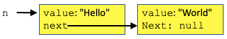


A **linked list** is a sequence of nodes. Typically, a linked list object contains a `Node` reference to the head of the list
along with a `size` variable indicating how many items are in the list.

## List ADT - Examples with Both Implementations

Let's take a look at how the array and linked list implementations would look internally for some of our List ADT methods. 
In the examples below, we show a few lines of Java code along with images demonstrating the internal state of the List 
object, `myList`, using both an array and a linked list as the internal data structure.

1. **Construct a new list.**

   ```java
   List myList = new List();
   System.out.println("List Size: " + myList.size());
   System.out.println("List Contents: " + myList.makeString(","));
   ```
   ```
   List Size: 0
   List Contents:
   ```
   
   <table>
   <tr>
   <td>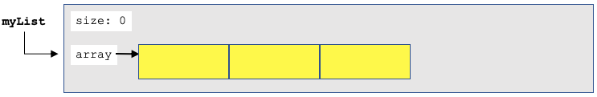</td>
   <td>Array notes...</td>
   </tr>
   <tr>
   <td></td>
   <td>Linked list notes...</td>
   </tr>
   </table>
   
1. **Add element into index position 0.**

   ```java
   myList.add(0, "Bread");
   System.out.println("List Size: " + myList.size());
   System.out.println("List Contents: " + myList.makeString(","));
   ```
   ```
   List Size: 1
   List Contents: Bread
   ```
   
   <table>
   <tr>
   <td>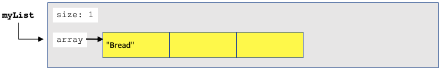</td>
   <td>Array notes...</td>
   </tr>
   <tr>
   <td></td>
   <td>Linked list notes...</td>
   </tr>
   </table>
   
1. **Add element into index position 0.**

   ```java
   myList.add(0, "Cheese");
   System.out.println("List Size: " + myList.size());
   System.out.println("List Contents: " + myList.makeString(","));
   ```
   ```
   List Size: 2
   List Contents: Cheese, Bread
   ```
   
   <table>
   <tr>
   <td>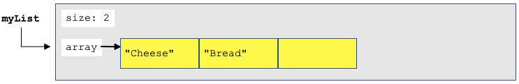</td>
   <td>Array notes...</td>
   </tr>
   <tr>
   <td></td>
   <td>Linked list notes...</td>
   </tr>
   </table>
   
1. **Add element into index position 1.**

   ```java
   myList.add(1, "Milk");
   System.out.println("List Size: " + myList.size());
   System.out.println("List Contents: " + myList.makeString(","));
   ```
   ```
   List Size: 3
   List Contents: Cheese, Milk, Bread
   ```
   
   <table>
   <tr>
   <td>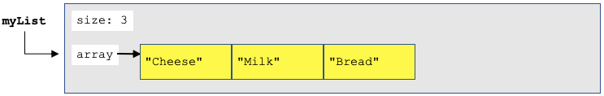</td>
   <td>Array notes...</td>
   </tr>
   <tr>
   <td></td>
   <td>Linked list notes...</td>
   </tr>
   </table>
      
1. **Add element into index position 3.**

   ```java
   myList.add(3, "Ice Cream");
   System.out.println("List Size: " + myList.size());
   System.out.println("List Contents: " + myList.makeString(","));
   ```
   ```
   List Size: 4
   List Contents: Cheese, Milk, Bread, Ice Cream
   ```
   
   <table>
   <tr>
   <td>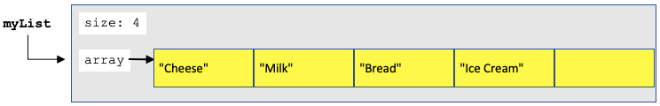</td>
   <td>Array notes...</td>
   </tr>
   <tr>
   <td>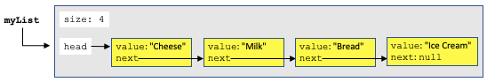</td>
   <td>Linked list notes...</td>
   </tr>
   </table>

1. **Remove first element.**  
   
   ```java
   System.out.println("Removed: " + myList.remove(0));
   System.out.println("List Size: " + myList.size());
   System.out.println("List Contents: " + myList.makeString(","));
   ```
   ```
   Removed: Cheese
   List Size: 3
   List Contents: Milk, Bread, Ice Cream
   ```
   
   <table>
   <tr>
   <td>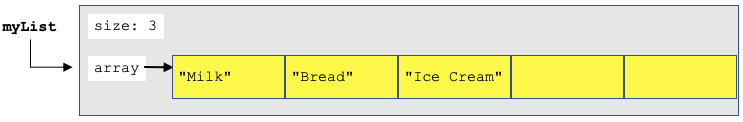</td>
   <td>Array notes...</td>
   </tr>
   <tr>
   <td>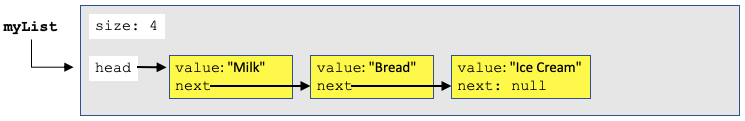</td>
   <td>Linked list notes...</td>
   </tr>
   </table>

1. **Get first element.** 

   ```java
   System.out.println("Item at index 0: " + myList.get(0));
   System.out.println("List Size: " + myList.size());
   System.out.println("List Contents: " + myList.makeString(","));
   ```
   ```
   Item at index 0: Milk
   List Size: 3
   List Contents: Milk, Bread, Ice Cream
   ```
   
   <table>
   <tr>
   <td></td>
   <td>Array notes...</td>
   </tr>
   <tr>
   <td></td>
   <td>Linked list notes...</td>
   </tr>
   </table>

1. **Clear.** Say something here....

   ```java
   myList.clear();
   System.out.println("List Size: " + myList.size());
   System.out.println("List Contents: " + myList.makeString(","));
   ```
   ```
   List Size: 0
   List Contents:
   ```
   
   <table>
   <tr>
   <td>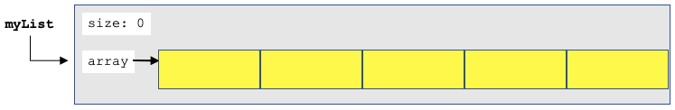</td>
   <td>Array notes...</td>
   </tr>
   <tr>
   <td></td>
   <td>Linked list notes...</td>
   </tr>
   </table>

## Operation Details

In this section, we will take a closer look at the `get(int index)` and `add(int index, String s)` operations with a linked list
implementation.

### Linked List Get Operation

The main drawback of a linked list implementation is that elements are slower to access. Each access requires the program 
to traverse from the head of the list to the desired index. The images below demonstrate how this might be accomplished if
the instruction `myList.get(2)` is executed.

1. A reference, `temp`, is assigned to the `head` of the list (index 0). 

   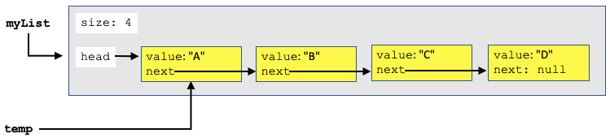

1. We move `temp` to the next node in the list. Now, `temp` is located at index 1. We avoid modifying `head` as to not 
   change the list itself. If we were to lose the `head` reference, we would lose access to the first node in the list.
   
   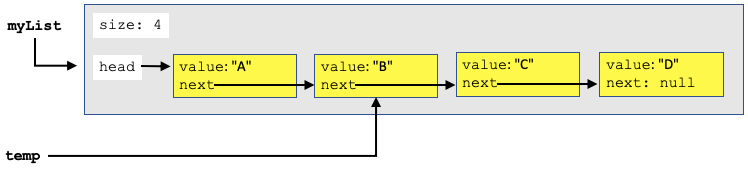

1. We move `temp` to the next node in the list. Now, `temp` is located at index 2, which is our desired destination. At 
   this point, we can return `value` from the `Node` object referenced by `temp` as that is the value we want.
   
   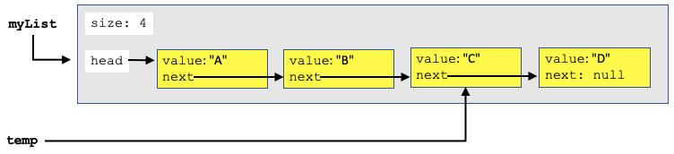

Compare this method to arrays where we would simply return `array[2]`. With an array implementation, the program can 
directly access the requrested index (one of the benefits of arrays). Traversing the links in a linked list implementation
is more costly. Especially when the desired element is located toward the end of a long linked list.

### Linked List Add Operation

The main benefit of an linked list implementation is the fact that these structures can easily increase size by adding a 
new, dynamically allocated node object. The images below demonstrate how this might be accomplished if the instruction
`myList.add(2, "F")` is executed.

1. The method starts off by creating a `Node` object referenced by `newNode` containing the `String` to be added. Also,
   in this step, a temporary reference, `temp`, refers to the first node in the List.
   
   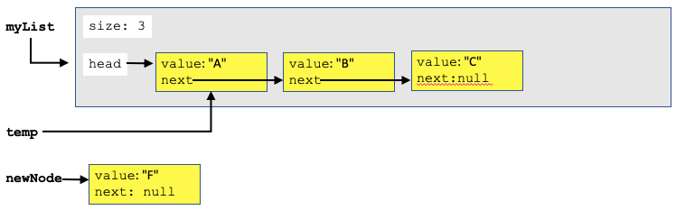

1. We move `temp` to the next node in the list. Now, `temp` is located at index 1. We avoid modifying `head` as to not 
   change the list itself. If we were to lose the `head` reference, we would lose access to the first node in the list.
   
   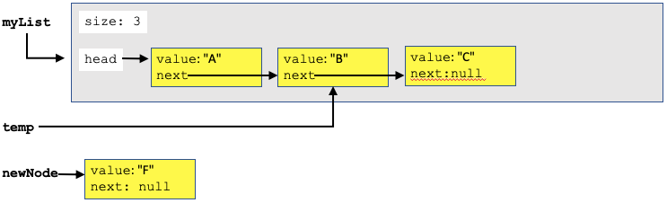

1. We move `temp` to the next node in the list. Now, `temp` is located at index 2, which is our desired destination. This
   is the location where `newNode` will be inserted. In this step, we set the `next` reference of `newNode` to the `next`
   value of `temp`.
   
   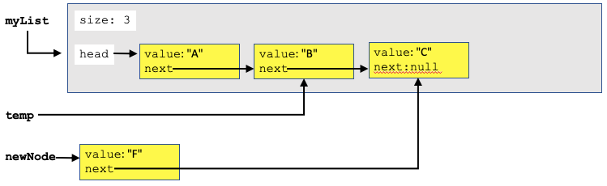
  
1. In this step, the `next` field of the object referenced by `temp` is set to `newNode`.

   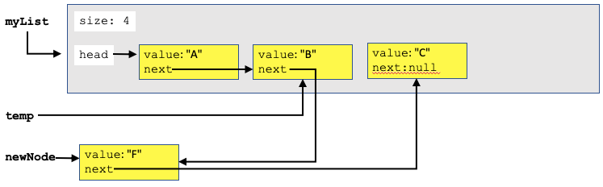
   
1. This image represents the same structure as the previous image just redrawn without any local variables with the nodes
   lined up cleanly.
   
   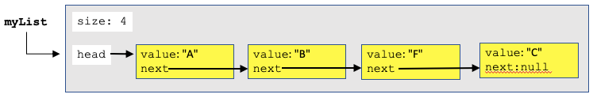

**Sumarize how this is better than array add when size has to increase**

## Conclusion

The chosen implementation of an interface can have a large impact on the program in which it is used. Selecting the 
appropriate implementation is an important decision. In this tutorial, we discussed a linked list vs array implementation
for the List ADT. The benefits and drawbacks of each apprach are summarized in the table below:

   |        | Array Approach          | Linked List Approach      |
   |--------|-------------------------|---------------------------|
   | Pros   | Fast Access to Elements | Easy to Add new Nodes     |
   | Cons   | Expensive to Resize     | Slower access to elements |
   
<hr/>

[](http://creativecommons.org/licenses/by-nc-nd/4.0/)

<small>
Copyright &copy; Michael E. Cotterell, Bradley J. Barnes, and the University of Georgia.
This work is licensed under a <a rel="license" href="http://creativecommons.org/licenses/by-nc-nd/4.0/">Creative Commons Attribution-NonCommercial-NoDerivatives 4.0 International License</a> to students and the public.
The content and opinions expressed on this Web page do not necessarily reflect the views of nor are they endorsed by the University of Georgia or the University System of Georgia.
</small>
