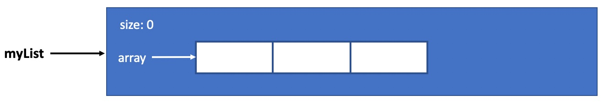
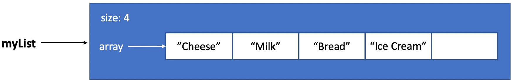
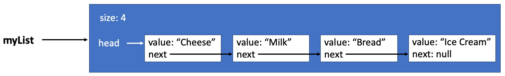

# ADTs and Lists Tutorial


## Introduction

An **Abstract Data Type** (ADT) is a high-level (abstract) description of a data type which includes the operations (methods)
available on the data type as well as what users of the data type should expect when using those operations. 
The exact implementation details, including the underlying structure, are left to the programmer. 
There are often many useful implementations for a given ADT. The decision of which implementation depends on which one would
be more efficient for the application at hand. You can think of an ADT as a well-commented interface describing 
the operations that an implementing class must contain.

**Consider a vending machine description as a physical analagy for an ADT.** From the outside perspective, 
users of a vending machine are only concerned with whether or not a machine _can_ vend. They do necessarily 
care _how_ a machine vends. An operation for a vending machine might be described by the following method:

* `void vendItem(double payment, int item) throws UnavailableItemException, InsufficientPaymentException`
  * Users should be able to call a method called `vendItem`, specifying a payment amount and item number.
    If valid and proper input is supplied, then the vending machine should vend the item to the user.
  * If the item is unavailable, then the method throws an `UnavailableItemException` which causes the
    vending machine's display to update accordingly.
  * Likewise, if an insufficient amount for the specified item is supplied, then the method throws
    an `InsufficientPaymentException` which also causes the vending machine's display to update accordingly.
    
In this analagy, we have a VendingMachine ADT with one operation called `vendItem`. Not only should
any vending machine implementation have a `vendItem` operation, but it should operate, from the user's
perspective, as described in the ADT description. **What does the ADT not describe?** It doesn't describe 
how the actual vending occurs. One vending machine implementation might use conveyer belts to vend an item,
while another vending machine implementation might use robotic arms to do the same. That is, different
vending machine manufacturers are responsible for the inner workings of their implementations so long
as the `vendItem` operation works as previously described. Take special care to notice that the ADT
description did not only describe what should happen under normal circumstances. It described what
should happen under exceptional circumstances as well.

## The List ADT

A common ADT is the List ADT. When thinking of a List as an abstract type, you can think of a List as an ordered collection 
of objects. There are a number of important operations needed for a List. Some common list operations include, but are not
limited to:

* Creating a new list.
* Retrieving an object in the list at a particular index.
* Adding an object to the list at a particular index.
* Removing an object from the list at a particular index.
* Clearing the list.
* Print the contents of the list.

The exact method signatures and behaviors of these methods may differ across various List ADT definitions. In this tutorial,
we will use the following definitions:

* `List()` - creates a new List object with an initial size of zero.
* `String get(int index)` - retrieves the object (String in this case) at the specified index. 
  This method throws an `IndexOutOfBoundsException` if the index is out of range 
  `(index < 0 || index >= size())`
* `boolean add(int index, String s)` - inserts the specified object (String in this case) at the specified index. 
  The method shifts the object currently at that position (if any) and any subsequent objects to the right 
  (i.e. it adds one to  their indices).
* `String remove(int index)` - removes and returns the string at the specified position in the list. 
  Shifts any subsequent elements to the left (i.e. subtracts one from their indices).
* `void clear()` - Removes all of the objects from the list. 
  The list will be empty after this call returns.
* `String makeString(String separator)` - Returns a string representation of this list with every string in
  the sequence separated by the specified seprator string.

Notice that the description and operations given above were independent of any underlying data structure or implementation.
When thinking of _using_ an ADT, try to avoid worrying about those details.

**List ADT Example**

In the example below, we provide example List ADT method calls. For each method call, we provide an associated picture of how
the List would look at a high level.

1.
   ```java
   List myList = new List();
   System.out.println("List Size: " + myList.size());
   System.out.println("List Contents: " + myList.makeString(","));
   ```
   ```
   List Size: 0
   List Contents:
   ```
   
1.
   ```java
   myList.add(0, "Bread");
   System.out.println("List Size: " + myList.size());
   System.out.println("List Contents: " + myList.makeString(","));
   ```
   ```
   List Size: 1
   List Contents: Bread
   ```

1.
   ```java
   myList.add(0, "Cheese");
   System.out.println("List Size: " + myList.size());
   System.out.println("List Contents: " + myList.makeString(","));
   ```
   ```
   List Size: 2
   List Contents: Cheese, Bread
   ```

1.
   ```java
   myList.add(1, "Milk");
   System.out.println("List Size: " + myList.size());
   System.out.println("List Contents: " + myList.makeString(","));
   ```
   ```
   List Size: 3
   List Contents: Cheese, Milk, Bread
   ```
   
1.
   ```java
   myList.add(3, "Ice Cream");
   System.out.println("List Size: " + myList.size());
   System.out.println("List Contents: " + myList.makeString(","));
   ```
   ```
   List Size: 4
   List Contents: Cheese, Milk, Bread, Ice Cream
   ```
   
1.   
   ```java
   System.out.println("Removed: " + myList.remove(0));
   System.out.println("List Size: " + myList.size());
   System.out.println("List Contents: " + myList.makeString(","));
   ```
   ```
   Removed: Cheese
   List Size: 3
   List Contents: Milk, Bread, Ice Cream
   ```
   
1.
   ```java
   System.out.println("Item at index 0: " + myList.get(0));
   System.out.println("List Size: " + myList.size());
   System.out.println("List Contents: " + myList.makeString(","));
   ```
   ```
   Item at index 0: Milk
   List Size: 3
   List Contents: Milk, Bread, Ice Cream
   ```
1.
   ```java
   myList.clear();
   System.out.println("List Size: " + myList.size());
   System.out.println("List Contents: " + myList.makeString(","));
   ```
   ```
   List Size: 0
   List Contents:
   ```
   

## Implementations of the List ADT

Now that we've seen how the List ADT is intended to function, we can focus on *how* to make it work. The List ADT is
commonly implemented using either an array or a linked list. Since you're likely more familiar with arrays, we will 
start with a discussion of this approach.

## List ADT - Array Implementation

In this section, you will see the same set of instructions as above, however, they will now be accompanied by a diagram
showing the internal structure of `myList` using one of many possible array-based implementations.

1.
   ```java
   List myList = new List();
   System.out.println("List Size: " + myList.size());
   System.out.println("List Contents: " + myList.makeString(","));
   ```
   ```
   List Size: 0
   List Contents:
   ```
   
   
1.
   ```java
   myList.add(0, "Bread");
   System.out.println("List Size: " + myList.size());
   System.out.println("List Contents: " + myList.makeString(","));
   ```
   ```
   List Size: 1
   List Contents: Bread
   ```
   
1.
   ```java
   myList.add(0, "Cheese");
   System.out.println("List Size: " + myList.size());
   System.out.println("List Contents: " + myList.makeString(","));
   ```
   ```
   List Size: 2
   List Contents: Cheese, Bread
   ```
   
   
1.
   ```java
   myList.add(1, "Milk");
   System.out.println("List Size: " + myList.size());
   System.out.println("List Contents: " + myList.makeString(","));
   ```
   ```
   List Size: 3
   List Contents: Cheese, Milk, Bread
   ```
   
      
1.
   ```java
   myList.add(3, "Ice Cream");
   System.out.println("List Size: " + myList.size());
   System.out.println("List Contents: " + myList.makeString(","));
   ```
   ```
   List Size: 4
   List Contents: Cheese, Milk, Bread, Ice Cream
   ```
   

   
1.   
   ```java
   System.out.println("Removed: " + myList.remove(0));
   System.out.println("List Size: " + myList.size());
   System.out.println("List Contents: " + myList.makeString(","));
   ```
   ```
   Removed: Cheese
   List Size: 3
   List Contents: Milk, Bread, Ice Cream
   ```
   

1.
   ```java
   System.out.println("Item at index 0: " + myList.get(0));
   System.out.println("List Size: " + myList.size());
   System.out.println("List Contents: " + myList.makeString(","));
   ```
   ```
   Item at index 0: Milk
   List Size: 3
   List Contents: Milk, Bread, Ice Cream
   ```
   

1.
   ```java
   myList.clear();
   System.out.println("List Size: " + myList.size());
   System.out.println("List Contents: " + myList.makeString(","));
   ```
   ```
   List Size: 0
   List Contents:
   ```
   


## Linked Lists require Nodes

Explain the idea of a Node in this section.

## List ADT - Linked List Implementation

In this section, you will see the same set of instructions as above, however, they will now be accompanied by a diagram
showing the internal structure of `myList` using one of many possible linked list implementations.

1.
   ```java
   List myList = new List();
   System.out.println("List Size: " + myList.size());
   System.out.println("List Contents: " + myList.makeString(","));
   ```
   ```
   List Size: 0
   List Contents:
   ```
   
   
1.
   ```java
   myList.add(0, "Bread");
   System.out.println("List Size: " + myList.size());
   System.out.println("List Contents: " + myList.makeString(","));
   ```
   ```
   List Size: 1
   List Contents: Bread
   ```
   
1.
   ```java
   myList.add(0, "Cheese");
   System.out.println("List Size: " + myList.size());
   System.out.println("List Contents: " + myList.makeString(","));
   ```
   ```
   List Size: 2
   List Contents: Cheese, Bread
   ```
   
   
1.
   ```java
   myList.add(1, "Milk");
   System.out.println("List Size: " + myList.size());
   System.out.println("List Contents: " + myList.makeString(","));
   ```
   ```
   List Size: 3
   List Contents: Cheese, Milk, Bread
   ```
   
      
1.
   ```java
   myList.add(3, "Ice Cream");
   System.out.println("List Size: " + myList.size());
   System.out.println("List Contents: " + myList.makeString(","));
   ```
   ```
   List Size: 4
   List Contents: Cheese, Milk, Bread, Ice Cream
   ```
   

   
1.   
   ```java
   System.out.println("Removed: " + myList.remove(0));
   System.out.println("List Size: " + myList.size());
   System.out.println("List Contents: " + myList.makeString(","));
   ```
   ```
   Removed: Cheese
   List Size: 3
   List Contents: Milk, Bread, Ice Cream
   ```
   

1.
   ```java
   System.out.println("Item at index 0: " + myList.get(0));
   System.out.println("List Size: " + myList.size());
   System.out.println("List Contents: " + myList.makeString(","));
   ```
   ```
   Item at index 0: Milk
   List Size: 3
   List Contents: Milk, Bread, Ice Cream
   ```
   

1.
   ```java
   myList.clear();
   System.out.println("List Size: " + myList.size());
   System.out.println("List Contents: " + myList.makeString(","));
   ```
   ```
   List Size: 0
   List Contents:
   ```
   

   
<hr/>

[](http://creativecommons.org/licenses/by-nc-nd/4.0/)

<small>
Copyright &copy; Michael E. Cotterell, Bradley J. Barnes, and the University of Georgia.
This work is licensed under a <a rel="license" href="http://creativecommons.org/licenses/by-nc-nd/4.0/">Creative Commons Attribution-NonCommercial-NoDerivatives 4.0 International License</a> to students and the public.
The content and opinions expressed on this Web page do not necessarily reflect the views of nor are they endorsed by the University of Georgia or the University System of Georgia.
</small>
