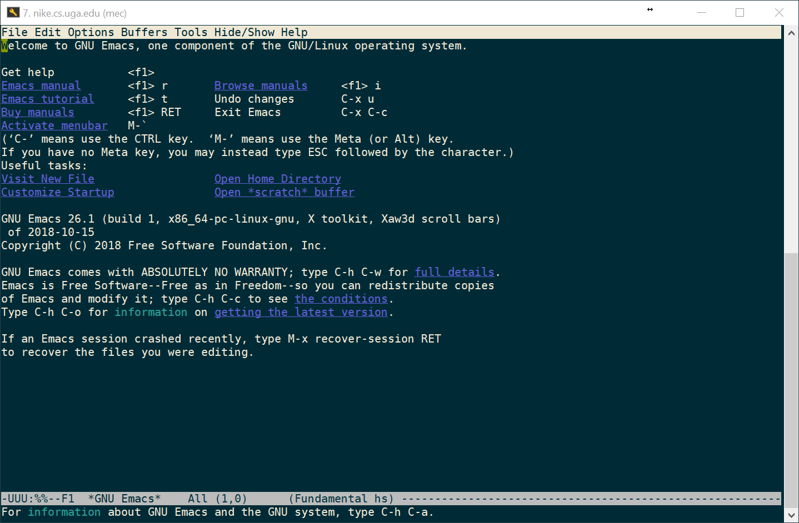
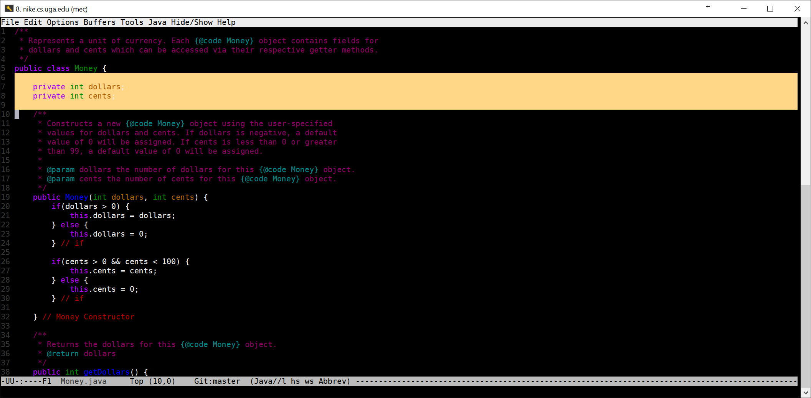
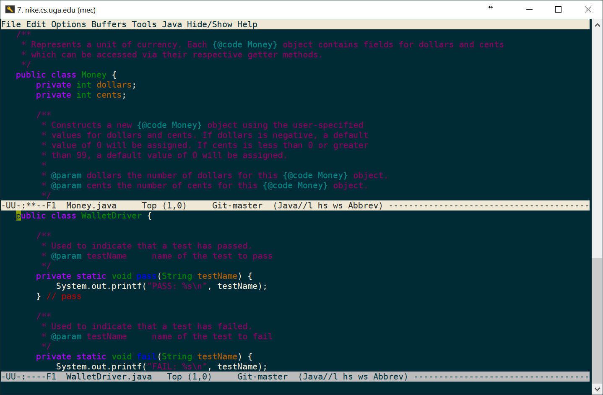

# Emacs Tutorial




## Table of Contents

1. [Introduction](#introduction)
1. [Control and Meta](#control-and-meta)
1. [Built-in Emacs Tutorial](#built-in-emacs-tutorial)
1. [Open / Create File](#open--create-file)
1. [Basic Commands](#basic-commands)
   1. [Open, Save, and Exit](#open-save-and-exit)
   1. [Cancel](#cancel)
   1. [Navigation](#navigation)
   1. [Delete](#delete)
   1. [Undo](#undo)
   1. [Selections and Copy / Paste](#selections-and-copy--paste)
   1. [Search and Replace](#search-and-replace)
   1. [Splitting the Screen](#splitting-the-screen)
1. [Make Emacs Your Default Editor](#make-emacs-your-default-editor)
1. [Customize Emacs](#customize-emacs)

## Introduction

Emacs is a powerful text-editor that runs in the terminal. Emacs allows us to read and write source
code (and any other text documents) without having to leave our terminal environment. While you are welcome
to use other text editors that are available in the Unix environment, we will focus on Emacs in this course.
If you're interested in learning more about Emacs, check out the [Wikipedia Page](https://en.wikipedia.org/wiki/Emacs).

**Why do we use Emacs in CSCI 1302?** Here is Dr. Cotterell's usual response to that question:

> Emacs works in the terminal, therefore working with it will build and strengthen your skills in a 
> Unix-like environment; With respect to Java, it allows you to focus on really learning the syntax
> of the language, which means you won't have to rely on the editor to write a program (e.g., we want
> to avoid, "I can only write Java in editor X"). Furthermore, if you go back to using a more advanced
> editor, then you'll be able to make informed decisions regarding suggestions the editor provides 
> instead of accepting them as, "must do."

In this tutorial, we will teach you the basics of the Emacs text editor.

## Control and Meta

Throughout this tutorial we will use `C` to refer to the control key (`CTRL`)
and `M` to refer to the meta key. On most systems, `ALT` or `ESC`
correspond to `M`. On macOS, the Terminal application can be configured
to use `OPT` (`option`) as `M`. If you are using macOS and you haven't setup
`OPT` to work as meta, the instructions are found [here](https://github.com/cs1302uga/cs1302-exercises/blob/master/misc/MacOS.md#install-homebrew).

| Key | Name    | Usually             |
|-----|---------|---------------------|
| `C` | Control | `CTRL`              |
| `M` | Meta    | `ESC`, `ALT`, `OPT` |

Emacs commands are recognized by their _key bindings_, which is just a fancy
way of saying keyboard shortcuts. To use Emacs commands effectively, you need
to understand how to read their associated key bindings so that you can
successfully make the appropriate keystrokes. In the table below, we'll use
`KEY(key)` to denote that you should press `key` while holding `KEY` and `(key)`
to denote that `key` should be pressed without any kind of modifier key.

| Command        | Binding   | Alternative | Keystrokes     |
|----------------|-----------|-------------|----------------|
| Open/Find File | `C-x C-f` | `C-xf`      | `CTRL(x, f)`   |
| Emacs tutorial | `C-h t`   |             | `CTRL(h), (t)` |

If a binding has consecutive occurences of either the `C` or `M` modifier keys, 
then there is no need to release the modifer key between those occurances. This 
can be seen in the first example, where both of the following keystroke sequences
result in `C-x C-f`:
* `CTRL(x), CTRL(f)`
* `CTRL(x, f)`

## Built-in Emacs Tutorial

**Learn by doing.** Emacs comes with a built-in, interactive turorial. It can be 
reached by launching Emacs using the `emacs` command, then following the instructions
on the Emacs welcome screen. With some terminal emulators, the shortcut used to 
start the tutorial is `C-h t` (i.e., type `C-h`, then release `CTRL` and type `t`),
while it may be `<f1> t` (i.e., press `<f1>`, then release `<f1>` and type `t`)
for others. The key combination that you need for the shortcut should appear next to
"Emacs tutorial" on the welcome screen.

## Open / Create File

Take a moment to create the directory structure below on Odin. Remember, the `.` represents
your present working directory so you don't need to explicitly create that folder.

```
.
└── cs1302
    └── emacs
        └── NOTES.txt
```

To replicate this scenario, you may have used the following commands to  
create the subdirectories and a blank `NOTES.txt` file. It is fine to use other commands
to complete the task. However, take a moment to make sure you understand these:

```
$ mkdir -p cs1302/emacs
$ touch cs1302/emacs/NOTES.txt
```

Without changing directories, you can **open a file** specified by the relative 
path `cs1302/emacs/NOTES.txt` in Emacs by executing the following command:

```
$ emacs cs1302/emacs/NOTES.txt
```

Alternatively, you can simply execute `emacs`, then use `C-x C-f` to find the
file you're trying to open.

To **create a file**, it is not necessary to first use the `touch` command. Instead,
you can use one of the methods just described with your desired
filename. When you create a new file, Emacs will display `(New file)` at 
the bottom of the screen. The new file does not actually exist until you
save it, usually using `C-x C-s`.

## Basic Commands

### Open, Save, and Exit

All of these commands start with a `C-x` prefix.

| Binding   | Action                                                                 |
|-----------|------------------------------------------------------------------------|
| `C-x C-c` | Close/Exit Emacs                                                       |
| `C-x C-f` | Open/Find file                                                         |
| `C-x C-s` | Save current window / buffer                                           |

### Cancel

To cancel a partially typed command (e.g., when you mistype), use `C-g`. 

| Binding   | Action                                                                 |
|-----------|------------------------------------------------------------------------|
| `C-g`     | Quit/cancel a partially typed command                                  |

### Navigation

In Emacs, there are special key bindings for navigation that can (and should) be
used instead of the standard arrow keys so that your hands rarely have a need to
leave the main part of the keyboard. If this sounds intimidating, then try not to
worry; the arrow keys still work. The more time you spend in the main area of
the keyboard, the more productive you can be when programming.

To test the navigation bindings, open the `NOTES.txt` file you created earlier. Then,
type a few sentences about yourself in the file. Make sure your text spans multiple lines.
Then, using the bindings below, navigate around the text file **without moving your hands from
the home row of the keyboard**. It's normal to feel a little awkward at first. However, keep 
practicing and, over time, you'll be amazed at how productive you become!

| Binding   | Action                                                                 |
|-----------|------------------------------------------------------------------------|
| `C-b`     | Move back/left one character                                           |
| `M-b`     | Move back/left one word                                                |
| `C-f`     | Move forward one character                                             |
| `M-f`     | Move forward one word                                                  |
| `C-p`     | Move to previous line                                                  |
| `C-n`     | Move to next line                                                      |
| `C-a`     | Move to the beginning of the current line                              |
| `C-e`     | Move to the end of the current line                                    |
| `C-v`     | Move down one page                                                     |
| `M-v`     | Move up one page                                                       |
| `C-l`     | Scroll to make the current line appear in the center, bottom, then top |
| `M-g M-g` | Go to line (enter number at prompt, then press `RET`)                  |
| `M-<`     | Move to beginning of buffer (`META` + `SHIFT` + `,` = `M-<`)           |
| `M->`     | Move to end of buffer (`META` + `SHIFT` + `.` = `M->`)                 |

### Delete

In Emacs, you can forward and backward delete single characters and forward 
delete words.

| Binding   | Action                                                                 |
|-----------|------------------------------------------------------------------------|
| `<DEL>`   | Backward delete a single character (here `<DEL>` refers to the backspace key) |
| `C-d`     | Forward delete a single character (similar to the delete key)          |
| `M-d`     | Forward delete a word                                                  |

### Undo

If you want to undo some recent changes, then use `C-_` where `_` is the underscore.
On most systems, this means holding the `CTRL`, `SHIFT`, and `-` keys at the same 
time. Using `C-_` one undoes one batch of changes. If you hold it down, then it
will keep undoing.

| Binding   | Action                                                                 |
|-----------|------------------------------------------------------------------------|
| `C-x u`   | Undo one batch of changes--usually, one command worth                  |
| `C-_`     | Undo one batch of changes--usually, one command worth                  |

### Selections and Copy / Paste

In Emacs, you can create or _mark_ selections and even perform operations like
copy and paste. When referring to copying and pasting, the term _kill buffer_ refers
to clipboard memory.



Use `C-<SPC>` to start your selection, then navigate to where you want the selection
to end (navigation bindings can be used here). Once your text is selected, use one of 
the other key bindings to cut or copy the selection into the kill buffer. To paste, 
navigate to where you want to paste, then yank the text from the kill buffer.

| Binding   | Action                                                                 |
|-----------|------------------------------------------------------------------------|
| `C-<SPC>` | Set the mark point (i.e., start a selection)                           |
| `C-k`     | Kill / Cut the current line (goes into kill buffer)                    |
| `C-w`     | Cut selection (goes into kill buffer)                                  |
| `M-w`     | Copy selection (goes into kill buffer)                                 |
| `C-y`     | Paste / Yank (from kill buffer)                                        |

### Search and Replace

To search for text, you can use the incremental search commands `C-s` and `C-r`,
which differ only in their search direction. After pressing `C-s`, Emacs will
display an `I-search:` prompt at the bottom of the screen. When prompted, type 
the text you want to find, then press `RET`. If multiple occurances are found,
then repeated calls to `C-s` will cycle through the occurances (`C-g` can be used
to stop).

| Binding   | Action                                                                 |
|-----------|------------------------------------------------------------------------|
| `C-s`     | Incremental search (forward direction)                                 |
| `C-r`     | Incremental search (backward direction)                                |
| `M-%`     | Query replace                                                          |

On most systems, `M-%` means holding the `META`, `SHIFT`, and `5` keys at the same 
time. Using `M-%` is interactive. Pay careful attention to the prompts provided by
Emacs as you use it. 

### Splitting the Screen

Emacs makes it easy to split your screen, enabling you to move, copy, paste, etc.
between multiple files with ease. 



In Emacs, each window is called a _buffer_. When we talk about splitting, we talk
about splitting the _current buffer_. When multiple buffers are displayed,
Emacs places the text cursor in the current buffer and usually highlights
the area containing the buffer's name.

| Binding   | Action                                                                 |
|-----------|------------------------------------------------------------------------|
| `C-x 1`   | Maximize current buffer                                                |
| `C-x 2`   | Split buffer horizontally (i.e., one stacked on top the other)         |
| `C-x 3`   | Split buffer vertically (i.e., side-by-side)                           |
| `C-x o`   | Navigate to an(o)ther buffer                                           |
| `C-x C-b` | List available buffers                                                 |

To open a file in another buffer, navigate to that buffer then use `C-x C-f` to
find and open your desired file. If you previously opened the file, then it's
likely still available. In that case, use `C-x C-b` to list the available buffers,
navigate to the text for the file's name, then type `RET` to replace the current
buffer area with the desired buffer.

When you save using `C-x C-s`, only the current buffer is saved.

## Make Emacs Your Default Editor

Some Unix programs recognize that they do not need to reinvent the wheel when a use
case is encountered where multi-line text entry is required. Instead of handling
the text entry themselves, they invoke your default text editor. On most systems,
the default text editor is `vi` or `vim`. You can change this by setting the 
`EDITOR` environmental variable in your `~/.bash_profile` file. 

```
export EDITOR=emacs
```

The changes won't take effect until either your next login or until you run the
`source` command on `~/.bash_profile`.

## Customize Emacs

Emacs can be heavily customized. If you look up or are provided with custom
Emacs configurations, the usual place to put them is in your `~/.emacs` file.
You can create it if it does not exist.

Some suggested Emacs custom configurations can be found in the 
[CS1302 Code Style Guide](https://github.com/cs1302uga/cs1302-styleguide).

<hr/>

**Feedback?** 
Please help us make this better!
If you have any feedback or suggestions for this reading or tutorial, then use 
the link below to reach the feedback form.

[](https://docs.google.com/forms/d/e/1FAIpQLSfBgZM_-G-9nKmX7F83k0Tgp1OlqBnrkt6vsxlIqLypc_keUQ/viewform?usp=pp_url&entry.1081181680=cs1302-emacs&entry.1901270436=https://github.com/cs1302uga/cs1302-tutorials/blob/master/emacs/emacs.md)

<hr/>

[](http://creativecommons.org/licenses/by-nc-nd/4.0/)

<small>
Copyright &copy; Michael E. Cotterell, Bradley J. Barnes, and the University of Georgia.
This work is licensed under a <a rel="license" href="http://creativecommons.org/licenses/by-nc-nd/4.0/">Creative Commons Attribution-NonCommercial-NoDerivatives 4.0 International License</a> to students and the public.
The content and opinions expressed on this Web page do not necessarily reflect the views of nor are they endorsed by the University of Georgia or the University System of Georgia.
</small>
