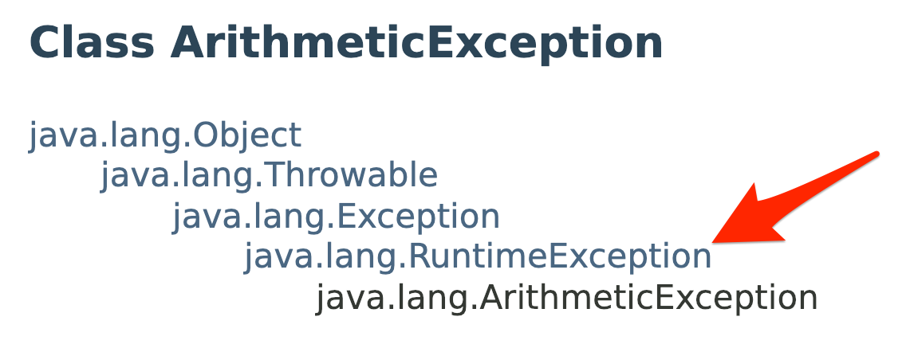

# Exceptions


## Prerequisites

This tutorial assumes that the reader has a knowledge of basic Unix commands and experience working
with a command-line text editor (e.g. emacs, vi, etc.). To get the most out of this tutorial,
you should follow along and take notes.

## Course-Specific Learning Outcomes

* **LO2.b:** Define, throw, and propagate exceptions appropriately in a software solution.

## Table of Contents

* [Definition](#definition)
* [Avoiding Exceptions](#avoiding-exceptions)
* [Handling Exceptions](#handling-exceptions)
* [Checked vs. Unchecked Exceptions](#checked-vs-unchecked-exceptions)
* [Identifying Checked vs. Unchecked Exceptions](#identifying-checked-vs-unchecked-exceptions)
* [Multiple Catch Blocks](#multiple-catch-blocks)
* [Explicitly Throwing Exceptions & Exception Propagation](#explicitly-throwing-exceptions--exception-propagation)
* [Regarding Scope](#regarding-scope)

## Definition

In Java, an **exception** is an event that occurs during the execution of a program that
encounters an error or some kind of exceptional situation. When an exception occurs,
two things happen:

1. an **exception object** is said to be _thrown_; and
1. the normal flow of control is disrupted.

You have likely encountered the dreaded
[`NullPointerException`](https://docs.oracle.com/en/java/javase/17/docs/api/java.base/java/lang/NullPointerException.html)
before reading this tutorial. If not, it's easy to create a program that will
throw a `NullPointerException` object:

```java
String s = null;
if (s.length() > 1) { // <------------------ throws NullPointerException object
    System.out.println("string length > 1");
} // if
```

If you run this code, then the JVM:
i) throws a `NullPointerException` object on the second line; and
ii) disrupts the normal flow of control to report to the
user that the exception was thrown and abruptly terminates the program.
Go ahead and test it out.

In general, there are two ways to deal with exceptions:

1. avoid them; and
2. handle them.

## Avoiding Exceptions

To *avoid the exception* in the example above, you need only ensure that you
do not invoke members (i.e., call methods or access instance variables)
using `s` when `s` is `null`.
Here are some examples:

```java
// use an if-statement to check
if (s != null) {
    if (s.length() > 1)) {
        System.out.println("string length > 1");
    } // if
} // if
```

```java
// avoid NPE via short circuiting
if ((s != null) && (s.length() > 1)) {
    System.out.println("string length > 1");
} // if
```

In general, in order to avoid an exception object, you need to understand the
conditions in which that exception object is thrown, then write code that
correctly identifies if those conditions are met prior to the line of code
that throws the exception object. Although it is relatively easy to amend code
to avoid `NullPointerException` objects as they arise when attempting to
invoke members of an object using a reference variable that contains the
value `null`, the same statement cannot be said about exception objects that
are thrown in more complicated exceptional situations. Here, we take complicated
to mean that there are a lot of conditions to check, including some that are
potentially tricky to identify. Such exceptions are generally handled
instead of avoided, although there is no reason a combination of both
handling and avoiding can be employed.

## Handling Exceptions

To *handle the exception* in the example above, you need to make use of a
special control flow snytax known as a **try block** or **try-catch block**.
With this syntax, you place code that can throw an exception into the
`try` block, then place code for how you want to deal with the exception
in the `catch` block. These two go together, which is why we often
refer to it as a try-catch block. During execution, each line in a `try` block
is executed until an exception object is thrown. When the exception is thrown,
the JVM redirects the flow of control into an appropriate associated
`catch` block. After the `catch` block is executed, flow of control is
redirected to immediately after the entire try-catch construct.
Here is an example:

```java
try {
    if (s.length() > 1)) {
        System.out.println("string length > 1");
    } // if
} catch (NullPointerException npe) {
    System.out.println("a NullPointerException was thrown!");
} // try
System.out.println("I will print regardless of the value of s.");
```

This try-catch block differentiates itself from the previous examples in
two ways:

1. we did not perform any condition checking for the exceptional
   situation--in this case, we did not compare the value of `s`
   to `null`; and

2. the exception is still reported, however, it's done so using code
   that we wrote (and, therefore, can customize) and using code
   that does not necessarily cause the program to abruptly terminate.

Here is a video with a more complicated example demonstrating the benefits of handling
exceptions instead of trying to avoid them:

https://www.youtube.com/watch?v=TETdh48t4YM

<a href="https://www.youtube.com/watch?v=TETdh48t4YM">

</a>

## Checked vs. Unchecked Exceptions

In Java, exceptions are either _checked_ or _unchecked_.
Checked exceptions must be explicitly caught or propagated by the programmer,
whereas unchecked exceptions may or may not be handled by the programmer.
Let's look at an example.

1. On Odin, create the class `exceptions.Unchecked` containing the following code:

   ```java
   package exceptions;

   public class Unchecked {
       public static void main(String [] args) {
          int result = 4/0;
          System.out.println(result);
       } // main
   } // Test
   ```

1. Compile and run `exceptions.Unchecked`. You should get an error message similar to the following
   when you run the program:

   ```
   Exception in thread "main" java.lang.ArithmeticException: / by zero
      at exceptions.Unchecked.main(Unchecked.java:5)
   ```
   An [`ArithmeticException`](https://docs.oracle.com/en/java/javase/17/docs/api/java.base/java/lang/ArithmeticException.html)
   (specifically, a divide by zero) caused our program to crash. Since `ArithmeticException` is an **unchecked exception**, the
   Java compiler did not force us (the programmer) to catch or propagate this exception.  It is completely up to the programmer to decide
   whether or not to handle exceptions of this type. You've probably experienced other, unchecked exceptions such as:
   [`StringIndexOutOfBoundsException`](https://docs.oracle.com/en/java/javase/17/docs/api/java.base/java/lang/StringIndexOutOfBoundsException.html),
   [`NullPointerException`](https://docs.oracle.com/en/java/javase/17/docs/api/java.base/java/lang/NullPointerException.html),
   [`NumberFormatException`](https://docs.oracle.com/en/java/javase/17/docs/api/java.base/java/lang/NumberFormatException.html), etc.

1. On Odin, create the class `exceptions.Checked` containing the following code:

   ```java
   package exceptions;

   import java.util.Scanner;
   import java.io.File;

   public class Checked {
       public static void main (String[] args) {
           File notesFile = new File("notes.txt");
           Scanner input = new Scanner(notesFile);
           System.out.println(input.nextLine());
       } // main
   } // Checked
   ```

   In this program, we are reading the first line of the file `notes.txt`. The first line of the `main` method creates a `File` object
   which is referred to by `notesFile`.  Then, it passes this object reference to the `Scanner` constructor.  As you may have guessed, the
   `input` object will read its input from the file (not the keyboard).  We will create the `notes.txt` file in a later step.

1. Compile `Checked.java`.  You should get an error similar to the following:

   ```
   src/exceptions/Checked.java:9: error: unreported exception FileNotFoundException; must be caught or declared to be thrown
      Scanner input = new Scanner(notesFile);
                      ^
   ```
   This error indicates that the `Scanner` constructor throws a `FileNotFoundException`.  `FileNotFoundException` is a
   **checked exception**.  When a method or constructor call throws a checked exception, the programmer must either:
      * surround the relevant call with a try-catch or
      * add a throws clause to the enclosing method (i.e., the method containing the call) to propogate this exception if it occurs.

   In `Checked.java`, the enclosing method is `main`.  We never want to add a `throws` clause to the `main` method as there is no code in
   our program above the `main` method to handle the exception. To fix `Checked.java`, we will use the first approach.

1. Now, let's modify `Checked.java` to include an appropriate try-catch:

   ```java
   import java.util.Scanner;
   import java.io.File;
   import java.io.FileNotFoundException;

   public class Checked {
       public static void main (String[] args) {
           File notesFile = new File("notes.txt");
           Scanner input = null;
           try {
               input = new Scanner(notesFile);
           } catch(FileNotFoundException e) {
               System.out.println(e.getMessage());
           }
           System.out.println(input.nextLine());
       } // main
   } // Checked
   ```

1. Create a `notes.txt` file in the directory where you will execute the program. Add a single line of text to the file.

1. Execute `exceptions.Checked`.  It should print the first line of `notes.txt`.

## Identifying Checked vs. Unchecked Exceptions

For now, we will use a simple method for checking if an exception is checked or unchecked.

1. Visit the Java API page for [`ArithmeticException`](https://docs.oracle.com/en/java/javase/17/docs/api/java.base/java/lang/ArithmeticException.html).

1. At the top of the page, there is a hierarchy of Java classes which looks like this:

   

   You can tell that `ArithmeticException` is an unchecked exception because `java.lang.RuntimeException` is listed in the hierarchy. If
   you cannot find `java.lang.RuntimeException` in the hierarchy for a given exception, then that tells you it is a checked exception.

1. For an example of a checked exception, see
[`FileNotFoundException`](https://docs.oracle.com/en/java/javase/17/docs/api/java.base/java/io/FileNotFoundException.html)

## Multiple Catch Blocks

Here is a video that demonstrates how to handle multiple exceptions at the same
time using multiple catch blocks:

https://www.youtube.com/watch?v=j-GNWvLNLjs

<a href="https://www.youtube.com/watch?v=j-GNWvLNLjs">

</a>

## Explicitly Throwing Exceptions & Exception Propagation

Now that you have seen how to handle exceptions in code written by others
that can throw exceptions, it's important understand how and why you can
throw exceptions yourself. In Java, the `throw` keyword is used to explicitly
throw an exception. Here is an example where we create an
[`IllegalArgumentException`](https://docs.oracle.com/en/java/javase/17/docs/api/java.base/java/lang/IllegalArgumentException.html)
and explicitly throw it:

```java
throw new IllegalArgumentException("nums array cannot be empty");
```

Since this line of code is known to throw an exception, we would
usually want to handle the exception by placing the line in a try block.
That may not always be ideal. Instead of handling the exception immediately,
let's make it someone else's responsibility using the `throws` keyword
in the signature of the method containing the line:

```java
int computeAverage(double[] nums) throws IllegalArgumentException {
    if (nums.length == 0) {
        throw new IllegalArgumentException("nums array cannot be empty");
    } // if
    double sum = 0;
    for (double num : nums) {
        sum += num;
    } // for
    return sum / nums.length;
} // computeAverage
```

Using the `throws` keyword, we told Java that the `IllegalArgumentException`
will not be handled directly in this method. Intead it will be _propagated_
up to the calling method, i.e., the method or methods, somewhere else, that are
actually calling `computeAverage`. In that other method, the programmer
can either handle the exception (using a try-catch) or choose to propagate it again
by repeating the `throws` in the calling method's signature.

In Java, checked exceptions must either be handled directly using a try-catch
or progated up using `throws`. Note, while it is possible to place a `throws`
in the signature of a program's `main` method, doing so is _strongly_ discouraged
as exceptions propagated past `main` will always cause the program to crash.

## Regarding Scope

The same basic scoping rules (i.e., what can be seen within a method when curly
braces are involved) that you are used to for if-statements and loops also apply
to try-blocks and catch-blocks. If you declare a variable inside a try-block or
catch-block, then its scope only extends to what is inside that block.

To illustrate this, we have included an *unfinished*
[`cs1302.scope.Example`](src/cs1302/scope/Example.java)
program with this tutorial that does not compile due to a scoping issue. Here is
the ``main`` method for that program:

```java
public static void main(String[] args) {

    try {
        String filename = args[0];
        File file = new File(filename);
    } catch (ArrayIndexOutOfBoundsException boundsException) {
        System.err.println("first command-line argument is missing");
    } // try

    try {
        PrintWriter output = new PrintWriter(file);
    } catch (FileNotFoundException notFoundException) {
        System.err.print("unable to open file for writing: ");
        System.err.println(notFoundException.getMessage());
    } // try

} // main
```

When you attempt to compile this example program, the compiler will emit
a `cannot find symbol` error similar to the following:

```
src/cs1302/scope/Example.java:22: error: cannot find symbol
            PrintWriter output = new PrintWriter(file);
                                                 ^
  symbol:   variable file
  location: class Example
1 error
```

Issues like simple typos, missing import statements, and even an incorrect
classpath often cause the Java compiler to emit the `cannot find symbol`; however,
the cause of this particular `cannot find symbol` error is related to the
scope of the symbol (the variable `file`), which does not extend to a specific
line of code that attempts to use that symbol, as indicated by error message.

Since the variable `file` is declared inside the try-block, its scope only
extends to subsequent lines within the try-block, as illustrated below.

```java
try {
    String filename = args[0];
    File file = new File(filename);
    // <---- ✓ scope of `file` extends to this line
    // <---- ✓ and this line
} catch (ArrayIndexOutOfBoundsException boundsException) {
    System.err.println("first command-line argument is missing");
    // <---- ✗ but NOT this line
} // try
// <---- ✗ NOR this line
// <---- ✗ nor any of the lines below
```

There are two high-level strategies for dealing with this kind of scoping issue:

1. Increase the symbol's scope by declaring and initializing it on a line
   that precedes the enclosing try-block and changing original declaration to a
   simple assignment -- this strategy is also sometimes used to fix similar scoping
   issues with variables declared in if-statements and loops. If you are able to
   extend the variable's scope to line that uses the symbol, then the compiler will
   be able to find it. This strategy does come at a cost:

   * The code that uses the variable after the try-catch cannot and should not
     assume the code in the try-block is ever executed as a thrown exception may
     cause it to get skipped. For example, if you initialize a reference variable to
     `null` prior to a try-catch and reassign it to something that's not `null` within
     the try-block, then the code after the try-catch needs to account for the
     possibility that the variable was never reassigned and is still `null`. If it
     does not, then it runs the risk of throwing an unchecked `NullPointerException`
     during runtime.

     ```java
     public static void main(String[] args) {

         File file = null;

         try {
             String filename = args[0];
             file = new File(filename);
         } catch (ArrayIndexOutOfBoundsException boundsException) {
             System.err.println("first command-line argument is missing");
         } // try

         try {
             PrintWriter output = new PrintWriter(file); // <--- risk NullPointerException
         } catch (FileNotFoundException notFoundException) {
             System.err.print("unable to open file for writing: ");
             System.err.println(notFoundException.getMessage());
         } // try

     } // main
     ```

2. Place code that depends on the symbol within the try-block with the understanding
   that it will be skipped should an exception occur within the try-block before that
   line (as execution flows to a corresponding catch-block).

   * This strategy often requires changes to multiple lines of code; however, it also often
     leads to a more elegent solution, as illustrated below:

     ```java
     public static void main(String[] args) {

         try {
             String filename = args[0];
             File file = new File(filename);
             PrintWriter output = new PrintWriter(file);
         } catch (ArrayIndexOutOfBoundsException boundsException) {
             System.err.println("first command-line argument is missing");
         } catch (FileNotFoundException notFoundException) {
             System.err.print("unable to open file for writing: ");
             System.err.println(notFoundException.getMessage());
         } // try

     } // main
     ```

Here is a short video demonstrating these concepts:

https://www.youtube.com/watch?v=DlmrBF7pP1k

<a href="https://www.youtube.com/watch?v=DlmrBF7pP1k">

</a>
<hr/>

[](http://creativecommons.org/licenses/by-nc-nd/4.0/)

<small>
Copyright &copy; Michael E. Cotterell, Brad Barnes, and the University of Georgia.
This work is licensed under a <a rel="license" href="http://creativecommons.org/licenses/by-nc-nd/4.0/">Creative Commons Attribution-NonCommercial-NoDerivatives 4.0 International License</a> to students and the public.
The content and opinions expressed on this Web page do not necessarily reflect the views of nor are they endorsed by the University of Georgia or the University System of Georgia.
</small>
