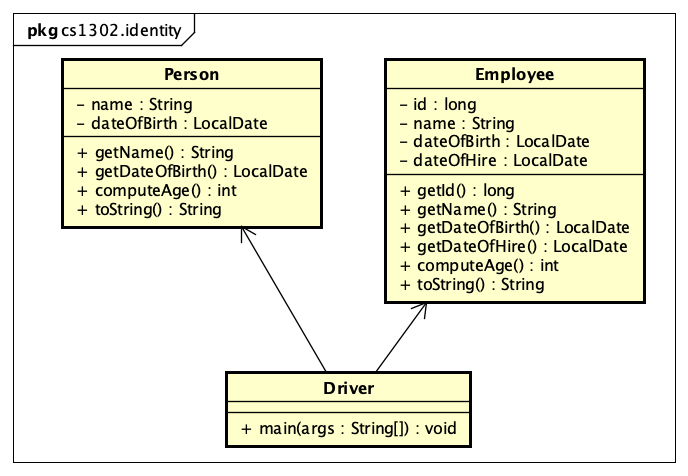
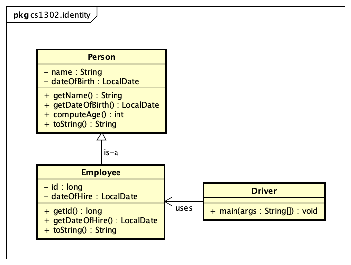
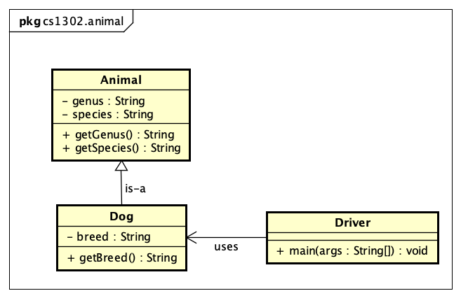

# Inheritance


This tutorial introduces the reader to Java inheritance and polymorphism via inheritance.

### Prerequisites

This tutorial assumes that the reader has a knowledge of basic Unix commands and experience working
with a command-line text editor (e.g. emacs, vi, etc.). The reader should be familiar with compiling
and running Java code contained in packages and working with the Javadoc tool.

To get the most out of this tutorial, you should follow along and take notes.

### Course-Specific Learning Outcomes

* **LO2.e:** (Partial) Utilize existing generic methods, interfaces, and classes in a software solution.
* **L04.c:** (Partial) Design, create and use inheritance relationships in a software solution.

### Getting Started

The steps in this tutorial assume that you are logged into the Odin server.

1. Use the following command to download and execute a shell script that retrieves
   the starter code for this tutorial and places it into a subdirectory
   called `cs1302-interfaces`:

   ```
   $ curl -s -L https://git.io/fjAqO | bash
   ```

1. Change into the `cs1302-inheritance` directory that was just created and look around. There should be
   multiple Java files contained within the directory structure. To see a listing of all of the
   files under the `person` and `animal` directories, use the `find` command as follows:

   ```
   $ find person animal
   ```

### What is Inheritance?

In its simplest terms, **inheritance** in Java is a way to create a new class based on an
existing class without the need for any manual copy-paste of the source code.
This is demonstrated in the video example below.

To follow along with the video you'll need to first:

   1. Change into the `person` subdirectory of `cs1302-inheritance`.

   1. Create a `bin` directory.

   1. Follow along with Dr. Cotterell:

   https://www.youtube.com/watch?v=V5Y85rfMfPw

   <a href="https://www.youtube.com/watch?v=V5Y85rfMfPw">
   
   </a>

Here is a UML diagram for the starter code:



After replicating the steps in the video, an inheritance relationship is
established. The UML diagram below illustrates this new relationship
(note the different arrow head types and number of items in the child class):



### Basic Terminology

Here are some terms that you should know related to inheritance in Java.

* **parent class**, **super class**, **base class** - the original class you want to extend.

* **child class**, **subclass** - the new class you want to create based on the parent class.

* **class hierarchy** - a collection of classes related by inheritance.

### What is Inherited?

In Java, when one class extends another, the child class inherits almost everything from the
parent class. Specifically, we are usually concerned with the fact that a child class inherits
instance variables and methods, regardless of their declared visibility, from its parent.
These _members_ are accessible, depending on their visibility, within the child class in much
the same way they would be accessible in the parent class. Even private instance variables are 
inherited. However, we should recall that they cannot be directly accessed outside of the class
in which they are declared.

### The `Object` Class

According the Java Language Specification, the
[`java.lang.Object`](https://docs.oracle.com/en/java/javase/11/docs/api/java.base/java/lang/Object.html)
class is the superclass for all other classes [1]. Take a few moments to look through 
the `Object` class documentation. Write down any methods you recognize and may have used in the past
in your notes. Remember, all classes that you create automatically inherit those methods. That is, 
if a class does not explicitly extend another class, then it implicitly extends `Object`. Therefore, 
`Object` is at the top of all inheritance hierarchies in Java.

### Constructors

Constructors are __not inherited in the usual sense__. That is, a parent constructor
does not become a constructor in the child class when inheritance is involved. However, child
constructors can invoke parent constructors via the `super` keyword. Java allows this
in order to facilitate a separation of concerns: let the parent class code be responsible 
for setting up the inherited variables. Let's illustrate this with a small
example:



To work through this example, perform the following steps:

1. Change into the `animal` subdirectory of `cs1302-inheritance`.

1. Create a `bin` directory.

1. Inspect the `.java` files under `src`. In particular, familiarize yourself with the code
   for the `Animal` and `Dog` classes.

1. Modify `Dog.java` so that the `Dog` constructor invokes the parent constructor via `super`,
   specifying `"Canis"` and `"Lupus Familiaris"` as the genus and species names, 
   respectively. This is similar to what was done in the first example video.

   **Since `genus` and `species` are declared with `private` visibility, you cannot do the following:**

   ```java
   super.genus = "Canis";
   super.species = "Lupus Familiaris"
   ```

   Even if the visibility allowed you to write the lines above, you should avoid doing so!
   There is already code that sets up these variables. It's in the parent constructor.
   Instead of duplicating code, just call the parent constructor.

1. Compile the `cs1302.animal.Animal` and `cs1302.animal.Dog` classes, specifying `bin`
   as the default package for compiled code. Since there is a dependency between those
   two classes, remember to properly specifiy the class path, as needed, when you compile.

1. Modify the `main` method in the `cs1302.animal.Driver` class to create some `Dog`
   objects, then print out information about them:

   ```java
   Dog bulldog = new Dog("Bulldog");
   System.out.println(bulldog.getGenus());
   System.out.println(bulldog.getSpecies());
   System.out.println(bulldog.getBreed());
   System.out.println();
   ```

   **Also add code for the following breeds:** poodle, beagle, and pug.

1. Compile the `cs1302.animal.Driver` class, specifying `bin` as the default package
   for compiled code and setting the class path as needed.

1. Run the `cs1302.animal.Driver` class. You should see the following output:

   ```
   Canis
   Lupus Familiaris
   Bulldog

   Canis
   Lupus Familiaris
   Poodle

   Canis
   Lupus Familiaris
   Beagle

   Canis
   Lupus Familiaris
   Pug
   ```

1. As you can see from the output, each `Dog` object does have a `genus` and `species`
   (inherited from `Animal`) that is set by the `Dog` constructor using the parameter
   values that you supplied. Furthermore, you can also see that each `Dog` object
   has the getter methods that it inherited and that they return the values of the
   inherited variables.

**IMPORTANT NOTE:** If a child constructor does not explicitly call a parent class
constructor via `super`, then Java will automatically add a call to `super()`, i.e.,
it will attempt to invoke the parent's default constructor if it exists.
**We always recommend explicitly calling a parent constructor**, even
if it's just `super()`, so that it's clear from reading the source code what
the your intent is.

### Method Overrides

Consider a scenario where a child class inherits some method from its parent, however,
the implementation of that method needs to be different in the child class. In Java,
this can be accomplished with a **method override**. Here's a video that illustrates
this:

https://www.youtube.com/watch?v=v5q1OCuCv8c

The starter code for the example in the video can be found [here](person/) and
under the `person` subdirectory of the `cs1302-inheritance` directory you
downloaded at the beginning of this tutorial. If you did the first part of this
tutorial, then you can follow along with this video.

<a href="https://www.youtube.com/watch?v=v5q1OCuCv8c">

</a>

Try to replicate what you saw in the video:

1. Change into the `person` subdirectory of `cs1302-inheritance`.

1. Follow along with the video!

**IMPORTANT NOTE:** You may have noticed the `@Override` above each `toString()`
method. This is an example of an **annotation**. In Java, annotations are used
to provide extra information to the compiler. In this case, the `@Override` is
an **optional** annotation that lets the compiler know your intent is to override.
Try the following scenarios:

1. Omit the `@Override`, then recompile.
1. Omit the `@Override` and mispell the `toString` method name, then recompile.
1. Include the `@Override` and mispell the `toString` method name, then recompile.

Notice the error that occurs in the thirs situation that did not occur in the
second. This is the primary purpose of the annotation. Although optional, it
allowd you to tell the compiler that your intent is to override. If the compiler
sees the `@Override` annotation, then it checks to make sure it's an override.

### References

* [1] [Java Language Specification 4.3.2. The Class `Object`](https://docs.oracle.com/javase/specs/jls/se11/html/jls-4.html#jls-4.3.2)

<hr/>

[](http://creativecommons.org/licenses/by-nc-nd/4.0/)

<small>
Copyright &copy; Michael E. Cotterell, Bradley J. Barnes, and the University of Georgia.
This work is licensed under a <a rel="license" href="http://creativecommons.org/licenses/by-nc-nd/4.0/">Creative Commons Attribution-NonCommercial-NoDerivatives 4.0 International License</a> to students and the public.
The content and opinions expressed on this Web page do not necessarily reflect the views of nor are they endorsed by the University of Georgia or the University System of Georgia.
</small>
