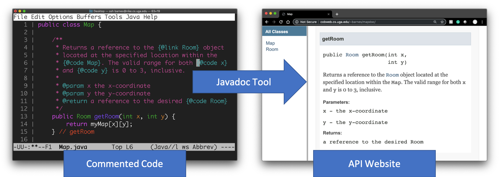

# Javadoc and API Documentation


## Prerequisites

This tutorial assumes that the reader has a knowledge of basic Unix commands and experience working 
with a command-line text editor (e.g. emacs, vi, etc.). To get the most out of this tutorial, 
you should follow along and take notes.

## Course-Specific Learning Outcomes

* **LO3.b:** Create class, interface, method, and inline documentation that satisfies a 
set of requirements.
* **LO3.c:** Generate user-facing API documentation for a software solution.

## Introduction

A well written, organized collection of code provides an **Application Programming Interface (API)**
for users of that code. That is, the design choices that were made in the naming of certain things
such as classes and methods impose an interface that programmers must follow when interacting with
that code. In many cases, the exact implementation for a piece of code is not available, and users 
must rely solely on documentation to help determine how that code should be used. 

Such documentation
is usually referred to as **API documentation**, and it should be written to provide enough detail 
so that others can use the code being documented without seeing the implementation of the code itself.
In other words, API documentation usually describes *what* a piece of code does and not *how* it
does what it does (i.e., unless absolutely needed to explain the "what"). As an example, most students 
are familar with the API documentation for the 
[`String`](https://docs.oracle.com/en/java/javase/11/docs/api/java.base/java/lang/String.html) and
[`Scanner`](https://docs.oracle.com/en/java/javase/11/docs/api/java.base/java/util/Scanner.html) classes
provided by Java.

By convention, API documentation for Java code is written directly in the source code in special
comments called Javadoc comments. The Javadoc tool is used to parse the source code and
Javadoc comments to produce a nicely formatted website for the documentation. 
Here is an example:



In the figure above, we see a Javadoc comment for the `getRoom` method. It starts with `/**`
and ends with `*/`. The body of the comment is a set of correctly punctuated English
sentences. Special `@` tags are used throughout the comment to provide semantic context
for terms. Semantic information is used to influence formatting in the generated website.
Toward the end of the comment, you see that the parameters and the return value are
documented using two `@param` tags and a `@return` tag.

In this tutorial, you will see Javadoc comments in action, write your own, and learn how 
to generate and host the corresponding API documentation website on Odin.

### Getting Started

The steps in this tutorial assume that you are logged into the Odin server. 

1. Use the following command to download and execute a shell script that retrieves 
   the starter code for this tutorial and places it into a subdirectory 
   called `cs1302-javadoc`:

   ```
   $ curl -s -L https://git.io/fh0nG | bash
   ```
  
1. Change into the `cs1302-javadoc` directory that was just created and look around. There should be
   a Java file contained within the directory structure. To see a listing of all of the 
   files under the current directory, use the `find` command as follows:
   
   ```
   $ find .
   ```
   
   Inspect the `.java` file that was listed. You will notice that some of the code contains special
   multiline comments that begin with `/**` instead of `/*`. These are known as Javadoc comments,
   and they are used to provide API documentation in Java. Some comments have been purposefully 
   omitted so that you can write them yourself later in this tutorial. For more information on
   the format of Javadoc comments and the various tags that are supported, see 
   [[1]](https://www.baeldung.com/javadoc) and
   [[2]](https://www.oracle.com/technetwork/java/javase/tech/index-137868.html).

### Generating the API Documentation Website

The Javadoc tool (`javadoc`) parses the Javadoc comments in a set of Java source files and 
produces a corresponding set of HTML pages describing classes, interfaces, constructors, 
methods, and fields. This effectively creates a website for the API documentation.

1. Make sure you are in `cs1302-javadoc`. Use the command presented below to 
   **generate the API documentation website** for the code contained in this 
   tutorial and place it in the `doc` subdirectory. 

   ```
   $ javadoc -d doc -sourcepath src -subpackages cs1302
   ```
   
   Here is a brief description of the command-line option that were used:
   * `-d` -- specifies the destination directory where javadoc saves the generated HTML files;
   * `-sourcepath` -- specifies the search paths for finding source files (`.java`); and
   * `-subpackages` -- specifies the packages for which documentation should be generated. 

   Be sure to verify that files were generated and placed in the `doc` directory before continuing.
   Take a few moments to consider each of the options above. Think about why the `javadoc` command
   may have needed all of these options and what exactly they mean. Carefully considering each
   command you write will give you a better understanding of what it does. If you have questions
   about any part of it, don't hesitate to ask!

### Hosting the API Documentation Website

Generating the API documentation is great, but seeing it is even better. You can use the steps
provided below to host the generated website using your Odin account. Alternative approaches 
to the explicit instructions provided below are explored in the FAQ section towards the end of 
this tutorial. 

1. Ensure that you have a `public_html` directory in your home directory. If the `~/public_html` 
   directory does not exist, then you should create it. The purpose of this directory on Odin (and
   on many systems) is to support user websites, which will be illustrated in the following steps. 
   You are fully responsible for anything that you host through your Odin website.

1. Use `ln`, as described below, to **create a symbolic link** (shortcut) in your `public_html` 
   directory to the `doc` subdirectory containing the API documentation website that you 
   created in a previous step. The exact command is presented below--it assumes you are currently 
   in the `cs1302-javadoc` directory. 

   ```
   $ ln -s $(pwd)/doc ~/public_html/cs1302-javadoc-doc
   ```
   
   **Note:** The `ln` command requires the **absolute path** to our link's target (in this case, `doc`). 
   Since our intended target is in the current directory, we know that its absolute path
   is the same as the absolute path of the current directory followed by `/` followed by
   the name of our target. We could manually figure out the desired path with the help of `pwd` 
   or we can use `$(pwd)`, as seen above, to fill in the output of `pwd` instead. You could also
   type out the entire absolute path but that would be tedious and error-prone.
   
   In this scenario, the symbolic link is called `cs1302-javadoc-doc`. You can see it if you
   change into your `public_html` directory and perform an `ls -l`. The entry for 
   `cs1302-javadoc-doc` in the long listing indicates that the file is a symbolic link in
   two different ways: i) an `l` is prefixed in the mode instead of `-` or `d`; and ii) the
   filename lists an arrow pointing to the link target. 

1. Navigate to the following URL in your web browser, replacing `user` with your Odin
   username:

   ```
   https://webwork.cs.uga.edu/~user/cs1302-javadoc-doc/
   ```

   Congratulations! If you followed the steps correctly, then you should see the API
   documentation website that you generated earlier. Does this website look similar to any 
   other websites that you may have visited? 

### Try It

1. When you first visit the website, you will see a link to the `Circle` class on the left and
   under the Class Summary. 
   If there were multiple classes within this package, it would display all of the classes 
   in the package. To see the documentation for the `Circle` class, click on either of the links.
   
1. Open `Circle.java` in your terminal. Compare the Javadoc comments for the `Circle` class to what
   you see on the website. Notice how the text is rendered differently in your browser based on the
   tags that were used in the comments. Look closely at the effect of `@code` vs. `@link`.

1. With `Circle.java` still open in your terminal, compare the Javadoc comments for the `Circle` 
   constructor to what you see under the Constructor Summary on the website. The Javadoc tool was
   able to correctly determine that this method is a constructor based on the fact that it has
   the same name as the class and is lacking a return type.
   
1. Take note of any Javadoc tags in the constructor comments that weren't present in the comments for
   the class. Our constructor takes in a parameter which is described using the `@param` tag.  
   Immediately after the `@param` tag is the name of the parameter followed by a description. The 
   `@throws` tag works similarly for any exceptions that are propagated by the method.
   
1. Notice that neither the `@param` nor the `@throws` descriptions are listed in the Method Summary
   section of the website.  To see those comments, you can either click on the constructor name in
   the Constructors list or scroll down to the Constructor Detail section of the webpage.
   
1. Under the Method Summary section, you will notice that only some of the methods contain Javadoc
   comments.  We intentionally left out the comments for the `setRadius`, `getDiameter` and `getArea`
   methods to give you an opportunity to write your own Javadoc comments.
   
1. Before adding comments to `Circle.java`, take a moment to look at the Method Detail section of the
   website. Compare a documented method (`getRadius` or `getPerimeter`) to an undocumented method.

1. In `Circle.java`, add Javadoc comments for each undocumented method. In each of your comments, 
   include a sentence that describes the method, along with tags that document, as needed, the parameters, 
   return type, and propagated exceptions. Use the `@code` tag where appropriate in your description.
   
1. Make sure you are in `cs1302-javadoc`. Use the same command presented earlier to regenerate the API 
   documentation website for the code contained in this tutorial. Executing this command will update the
   files in the `doc` directory. Remember, we created a symbolic link in `public_html` that targets `doc`.
   Therefore, we don't have to take additional steps to update the website--they are now visible by
   refreshing the page in your web browser. In other words, **you do not need to create the symbolic link
   again using `ln`**! Since the symbolic link points to your `doc` folder, it will automatically point
   to the newly generated content. Go look (refresh your browser page)!
   
### FAQ

1. __What is the difference between `throw`, `throws`, and `@throws`?__

   * The `throw` keyword is used in a block of code to 
     [explicitly throw an exception](https://github.com/cs1302uga/cs1302-tutorials/blob/master/exceptions/exceptions.md#explicitly-throwing-exceptions--exception-propagation).
     This is desirable when you want your method to throw an exception under
     some predefined conditions. If the exception object being thrown using `throw`
     is a [checked exception](https://github.com/cs1302uga/cs1302-tutorials/blob/master/exceptions/exceptions.md#checked-vs-unchecked-exceptions),
     then you might also need to include `throws` in the method signature.
     
   * The `throws` keyword is used in a method or constructor signature to list the checked exceptions
     that the method is allowed to [propagate](https://github.com/cs1302uga/cs1302-tutorials/blob/master/exceptions/exceptions.md#explicitly-throwing-exceptions--exception-propagation).
     
   * The `@throws` tag is a Javadoc tag that is used in the Javadoc comment associated with a method 
     (or constructor) to document that it can throw an exception under certain circumstances.
     The rule of thumb is this: **if your method throws an exception (checked or unchecked) that a 
     user of your method should handle, then you should document that exception using `@throws`
     in the associated Javadoc comment.**

1. __How do I update the documentation website?__

   To update the documentation website, rerun the same `javadoc` command you used to
   originally generate the website. You should _not_ need to recreate the symbolic
   link.

1. __Why not tell `javadoc` to generate the API documentation website directly in__ 
   __`~/public_html/cs1302-javadoc-doc` instead of `doc`?__
   
   That is definitely an option, assuming the `~/public_html/cs1302-javadoc-doc` directory
   already exists. We chose the symbolic link approach in the tutorial because
   it helps keep the `javadoc` command nice and short and to provide an example of
   a symbolic link.
   
1. __Why not use `cp` or `mv` to copy or move (respectively) the generated API documentation__
   __website directly to `~/public_html/cs1302-javadoc-doc` instead using `ln`?__
   
   Since our use of `ln` created a symbolic link to the `doc` directory, we can now
   regenerate the API documentation website in `doc` and have those changes be automatically
   reflected in `~/public_html/cs1302-javadoc-doc`. Also, from an organizational standpoint, 
   it makes sense to have the documentation contained within the main project directory.

### References

* [[1] Baeldung: Introduction to Javadoc](https://www.baeldung.com/javadoc)
* [[2] Oracle: How to Write Doc Comments for the Javadoc Tool](https://www.oracle.com/technetwork/java/javase/tech/index-137868.html)

<hr/>

**Feedback?** 
Please help us make this better!
If you have any feedback or suggestions for this reading or tutorial, then use 
the link below to reach the feedback form.

[](https://docs.google.com/forms/d/e/1FAIpQLSfBgZM_-G-9nKmX7F83k0Tgp1OlqBnrkt6vsxlIqLypc_keUQ/viewform?usp=pp_url&entry.1081181680=cs1302-javadoc&entry.1901270436=https://github.com/cs1302uga/cs1302-tutorials/blob/master/javadoc/javadoc.md)

<hr/>

[](http://creativecommons.org/licenses/by-nc-nd/4.0/)

<small>
Copyright &copy; Michael E. Cotterell, Brad Barnes, and the University of Georgia.
This work is licensed under a <a rel="license" href="http://creativecommons.org/licenses/by-nc-nd/4.0/">Creative Commons Attribution-NonCommercial-NoDerivatives 4.0 International License</a> to students and the public.
The content and opinions expressed on this Web page do not necessarily reflect the views of nor are they endorsed by the University of Georgia or the University System of Georgia.
</small>
