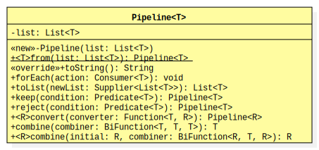

.. rst setup
.. sectnum::
.. .. |approval_notice| image:: https://img.shields.io/badge/Approved%20for-Fall%202021-blue
.. |approval_notice| replace:: **NOT READY FOR RELEASE**
.. copyright and license information
.. |copy| unicode:: U+000A9 .. COPYRIGHT SIGN
.. |copyright| replace:: Copyright |copy| Michael E. Cotterell, Bradley J. Barnes, and the University of Georgia.
.. |license| replace:: CC BY-NC-ND 4.0
.. _license: http://creativecommons.org/licenses/by-nc-nd/4.0/
.. |license_image| image:: https://img.shields.io/badge/License-CC%20BY--NC--ND%204.0-lightgrey.svg
                   :target: http://creativecommons.org/licenses/by-nc-nd/4.0/
.. standard footer
.. footer:: |license_image|

   |copyright| This work is licensed under a |license|_ license to students
   and the public. The content and opinions expressed on this Web page do not necessarily
   reflect the views of nor are they endorsed by the University of Georgia or the University
   System of Georgia.

==================================
Lambda Expressions: Video Examples
==================================

|approval_notice|

.. contents:: **Table of Contents**
   :depth: 3

----

This tutorial assumes that the reader is already familiar with
interface-based polymorphism and generics in Java.

Introduction
============

Processing the elements of a list explicit with multiple for-loops
can be tedious, repetitive, and potentially error prone. Consider
the following code that looks at the items in the list, keeps its
attention on the small items (length less than 6), converts those
items to upper case, then prints each one out such that they all
appear on the same line, all without modifying the original list:

.. code:: java

   List<String> list = List.<String>of("one", "two   ", "three", "stream", "world");

   List<String> copy = List.<String>copyOf(list);
   List<Integer> result = new LinkedList<Integer>();
   for (String item: copy) {
       if (item.length() < 6) {
           String allCaps = item.toUpperCase();
           result.add(allCaps);
       } // if
   } // for

   for (String item: result) {
       System.out.print(item + " ");
   } // for
   System.out.println();

.. code:: text

   ONE HELLO WORLD

Instead of expressing the overall computation as a sequence of
**imperative operations** on the individual elements of a list
(using a for-loop), let's express them more simply and concisely
as a *pipeline* of **aggregate operations**. Here is an example:

.. code:: java

   List<String> list = List.<String>of("one", "two   ", "three", "stream", "world");

   Pipeline.<String>from(list)
       .keep(item -> item.length() < 6)
       .convert(item -> item.toUpperCase())
       .forEach(item -> System.out.print(item + " "));
   System.out.println();

.. code:: text

   ONE HELLO WORLD

In this set of videos, we are going to implement a generic class called
``Pipeline<T>`` that will enable us to create **pipeline** objects from
**list** objects (i.e., objects of classes that implements Java's
``java.util.List<T>`` interface). The goal of a pipeline object is to
enable us to express our logic as a pipeline of aggregate operations,
as described above.

