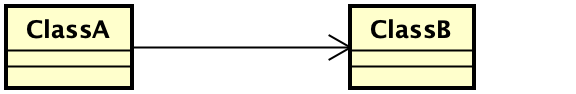
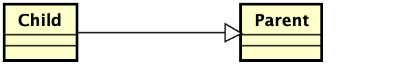
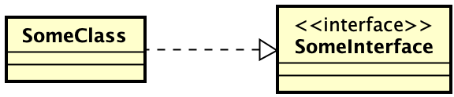

# UML Class Diagrams


## Introduction

In object-oriented programming, it's not uncommon to visualize classes
using the Unified Modeling Language (UML). While UML has many different
types of diagrams, this reading focusses only on UML class diagrams,
which are used to visualize classes and their associations.

### Basic Class Diagram

Consider the following UML class diagram:


The diagram consists of a rectangle broken up vertically into three sections:

1. **Class name.** In this case, the fully qualified name of the class is given.
   Sometimes, if multiple classes are given and assumed to be in the same package,
   then the simple name is used here instead.
   
1. **Variables.** In UML, the variables of a class are called _attributes_. In
   this example, there are two private instance variables (indicated with a `-`) 
   and one private static variable. In UML, attributes and methods are shown
   to be public with a `+` symbol to the left of the name. Static variables are underlined.
   
1. **Methods.** In UML, the methods of a class are called _operations_. In this
   example, there is one public constructor, two public (indicated by `+`) instance 
   methods, and one public static method. In UML, attributes and methods are shown
   to be public with a `+` symbol to the left of the name. Static methods are underlined.
   
The diagram above gives enough information for a programmer (or a program) to generate the following 
`Person.java` file:

```java
package cs1302.example;

public class Person {

    private String name;
    private int age;
    private static int personCounter;
    
    public Person(String name, int age) {
        ...
    } // Person
    
    public String getName() {
        ...
    } // getName
    
    public int getAge() {
        ...
    } // getAge

    public static int getPersonCounter() {
        ...
    } // getPersonCounter
    
} // Person
```

### Visibilities

UML supports the standard four visibilities:

| Visibility Name | Modifier Keyword | UML Symbol |
|-----------------|------------------|------------|
| private         | `private`        | `-`        |
| package private |                  | `~`        |
| protected       | `protected`      | `#`        |
| public          | `public`         | `+`        |

For an in-depth discussion on visibilities, see the [Visibility Reading](/visibility/visibility.md).

### Atributes and Parameters (Variables)

In UML, attributes and parameters are written in the following format:

```
visibility name : type
```

### Operations (Methods)

In UML, operations are written in the following format:

```
visibility [<<stereotype>>] methodName(param1: type, param2: type): returnType
```

### Stereotypes

A _stereotype_ is optional and is used to convey additional information. For
example, you might use the following stereotypes in different situations:

| Stereotype      | Description          |
|-----------------|----------------------|
| `<<new>>`       | Denotes constructor. |
| `<<abstract>>`  | Denotes abstract.    |
| `<<override>>`  | Denotes override.    |
| `<<interface>>` | Denotes interface.   |
| `<<final>>`     | Denotes final.       |

### Abstract Classes and Operations

The usual way to denote that a class or operation is abstract is to italicize the
name of class or operation. Sometimes this is impractical in situations where it's
difficult to discern the difference between the normal lettering of a font and
its italicized version. In such casses, the names might also be prefixed with
an `<<abstract>>` stereotype in order to better communicate the intention to the
viewer of the diagram. 

To illustrate the differences, consider the following three `Shape` classes:


In the diagram, the first class on the left is not abstract and the other two
are. While the italics in the middle class indicate that its abstract, it
can be easily confused as a non-abstract class if viewed quickly. For this
reason, we suggest you italicize and use a stereotype to indicate that a
class is abstract just as is done with the third class in the diagram. 

### Associations

When you have more than one class in a diagram, you often want to express
how they are associated. In UML, this is done with association arrows.
While UML supports many different kinds of association arrows, the following
are arguably the most common:

| Association                   | Description                               | Usage                                  |
|-------------------------------|-------------------------------------------|----------------------------------------|
|              | Solid line; open arrowhead.               | `ClassA` uses `ClassB`                 |
|        | Solid line; unfilled triangle arrowhead.  | `Child` extends `Parent`               |
|  | Dashed line; unfilled triangle arrowhead. | `SomeClass` implements `SomeInterface` |

**It may seem nit picky,** but each of these arrows is visually different
with respect to its line and its arrowhead!

<hr/>

[](http://creativecommons.org/licenses/by-nc-nd/4.0/)

<small>
Copyright &copy; Michael E. Cotterell, Bradley J. Barnes, and the University of Georgia.
This work is licensed under a <a rel="license" href="http://creativecommons.org/licenses/by-nc-nd/4.0/">Creative Commons Attribution-NonCommercial-NoDerivatives 4.0 International License</a> to students and the public.
The content and opinions expressed on this Web page do not necessarily reflect the views of nor are they endorsed by the University of Georgia or the University System of Georgia.
</small>
