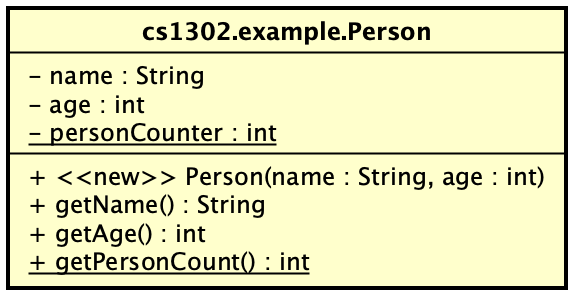
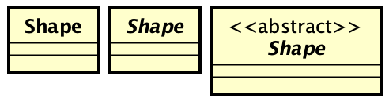

# UML Class Diagrams


## Introduction

In object-oriented programming, it's not uncommon to visualize classes
using the Unified Modeling Language (UML). While UML has many different
types of diagrams, this reading focusses only on UML class diagrams,
which are used to visualize classes and their associations.

### Basic Class Diagram

Consider the following UML class diagram:



The diagram consists of a rectangle broken up verticall into three sections:

1. **Class name.** In this case, the fully qualified name of the class is given.
   Sometimes, if multiple classes are given and assumed to be in the same package,
   then the simple name is used here instead.
   
1. **Variables.** In UML, the variables of a class are called _attributes_. In
   this example, there are two private instance variables and one private
   static variable.
   
1. **Methods.** In UML, the methods of a class are called _operations_. In this
   example, there is one public constructor, two public instance methods, and
   one public static method. 
   
The diagram above is enough to generate the following `Person.java` file:

```java
package cs1302.example;

public class Person {

    private String name;
    private int age;
    private static int personCounter;
    
    public Person(String name, int age) {
        ...
    } // Person
    
    public String getName() {
        ...
    } // getName
    
    public int getAge() {
        ...
    } // getAge

    public static int getPersonCounter() {
        ...
    } // getPersonCounter
    
} // Person
```

### Visibilities

UML supports the standard four visibilities:

| Visibility Name | Modifier Keyword | UML Symbol |
|-----------------|------------------|------------|
| private         | `private`        | `-`        |
| package private |                  | `~`        |
| protected       | `protected`      | `#`        |
| public          | `public`         | `+`        |

For an in-depth discussion of visibilities, see the [Visibility Reading](/visibility/visibility.md).

### Atributes and Parameters (Variables)

In UML, attributes and parameters are written in the following format:

```
visibility name : type
```

### Operations (Methods)

In UML, operations are written in the following format:

```
visibility [<<stereotype>>] methodName(param1: type, param2: type): returnType
```

### Stereotypes

A _stereotype_ is optional and is used to convey additional information. For
example, you might use the following stereotypes in different situations:

| Stereotype      | Description          |
|-----------------|----------------------|
| `<<new>>`       | Denotes constructor. |
| `<<abstract>>`  | Denotes abstract.    |
| `<<override>>`  | Denotes override.    |
| `<<interface>>` | Denotes interface.   |

### Abstract Classes and Operations

The usual way to denote that a class or operation is abstract is to italicize the
name of class or operation. Sometimes this is impractical in situations where it's
difficult to discern the difference between the normal lettering of a font and
its italicized version. In such casses, the names might also be prefixed with
an `<<abstract>>` stereotype in order to better communicate the intention to the
viewer of the diagram. 

To illustrate the differences, consider the following three `Shape` classes:




<hr/>

[](http://creativecommons.org/licenses/by-nc-nd/4.0/)

<small>
Copyright &copy; Michael E. Cotterell, Bradley J. Barnes, and the University of Georgia.
This work is licensed under a <a rel="license" href="http://creativecommons.org/licenses/by-nc-nd/4.0/">Creative Commons Attribution-NonCommercial-NoDerivatives 4.0 International License</a> to students and the public.
The content and opinions expressed on this Web page do not necessarily reflect the views of nor are they endorsed by the University of Georgia or the University System of Georgia.
</small>
