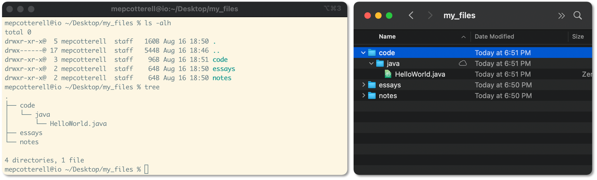
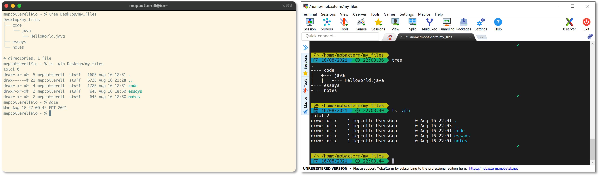
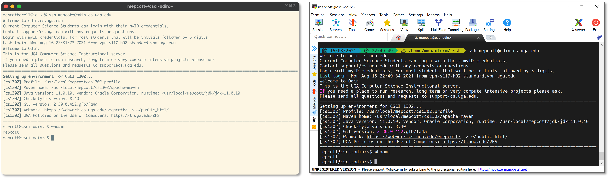
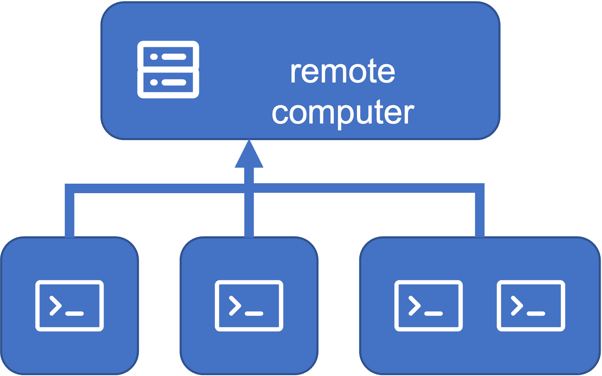

.. .. |approval_notice| image:: https://img.shields.io/badge/Approved%20for-Spring%202021-success
..    :alt: Approved for: Spring 2021
.. sectnum::

.. |approval_notice| image:: https://img.shields.io/badge/Status-Not%20Ready-red.svg

======
 Unix
======

|approval_notice|

.. contents:: **Table of Contents**
   :depth: 2

Getting Started
===============

Unix is a family of computer operating systems that derive from work performed
in the 1970s at the Bell Labs research center by Ken Thompson, Dennis Ritchie,
and others. In this course, we use the term Unix to refer to systems that are
Unix-like; i.e., their user interface and basic set of utilities are
reminiscent of a Unix system.

In Unix, the primary end-user, command-line interface to the system is a program
called the *shell*. This program can be usually be accessed via another program
called a *terminal emulator*. In the shell, you enter *commands* at a *prompt*.
Here are some examples of what such a prompt might look like:

.. code-block:: shell

   bash$

.. code-block:: shell

   zsh%

The shell is just another way to interact with computer. These days, all
students are familiar with the point-and-click graphical windowing systems
provided in operating systems like Windows, macOS, and even phones.
However, only some realize that the windowing system they're used to is
only one way to interact with a computer. Consider the figure below.

In the figure, two different interfaces to the same computer running the Unix-like
macOS operating system are presented. On the left, the window of a terminal
emulator (or a "terminal window," for short) is displayed containing the output
of the commands ``ls`` and ``tree`` (discussed later). On the right, the graphical
Finder app is displayed containing some of the same information.

Prompt and Circumstance
-----------------------

The text that a shell displays for its prompt will differ depending
the shell program itself and a user's profile settings. Consider the
two prompts shown in the introduction. Intentionally presented, the
``bash$`` prompt is similar to what a |bash|_ shell would produce, and
the ``zsh%`` prompt is similar to what a |zsh|_ shell would produce.
In this tutorial, we will not present any features that are specific
to either of these shells; instead, we will focus on general Unix
commands using syntax that is supported by both.

.. |bash| replace:: Bash
.. _bash: https://en.wikipedia.org/wiki/Bash_(Unix_shell)

.. |zsh| replace:: Zsh
.. _zsh: https://en.wikipedia.org/wiki/Z_shell

To keep things simple, we will follow a standard convention of denoting
the prompt with a single ``$`` character. Therefore, if you see a line
of text in this tutorial that begins with a single ``$`` character, then it
means that the text after the ``$`` character represents a command that
should be typed at a prompt. In such examples, the first ``$`` character
is **not** part of the command. To emphasize this, consider the following
example of the ``date`` command:

.. code-block:: shell

   $ date

When you try to execute the command on your own, do not include the
first ``$`` character in what you type or paste into your terminal emulator.  If
you forget to omit it, then your shell will interpret it as part of the
command itself. This is illustrated in the figures below.

.. figure:: img/prompt-correct.png?2

.. figure:: img/prompt-incorrect.png?2

Required Setup
--------------

Before you continue, you need to make sure that your computer is setup so
that you can follow along with the tutorial. If you are using a Windows
computer or a Mac, then please follow the instructions below that best match
your computer's operating system.

* `Setup on macOS <https://github.com/cs1302uga/cs1302-exercises/blob/master/misc/MacOS.md>`__
* `Setup on Windows 10 <https://github.com/cs1302uga/cs1302-exercises/blob/master/misc/Windows10.md>`__
  (should also work for Windows 11)

If you are using a Linux computer or a computer running a Unix-like operating
system (other than macOS), then do not fret -- they almost always come with a
terminular emulator installed. If you are not sure how to access the terminal
emulator provided by your operating system, then please consult your operating
system's documentation.

Local Terminal
--------------

When you run a terminal emulator, the usual default is for it
to connect to the same computer it is running on. This *local terminal*
provides a shell with a command-line interface to that computer. Consider the
figure below.

In the figure, we see two different terminal emulators running on two different
computers: the iTerm 2 terminal emulator on the left is running on macOS
and the MobaXterm terminal emulator on the right is running on Windows. While
the commands that were entered by the user are similar in both images, the output
is different because the commands are executing on different machines.

Most, if not all, of the basic commands that we present in the tutorial
should work within a local terminal. When they do not, you should seek out
and consult the documentation for your combination of terminal emulator and
operating system.

Remote Terminal
---------------

To make sure that readers all have roughly the same experience with the tutorial,
we will instruct them to use a local terminal to launch a program that will
connect their terminal emulator to a remote computer (often referred to as a
server). Once connected, that *remote terminal* provides a shell with a command-line
interface to that remote computer. Consider the figure below.

         both connected to a third, remote machine.

In the figure, we see two different terminal emulators running on two different
machines; however, both are connected to the same remote computer. Just like
you need credentials (e.g., a personal username and password) to access certain
websites or online apps, you will also need credentials to initiate a remote
terminal session. In the figure, the same user credentials were used in both
images, which means that that they are both logged in as the same user on
the remote computer. Since a terminal emulator is, itself, a program, you can
even have two terminal emulators on the same machine connected to the remote computer,
as illustrated in the figure below.

         all connected to a remote computer (center).

Most Unix-like operating systems support multiple users and multiple sessions
per user. The tutorial will show you how to establish a remote terminal
session. After that, you are encouraged to try logging in more than once to
see what it's like.

Tutorial
========

This tutorial assumes that the reader is a Computer Science student
at the University of Georgia with access to the department's
instructional server called Odin. If you were assigned this reading in a
CSCI class at UGA, then you probably have access.

Logging into a Unix Machine
---------------------------

Access to Odin is restricted behind a firewall. In order to access Odin, you
will need to connect to UGA's remote access VPN using the instructions found
`here <https://eits.uga.edu/access_and_security/infosec/tools/vpn/>`__.

``ssh``
+++++++

Your username on Odin is your UGA MyID and the password is the same one that
is associated with your MyID. Once you are successfully logged into the VPN,
open up a local terminal in your terminal emulator and execute the ``ssh``
(secure shell) command shown below to establish a secure connection -- be
sure to replace ``username`` with your MyID. When you type in your password,
it will not display anything to the screen -- this is the expected behavior.
Simply type in your password, then press the return key to continue.

.. code-block:: shell

   $ ssh username@odin.cs.uga.edu

.. figure:: img/login-demo.svg

If you have trouble logging into Odin, then please
contact support@cs.uga.edu as soon as possible.

``pwd``
+++++++

When you login to Odin, you are placed in your *home directory* (home folder).
You can see where your home directory is on the system with the help of the
``pwd`` (print working directory) command. It always displays the absolute
"path" of the directory that you are presently in. It is called an absolute
path, because it describes the directories that you would need to traverse
to get from the root of the filesystem to the current working directory one
directory at a time.

.. code-block:: shell

   $ pwd

.. figure:: img/pwd-demo.svg?1

.. code-block:: plain

   /
   └── home
       └── myid
           └── mepcott

* What your username?
* What is the absolute path of your home directory?

``whoami``
++++++++++

``date``
++++++++

Navigating the Filesystem
-------------------------

* ``ls``
* ``cd``, path, relative path, absolute path
* ``..``

New Directories and Regular Files
---------------------------------

* ``mkdir``
* ``touch``

Glossary
========

command
    Valid text input for a shell that instructs the shell to work
    with the operating system to accomplish some task (e.g.,
    running another program).

prompt
    The text produced by the shell to request user prompt.

shell
    A computer program that wraps access to an operating system's
    services via a command-line or graphical interface. If a shell
    provides a command-line interface, then services and other programs
    are managed via commands.

terminal
   A computer hardware interface for text entry and display. For example, a
   laptops's keyboard and display might be considered its terminal.

terminal emulator
    A computer program that emulates a terminal, usually whinin a window.
    If the emulated terminal is connected to the same computer that
    the terminal emulator program is running on, then it's often
    referred to as a *local terminal*; however, if the emulated
    terminal is connected to some other computer (e.g., a remote server),
    then it's called a *remote terminal*.

.. copyright and license information
.. |copy| unicode:: U+000A9 .. COPYRIGHT SIGN
.. |copyright| replace:: Copyright |copy| Michael E. Cotterell, Bradley J. Barnes, and the University of Georgia.
.. |license| replace:: CC BY-NC-ND 4.0
.. _license: http://creativecommons.org/licenses/by-nc-nd/4.0/
.. |license_image| image:: https://img.shields.io/badge/License-CC%20BY--NC--ND%204.0-lightgrey.svg
                   :target: http://creativecommons.org/licenses/by-nc-nd/4.0/
.. standard footer
.. footer:: |license_image|

   |copyright| This work is licensed under a |license|_ license to students
   and the public. The content and opinions expressed on this Web page do not necessarily
   reflect the views of nor are they endorsed by the University of Georgia or the University
   System of Georgia.

----

.. include:: navigation.rst
