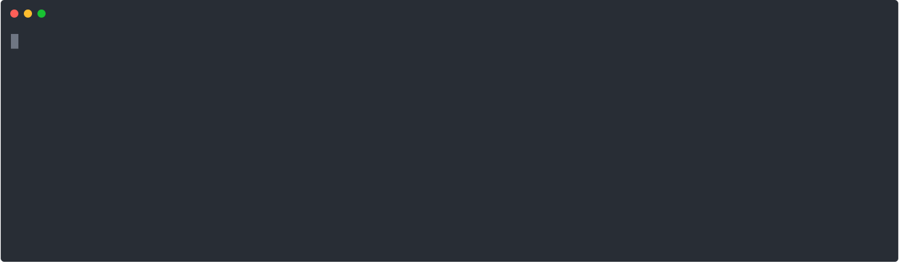
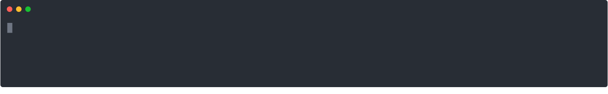

.. .. |approval_notice| image:: https://img.shields.io/badge/Approved%20for-Spring%202021-success
..    :alt: Approved for: Spring 2021
.. sectnum::

.. |approval_notice| image:: https://img.shields.io/badge/Status-Not%20Ready-red.svg

======
 Unix
======

|approval_notice|

.. contents:: **Table of Contents**
   :depth: 3

Getting Started
===============

Unix is a family of computer operating systems that derive from work performed
in the 1970s at the Bell Labs research center by Ken Thompson, Dennis Ritchie,
and others. In this course, we use the term Unix to refer to systems that are
Unix-like; i.e., their user interface and basic set of utilities are
reminiscent of a Unix system.

In Unix, the primary end-user, command-line interface to the system is a program
called the *shell*. This program can be usually be accessed via another program
called a *terminal emulator*. In the shell, you enter *commands* at a *prompt*.
Here are some examples of what such a prompt might look like:

.. code-block:: shell

   bash$

.. code-block:: shell

   zsh%

The shell is just another way to interact with computer. These days, all
students are familiar with the point-and-click graphical windowing systems
provided in operating systems like Windows, macOS, and even phones.
However, only some realize that the windowing system they're used to is
only one way to interact with a computer. Consider the figure below.

.. figure:: img/intro1.png
   :alt: Local terminal (left) and Finder app (right) on macOS.

In the figure, two different interfaces to the same computer running the Unix-like
macOS operating system are presented. On the left, the window of a terminal
emulator (or a "terminal window," for short) is displayed containing the output
of the commands ``ls`` and ``tree`` (discussed later). On the right, the graphical
Finder app is displayed containing some of the same information.

Prompt and Circumstance
-----------------------

The text that a shell displays for its prompt will differ depending
the shell program itself and a user's profile settings. Consider the
two prompts shown in the introduction. Intentionally presented, the
``bash$`` prompt is similar to what a |bash|_ shell would produce, and
the ``zsh%`` prompt is similar to what a |zsh|_ shell would produce.
In this tutorial, we will not present any features that are specific
to either of these shells; instead, we will focus on general Unix
commands using syntax that is supported by both.

.. |bash| replace:: Bash
.. _bash: https://en.wikipedia.org/wiki/Bash_(Unix_shell)

.. |zsh| replace:: Zsh
.. _zsh: https://en.wikipedia.org/wiki/Z_shell

To keep things simple, we will follow a standard convention of denoting
the prompt with a single ``$`` character. Therefore, if you see a line
of text in this tutorial that begins with a single ``$`` character, then it
means that the text after the ``$`` character represents a command that
should be typed at a prompt. In such examples, the first ``$`` character
is **not** part of the command. To emphasize this, consider the following
example of the ``date`` command:

.. code-block:: shell

   $ date

When you try to execute the command on your own, do not include the
first ``$`` character in what you type or paste into your terminal emulator.  If
you forget to omit it, then your shell will interpret it as part of the
command itself. This is illustrated in the figures below.

.. figure:: img/prompt-correct.png?2

.. figure:: img/prompt-incorrect.png?2

Required Setup
--------------

Before you continue, you need to make sure that your computer is setup so
that you can follow along with the tutorial. If you are using a Windows
computer or a Mac, then please follow the instructions below that best match
your computer's operating system.

* `Setup on macOS <https://github.com/cs1302uga/cs1302-exercises/blob/master/misc/MacOS.md>`__
* `Setup on Windows 10 <https://github.com/cs1302uga/cs1302-exercises/blob/master/misc/Windows10.md>`__
  (should also work for Windows 11)

If you are using a Linux computer or a computer running a Unix-like operating
system (other than macOS), then do not fret -- they almost always come with a
terminal emulator installed. If you are not sure how to access the terminal
emulator provided by your operating system, then please consult your operating
system's documentation.

Local Terminal
--------------

When you run a terminal emulator, the usual default is for it
to connect to the same computer it is running on. This *local terminal*
provides a shell with a command-line interface to that computer. Consider the
figure below.

.. figure:: img/local-terminals.png
   :alt: iTerm 2 on macOS Big Sur (left) and MobaXterm 21.2 on Windows 10 (right)

In the figure, we see two different terminal emulators running on two different
computers: the iTerm 2 terminal emulator on the left is running on macOS
and the MobaXterm terminal emulator on the right is running on Windows. While
the commands that were entered by the user are similar in both images, the output
is different because the commands are executing on different machines.

Most, if not all, of the basic commands that we present in the tutorial
should work within a local terminal. When they do not, you should seek out
and consult the documentation for your combination of terminal emulator and
operating system.

Remote Terminal
---------------

To make sure that readers all have roughly the same experience with the tutorial,
we will instruct them to use a local terminal to launch a program that will
connect their terminal emulator to a remote computer (often referred to as a
server). Once connected, that *remote terminal* provides a shell with a command-line
interface to that remote computer. Consider the figure below.

.. figure:: img/remote-terminals.png
   :alt: iTerm 2 on macOS Big Sur (left) and MobaXterm 21.2 on Windows 10 (right)
         both connected to a third, remote machine.

In the figure, we see two different terminal emulators running on two different
machines; however, both are connected to the same remote computer. Just like
you need credentials (e.g., a personal username and password) to access certain
websites or online apps, you will also need credentials to initiate a remote
terminal session. In the figure, the same user credentials were used in both
images, which means that that they are both logged in as the same user on
the remote computer. Since a terminal emulator is, itself, a program, you can
even have two terminal emulators on the same machine connected to the remote computer,
as illustrated in the figure below.

.. figure:: img/multi-user.png
   :alt: One terminal on one machine (left) and two terminals on a second machine (right)
         all connected to a remote computer (center).

Most Unix-like operating systems support multiple users and multiple sessions
per user. The tutorial will show you how to establish a remote terminal
session. After that, you are encouraged to try logging in more than once to
see what it's like.

Tutorial
========

This tutorial assumes that the reader is a Computer Science student
at the University of Georgia with access to the department's
instructional server called Odin. If you were assigned this reading in a
CSCI class at UGA, then you probably have access.

Logging into a Unix Machine
---------------------------

Access to Odin is restricted behind a firewall. In order to access Odin, you
will need to connect to UGA's remote access VPN using the instructions found
`here <https://eits.uga.edu/access_and_security/infosec/tools/vpn/>`__.

``ssh``
+++++++

Your username on Odin is your UGA MyID and the password is the same one that
is associated with your MyID. Once you are successfully logged into the VPN,
open up a local terminal in your terminal emulator and execute the ``ssh``
(secure shell) command shown below to establish a secure connection -- be
sure to replace ``username`` with your MyID. When you type in your password,
it will not display anything to the screen -- this is the expected behavior.
Simply type in your password, then press the return key to continue.

.. code-block:: shell

   $ ssh username@odin.cs.uga.edu

.. figure:: img/login-demo.svg

If you have trouble logging into Odin, then please
contact support@cs.uga.edu as soon as possible.

When typing into a remote terminal, the commands that you enter
are executed on the remote computer. It might look like you are
running programs locally, but they are simply being displayed
locally.

``echo``, ``env``, ``bash``
+++++++++++++++++++++++++++

On Odin, the shell that is launched when you login (i.e., the *login shell*)
is GNU `bash <bash>`__. On most Unix-like systems, the login procedure not only
launches a login shell, it also exposes the location of the login shell program
via a ``$SHELL`` variable that is available in your shell's running environment.
You can display this and other environment variables in a line of text using the
``echo`` command. Once ``echo`` is finished running, control returns to the shell
that launched it -- this is the usual behavior for programs launched via shell
commands.

.. code-block:: shell

   $ echo "login shell: $SHELL"

* Is ``bash`` still the login shell when you login?
  If not, then please inform your instructor!

If you are interested in the environment variables that are available to you,
then you can list them using the ``env`` (environment) command -- the variable
names are displayed without the ``$`` prefix.

.. code-block:: shell

   $ env

* What is the value of your ``$HOME`` variable?

Remember, the shell itself is a program, and one of the things it does is help
us run other programs. To see what version of ``bash`` is running, you run
``bash`` itself with ``--version`` supplied as a command-line argument.

.. code-block:: shell

   $ bash --version

* Odin may have received updates since this tutorial was written.
  What version of ``bash`` is available when you are logged in?

The GNU of GNU bash is an extensive collection of free programs
maintained by the Free Software Foundation. The word "GNU" is a |racronym|_ that
stands for "GNU's Not Unix!" While the GNU project provides implementations of
most programs that people associate with Unix, some Unix-like operating
systems utilize different implementations. Don't let that deter you! The
different implementations of a "Unix program" usually support a common set
of features and a common command-line interface for those features. When
you encounter an implementation that offers an additional feature or
strays from the norm, then there are various ways to get help directly
from the machine the program is running on. We will cover some different
ways to get help later in this tutorial.

.. |racronym| replace:: recursive acronym
.. _racronym: https://en.wikipedia.org/wiki/Recursive_acronym

``pwd``
+++++++

When you login to Odin, you are placed in your *home directory* (home folder).
You can see where your home directory is on the system with the help of the
``pwd`` (print working directory) command. It always displays the absolute
"path" of the directory that you are presently in. It is called an absolute
path, because it describes the path of directories that you would need to
traverse to get from the root of the file system (i.e., the ``/`` directory)
to the current working directory one directory at a time.

.. code-block:: shell

   $ pwd

.. figure:: img/pwd-demo.svg?1

.. code-block:: plain

   /
   └── home
       └── myid
           └── mepcott

* What is the absolute path of your home directory?
* What character does an absolute path always start with, and
  what does it represent?

``date``, ``exit``, ``logout``, ``whoami``
++++++++++++++++++++++++++++++++++++++++++

Listed below are some easy commands that you can try out immediately, some
of which you may have seen in earlier examples.

.. table::

   ==========  ======================================================================================
   Command     Description
   ==========  ======================================================================================
   ``date``    Print the system date and time.
   ``exit``    Exit the current shell -- if the current shell is a login shell, this runs ``logout``.
   ``logout``  Exit the login shell.
   ``whoami``  Print the user name associated with the current user.
   ==========  ======================================================================================

If you run a shell inside your login shell, then a *subshell* is launched.
A subshell is not the login shell, even if they are instances of the same
shell program. A more precise definition for *login shell* is the *instance*
of the shell program that is launched when you login. For example, if you
run ``bash`` supplying the ``--norc`` command-line argument, then a ``bash``
subshell is launched with no customizations (e.g., no custom prompt text).
Just like most programs launched by a shell, when a subshell exits, control
returns to the shell that launched it.

.. code-block:: shell

   $ bash --norc

.. figure:: img/bash-bash-demo.svg?3

* What is the difference between the two ``exit`` commands in
  the example shown above?

The ``bash`` program can also be used to execute scripts containing sequences
of commands and more. We will cover the creation and execution of scripts in
another reading.

``.bash_profile``
+++++++++++++++++

To continue with this tutorial, the **CSCI 1302 shell profile** needs
to be enabled on your Odin account. Enabling this profile is also required
to complete coursework in CSCI 1302. A *shell profile* includes commands
and setting customizations that take effect when the profile is *sourced* (loaded).
When ``bash`` is launched as a login shell, it sources a default system profile,
then it looks in the user's home directory for ``.bash_profile``, ``.bash_login``,
and ``.profile`` files, in that order, and sources the first one that is available.

You may already have the CSCI 1302 shell profile enabled. If you do, then
you will see ``Setting up environment for CSCI 1302...``
followed by lines prefixed with ``[cs1302]`` when you login to Odin.

.. figure:: img/cs1302-profile-check-demo.svg?1

* If you see something similar to what is presented above when you login,
  then the CSCI 1302 shell profile is enabled on your account, and you should
  proceed immediately to the next section of this tutorial.

* If you do not see any of that when you login, then the CSCI 1302 shell profile
  is not enabled on your account. To enable it, execute the command below. The
  command adds a line to the ``.bash_profile`` file in your home directory so
  that the profile is sourced each time you login.

  .. code-block:: shell

     $ /usr/local/mepcott/cs1302.enable

  .. figure:: img/cs1302-profile-enable-demo.svg

  * Make sure that you logout, then login again before continuing.

Navigating the File System
-------------------------

Earlier in this tutorial, you experienced the ``pwd`` (print working directory)
command and were provided a brief introduction to absolute paths. In Unix, a
*directory file* or *directory* is same concept as a folder in other
operating systems; that is, in most cases the words "directory" and "folder"
are interchangeable. Your current working directory is the directory that you
are currently executing commands in. There are other directories, and in Unix,
they all organized under a top-most directory called ``/``, representing the
root of the file system. The macOS and Linux operating systems organize their
file systems the same way. If you are coming from a Windows background, then it
is not unreasonable to compare ``/`` to the ``C:`` drive.

For this part of the tutorial, we are going to assume that you have
some specific files in your home directory. To make sure that you
have these files, you should execute the command below. The command
may take a few seconds to run as it involves downloading some files
from the Internet.

.. code-block:: shell

   $ curl -s -L https://git.io/fjbdg | bash

.. figure:: img/nav-prep-demo.svg

``ls``, ``ls PATH``, ``tree PATH``
++++++++++++++++++++++++++++++++++

To list the files in your current working directory, use the ``ls`` (list)
command. It is common for ``ls`` to differentiate between directories
and regular files in its output using different colors.

.. code-block:: shell

   $ ls

.. figure:: img/ls-demo.svg?1

* How many directories and regular files are in your home directory?

The ``ls`` (list) command is not limited to the current working directory.
You can tell ``ls`` to list the files in some other directory by supplying a
path to that directory as a command-line argument.

.. code-block:: shell

   $ ls cs1302-unix

.. figure:: img/ls-path-demo.svg?1

* The paths used in the examples above are *relative paths*. Instead of describing
  the traversal path starting from ``/``, they describe the traversal path starting
  from the current working directory. The ``ls`` command also works with absolute paths.
  What is the command to list the files in your home directory using an
  absolute path?

While ``ls`` is nice and probably one of the most used Unix commands of all time,
it doesn't really let us see the whole picture without us issuing repetetive
``ls`` commands. To see the bigger picture, use the ``tree`` command, which
lists the contents of a directory in a tree-like format.

.. code-block:: shell

   $ tree cs1302-unix

.. figure:: img/tree-path-demo.svg

``ls -l``, ``ls -lh``
+++++++++++++++++++++

By defauly, the ``ls`` command displays the contents of a directory using its "simple"
output format. A "long" output option can be specified by supplying a ``-l`` as a
command-line argument.  In addition to the name of each file, the following information
is included in the "long" output format:

* file type,
* file mode bits (permissions),
* number of hard links
* owner name,
* group name,
* file size,
* modification timestamp

.. code-block:: shell

   $ ls -l cs1302-unix/books

.. figure:: img/ls-long-demo.svg?1

.. table::

   ===============  =====  ============  ==========  ===========  ================  ===========================
   [1]_ Mode        [2]_   [3]_ User     [4]_ Group  [5]_ Size    [6]_ Timestamp    [7]_ Name
   ===============  =====  ============  ==========  ===========  ================  ===========================
   ``-rw-r--r--.``  ``1``  ``mepcott``   ``myid``    ``1276233``  ``Feb 28 10:45``  ``moby_dick.txt``
   ``-rw-r--r--.``  ``1``  ``mepcott``   ``myid``    ``799645``   ``Feb 10  2021``  ``pride_and_prejudice.txt``
   ``-rw-r--r--.``  ``1``  ``mepcott``   ``myid``    ``607430``   ``Jun  9 12:45``  ``sherlock_holmes.txt``
   ===============  =====  ============  ==========  ===========  ================  ===========================

.. [1] **Mode:** the file type and permissions. The first character denotes the file type.
       Common file types include:

       =========  ==============
       Character  Type
       =========  ==============
       ``-``      regular file
       ``d``      directory file
       ``l``      symbolic link
       =========  ==============

       The next nine (9) characters denote the read (``r``), write (``w``), and execute (``x``) for permissions
       for the file's user (``u``), group (``g``), and others (``o``). Here is a breakdown for ``rw-r--r--``:

       =====  =====  =====  =====  =====  =====  =====  =====  =====
       User                 Group                Others
       -------------------  -------------------  -------------------
       ``r``  ``w``  ``x``  ``r``  ``w``  ``x``  ``r``  ``w``  ``x``
       =====  =====  =====  =====  =====  =====  =====  =====  =====
       ``r``  ``w``  ``-``  ``r``  ``-``  ``-``  ``r``  ``-``  ``-``
       ``✓``  ``✓``  ``✗``  ``✓``  ``✗``  ``✗``  ``✓``  ``✗``  ``✗``
       =====  =====  =====  =====  =====  =====  =====  =====  =====

       The eleventh (11) character specifies whether an alternate access method such as an access control list
       applies to the file in addition to the displayed permissions. This topic is beyond the scope of this
       reading, but for those who are curious, the ``.`` indicates that a file has an SELinux security context
       and no other alternate access method.

.. [2] **Hard Links:** TODO

.. [3] **User / Owner:** TODO

.. [4] **Group:** TODO

.. [5] **Size:** TODO

.. [6] **Last Modified Timestamp:** TODO

.. [7] **Name:** TODO

``cd PATH``
+++++++++++

``ls -a``, ``cd ..``
++++++++++++++++++++

``cd ~``, ``cd``
++++++++++++++++

Time-saving Tips
----------------

Tab Completion
++++++++++++++

Keyboard Shortcuts
++++++++++++++++++

Getting Help
------------

``--help``
++++++++++

``man``
+++++++

``apropos``
+++++++++++

``whatis``
++++++++++

Inspecting Files
----------------

``cat``, ``head``, ``tail``
+++++++++++++++++++++++++++

``less``
++++++++

``wc``
++++++

New Directories and Regular Files
---------------------------------

``mkdir``, ``mkdir -p``
+++++++++++++++++++++++

``touch``
+++++++++

Moving and Removing
-------------------

``mv``
++++++

``cp``, ``cp -r``
+++++++++++++++++

``rm``, ``rm -r``
+++++++++++++++++

Piping and File Redirection
---------------------------

``|``
+++++

``>``, ``>>``
+++++++++++++

``<``
+++++

Job Control
-----------

What is a Job?
++++++++++++++

``C-c``, ``C-z``
++++++++++++++++

``jobs``, ``fg``
++++++++++++++++

Glossary
========

command
    Valid text input for a shell that instructs the shell to work
    with the operating system to accomplish some task (e.g.,
    running another program).

prompt
    The text produced by the shell to request user prompt.

shell
    A computer program that wraps access to an operating system's
    services via a command-line or graphical interface. If a shell
    provides a command-line interface, then services and other programs
    are managed via commands.

terminal
   A computer hardware interface for text entry and display. For example, a
   laptops's keyboard and display might be considered its terminal.

terminal emulator
    A computer program that emulates a terminal, usually within a window.
    If the emulated terminal is connected to the same computer that
    the terminal emulator program is running on, then it's often
    referred to as a *local terminal*; however, if the emulated
    terminal is connected to some other computer (e.g., a remote server),
    then it's called a *remote terminal*.

.. copyright and license information
.. |copy| unicode:: U+000A9 .. COPYRIGHT SIGN
.. |copyright| replace:: Copyright |copy| Michael E. Cotterell, Bradley J. Barnes, and the University of Georgia.
.. |license| replace:: CC BY-NC-ND 4.0
.. _license: http://creativecommons.org/licenses/by-nc-nd/4.0/
.. |license_image| image:: https://img.shields.io/badge/License-CC%20BY--NC--ND%204.0-lightgrey.svg
                   :target: http://creativecommons.org/licenses/by-nc-nd/4.0/
.. standard footer
.. footer:: |license_image|

   |copyright| This work is licensed under a |license|_ license to students
   and the public. The content and opinions expressed on this Web page do not necessarily
   reflect the views of nor are they endorsed by the University of Georgia or the University
   System of Georgia.

----

.. include:: navigation.rst
