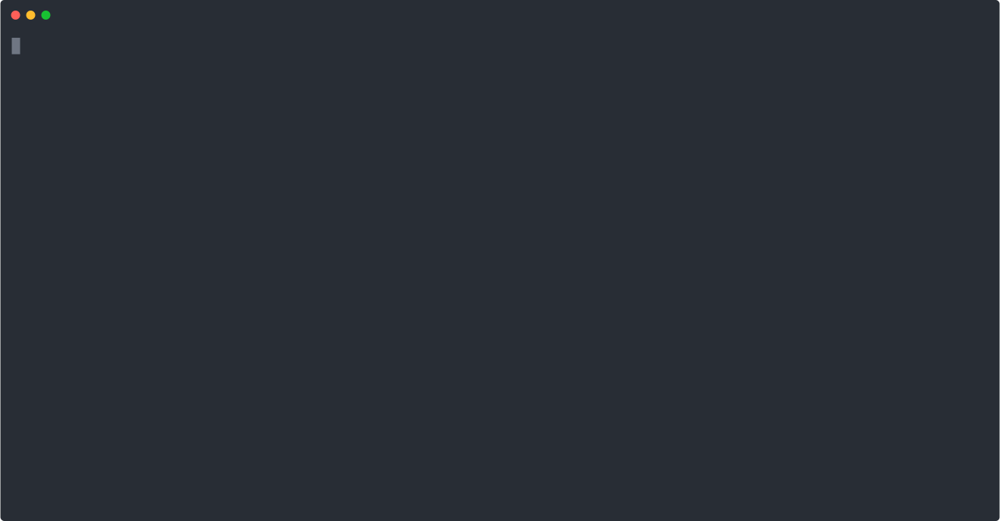
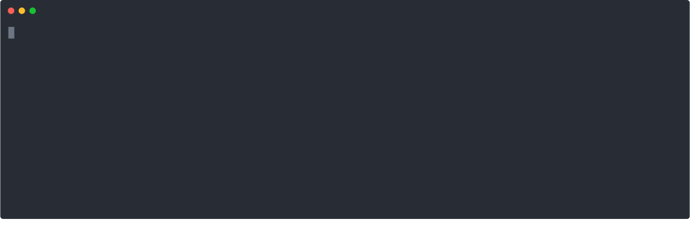
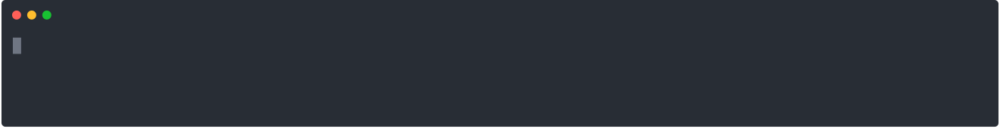
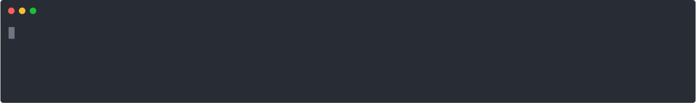
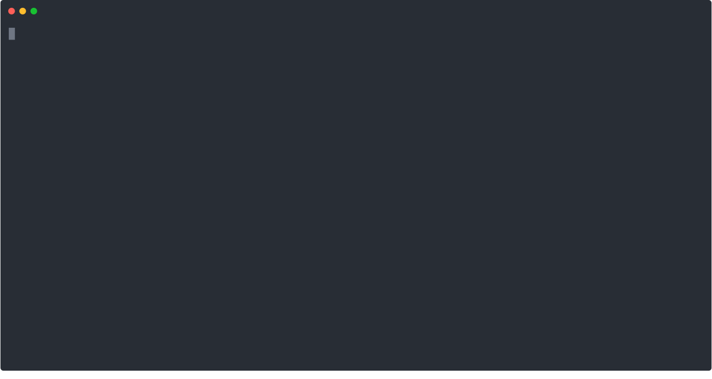
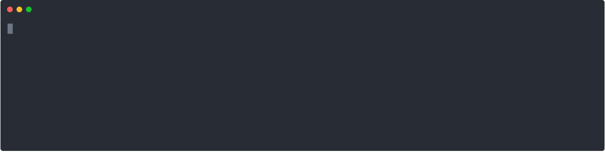

.. sectnum::
.. |approval_notice| image:: https://img.shields.io/badge/Status-Not%20Ready-red.svg

================
 Unix: Tutorial
================

|approval_notice|

.. contents:: **Table of Contents**
   :depth: 3

----

This tutorial assumes that the reader is a Computer Science student
at the University of Georgia with access to the department's
instructional server called Odin. If you were assigned this reading in a
CSCI class at UGA, then you probably have access.

Logging into a Unix Machine
---------------------------

Access to Odin is restricted behind a firewall. In order to access Odin, you
will need to connect to UGA's remote access VPN using the instructions found
`here <https://eits.uga.edu/access_and_security/infosec/tools/vpn/>`_.

``ssh``
+++++++

Your username on Odin is your UGA MyID and the password is the same one that
is associated with your MyID. Once you are successfully logged into the VPN,
open up a local terminal in your terminal emulator and execute the ``ssh``
(secure shell) command shown below to establish a secure connection -- be
sure to replace ``username`` with your MyID. When you type in your password,
it will not display anything to the screen -- this is the expected behavior.
Simply type in your password, then press the return key to continue.

.. code-block:: shell

   $ ssh username@odin.cs.uga.edu

If you have trouble logging into Odin, then please
contact support@cs.uga.edu as soon as possible.

When typing into a remote terminal, the commands that you enter
are executed on the remote computer. It might look like you are
running programs locally, but they are simply being displayed
locally.

.. table::

   =====================  ======================================================================
   Command                 Description
   =====================  ======================================================================
   ``ssh user@hostname``  Start a secure shell connection to ``hostname`` and login as ``user``.
   =====================  ======================================================================

``pwd``
+++++++

When you login to Odin, you are placed in your *home directory* (home folder).
You can see where your home directory is on the system with the help of the
``pwd`` (print working directory) command. It always displays the absolute
"path" of the directory that you are presently in. It is called an absolute
path, because it describes the path of directories that you would need to
traverse to get from the root of the file system (i.e., the ``/`` directory)
to the current working directory one directory at a time.

.. code-block:: shell

   $ pwd

.. figure:: img/pwd-demo.svg?1

.. code-block:: plain

   /
   └── home
       └── myid
           └── mepcott

* What is the absolute path of your home directory?
* What character does an absolute path always start with, and
  what does it represent?

.. table::

   ========  ======================================================================
   Command   Description
   ========  ======================================================================
   ``pwd``   Print absolute path of current working directory.
   ========  ======================================================================

``date``, ``exit``, ``whoami``
++++++++++++++++++++++++++++++

Listed below are some easy commands that you can try out immediately, some
of which you may have seen in earlier examples.

.. table::

   ==========  ======================================================================================
   Command     Description
   ==========  ======================================================================================
   ``date``    Print the system date and time.
   ``exit``    Exit the current shell.
   ``whoami``  Print the user name associated with the current user.
   ==========  ======================================================================================

``.bash_profile``
+++++++++++++++++

To continue with this tutorial, the **CSCI 1302 shell profile** needs
to be enabled on your Odin account. Enabling this profile is also required
to complete coursework in CSCI 1302. A *shell profile* includes commands
and setting customizations that take effect when the profile is *sourced* (loaded).
When ``bash`` is launched as a login shell, it sources a default system profile,
then it looks in the user's home directory for ``.bash_profile``, ``.bash_login``,
and ``.profile`` files, in that order, and sources the first one that is available.

You may already have the CSCI 1302 shell profile enabled. If you do, then
you will see ``Setting up environment for CSCI 1302...``
followed by lines prefixed with ``[cs1302]`` when you login to Odin.

.. figure:: img/cs1302-profile-check-demo.svg?1

* If you see something similar to what is presented above when you login,
  then the CSCI 1302 shell profile is enabled on your account, and you should
  proceed immediately to the next section of this tutorial.

* If you do not see any of that when you login, then the CSCI 1302 shell profile
  is not enabled on your account. To enable it, execute the command below. The
  command adds a line to the ``.bash_profile`` file in your home directory so
  that the profile is sourced each time you login.

  .. code-block:: shell

     $ /usr/local/mepcott/cs1302.enable

  .. figure:: img/cs1302-profile-enable-demo.svg

  * Make sure that you logout, then login again before continuing.

Navigating the File System
-------------------------

Earlier in this tutorial, you experienced the ``pwd`` (print working directory)
command and were provided a brief introduction to absolute paths. In Unix, a
*directory file* or *directory* is same concept as a folder in other
operating systems; that is, in most cases the words "directory" and "folder"
are interchangeable. Your current working directory is the directory that you
are currently executing commands in. There are other directories, and in Unix,
they all organized under a top-most directory called ``/``, representing the
root of the file system. The macOS and Linux operating systems organize their
file systems the same way. If you are coming from a Windows background, then it
is not unreasonable to compare ``/`` to the ``C:`` drive.

For this part of the tutorial, we are going to assume that you have
some specific files in your home directory. To make sure that you
have these files, you should execute the command below. The command
may take a few seconds to run as it involves downloading some files
from the Internet. You don't need to memorize or understand the command
below; you just need to execute in order to proceed with the tutorial.

.. code-block:: shell

   $ curl -s -L https://git.io/fjbdg | bash

``ls``, ``ls PATH``, ``tree PATH``
++++++++++++++++++++++++++++++++++

To list the files in your current working directory, use the ``ls`` (list)
command. It is common for ``ls`` to differentiate between directories
and regular files in its output using different colors.

.. code-block:: shell

   $ ls

.. figure:: img/ls-demo.svg?1

* How many directories and regular files are in your home directory?

The ``ls`` (list) command is not limited to the current working directory.
You can tell ``ls`` to list the files in some other directory by supplying a
path to that directory as a command-line argument.

.. code-block:: shell

   $ ls cs1302-unix

.. figure:: img/ls-path-demo.svg?1

* The paths used in the examples above are *relative paths*. Instead of describing
  the traversal path starting from ``/``, they describe the traversal path starting
  from the current working directory. The ``ls`` command also works with absolute paths.
  What is the command to list the files in your home directory using an
  absolute path?

While ``ls`` is nice and probably one of the most used Unix commands of all time,
it doesn't really let us see the whole picture without us issuing repetetive
``ls`` commands. To see the bigger picture, use the ``tree`` command, which
lists the contents of a directory in a tree-like format.

.. code-block:: shell

   $ tree cs1302-unix

.. table::

   ===============  ======================================================================================================
   Command          Description
   ===============  ======================================================================================================
   ``ls``           List contents of current working directory.
   ``ls PATH``      List contents of the last directory in the provided ``PATH`` (e.g., ``c`` in ``a/b/c`` or ``/a/b/c``).
   ``tree PATH``    List contents of the last directory in the provided ``PATH`` and its subdirecoties, in a tree format.
   ===============  ======================================================================================================

``ls -l``, ``ls -lh``
+++++++++++++++++++++

By defauly, the ``ls`` command displays the contents of a directory using its "simple"
output format. A "long" output option can be specified by supplying a ``-l`` as a
command-line argument. In addition to the name of each file, additional information
is included in the "long" output format, as described below the next few examples.

.. code-block:: shell

   $ ls -l cs1302-unix/books

.. figure:: img/ls-long-demo.svg?1

.. table::

   ===============  =====  ============  ==========  ===========  ================  ===========================
   [1]_ Mode        [2]_   [3]_ User     [4]_ Group  [5]_ Size    [6]_ Timestamp    [7]_ Name
   ===============  =====  ============  ==========  ===========  ================  ===========================
   ``-rw-r--r--.``  ``1``  ``mepcott``   ``myid``    ``1276233``  ``Feb 28 10:45``  ``moby_dick.txt``
   ``-rw-r--r--.``  ``1``  ``mepcott``   ``myid``    ``799645``   ``Feb 10  2021``  ``pride_and_prejudice.txt``
   ``-rw-r--r--.``  ``1``  ``mepcott``   ``myid``    ``607430``   ``Jun  9 12:45``  ``sherlock_holmes.txt``
   ===============  =====  ============  ==========  ===========  ================  ===========================

.. code-block:: shell

   $ ls -l cs1302-unix

.. table::

   ===============  =====  ============  ==========  ===========  ================  ===========================
   [1]_ Mode        [2]_   [3]_ User     [4]_ Group  [5]_ Size    [6]_ Timestamp    [7]_ Name
   ===============  =====  ============  ==========  ===========  ================  ===========================
   ``drw-r-xr-x.``  ``2``  ``mepcott``   ``myid``    ``85``       ``Aug 17 17:39``  ``books``
   ``drw-r-xr-x.``  ``4``  ``mepcott``   ``myid``    ``46``       ``Aug 17 17:39``  ``notes``
   ``-rw-r--r--.``  ``1``  ``mepcott``   ``myid``    ``9``        ``Aug 17 17:39``  ``README.md``
   ===============  =====  ============  ==========  ===========  ================  ===========================

.. [1] .. rubric:: **Mode**

       The file type and permissions. The first character denotes the file type.
       In Unix, file type refers to how the file behaves from the file system's perspective.
       File type and content format are different concepts. File suffixes like ``.txt``,
       ``.mp3``, ``.pdf``, etc. are all naming conventions for the content formats of certain
       regular files. Common file types include:

       =========  ==============  ===================
       Character  File Type       Description
       =========  ==============  ===================
       ``-``      regular file    text or binary data
       ``d``      directory file  collection of files
       ``l``      symbolic link   shortcut to a file
       =========  ==============  ===================

       The next nine (9) characters denote the read (``r``), write (``w``), and execute (``x``) permissions
       for the file's user (``u``), group (``g``), and others (``o``). We will go into more detail regarding
       file permissions later, but here is a quick breakdown for ``rw-r--r--``:

       =====  =====  =====  =====  =====  =====  =====  =====  =====
       User                 Group                Others
       -------------------  -------------------  -------------------
       R      W      X      R      W      X      R      W      X
       =====  =====  =====  =====  =====  =====  =====  =====  =====
       ``r``  ``w``  ``-``  ``r``  ``-``  ``-``  ``r``  ``-``  ``-``
       ✓      ✓      ✗      ✓      ✗      ✗      ✓      ✗      ✗
       =====  =====  =====  =====  =====  =====  =====  =====  =====

       File type cannot usually be changed after a file has been created; however, a file's permissions
       can always be changed by its owner, a superuser (administrator), or a program acting on behalf
       of either the owner or a superuser. It is also worth noting that superusers are usually not
       subject to permission restrictions.

       The eleventh (11) character specifies whether an alternate access method such as an access control list
       applies to the file in addition to the displayed permissions. This topic is beyond the scope of this
       reading, but for those who are curious, the ``.`` indicates that a file has an SELinux security context
       and no other alternate access method.

.. [2] .. rubric:: **Hard Links**

       This topic is outside the scope of this reading. If you are interested in hard links,
       then you are encouraged to read about them `here <wiki_hard_link>`_.
       Symbolic links are more common, and will discussed in a future reading.

       .. _wiki_hard_link: https://en.wikipedia.org/wiki/Hard_link

.. [3] .. rubric:: **User / Owner**

       The user denoted as the owner of the file. In most cases, the owner of a file
       is the user who created the file. A file's owner can only be changed by a superuser (administrator)
       or a program acting on behalf of a superuser. Unless the owner of a file is a superuser, the owner
       is subject to the user permissions indicated in the file's mode.

.. [4] .. rubric:: **Group**

       The user denoted as the group of the file. In most cases, a file's group is the same
       as its owner's group. A file's owner can only be changed by a superuser (administrator)
       or a program acting on behalf of a superuser. Users in a file's group that are not the
       file's owner or a superuser are subject to the group permissions indicated in the file's mode.

.. [5] .. rubric:: **File Size**

       Normally the size is printed as a byte count or block count without punctuation.
       These days, byte counts are not very readable, especially for larger file sizes. You can make
       the output more human-readable by supplying the ``-h`` (human-readable) option as a command-line
       argument to ``ls -l``. The human-readable output uses unites like ``K`` (kilobyte), ``M`` (megabyte),
       ``G`` (gigabyte), etc. whenever they apply. Block counts are usually shown for directories,
       but that topic is outside the scope of this reading.

.. [6] .. rubric:: **Last Modified Timestamp**

       The last time the contents of the file were modified or the file itself was touched. Often
       referred to as the file's last modification time. Neither reading a file nor changing a file's
       permissions modify the contents of a file, and thus do not cause a change in the file's
       modification time. A file's modification time is changed when a program writes to the file
       or uses the ``touch`` command to update the file's access and modification times to the
       current time.

.. [7] .. rubric:: **Filename:**

       The name of the file. Most systems limit the length of a filename to some value between
       14 characters (older systems) and 255 characters (newer systems), and they require that
       a filename be unique inside its directory. Except for the directory file ``/`` at the root
       of the file system, file names in Unix cannot contain the ``/`` character since
       it is used as the path separator character.

As mentioned in [5]_, you can supply ``-h`` as a command line argument to ``ls -l`` to
enable the display of human-readable units for file sizes. Many Unix programs
like ``ls`` allow you to combine single character (short) options into a single
command-line argument when entering the command at the shell prompt. All three
examples below produce the same output.

.. code-block:: shell

   $ ls -l -h cs1302-unix/books

.. code-block:: shell

   $ ls -h -l cs1302-unix/books

.. code-block:: shell

   $ ls -lh cs1302-unix/books

.. table::

   =================  ================================================================================================
   Command            Description
   =================  ================================================================================================
   ``ls -l``          ``ls`` uses long listing format
   ``ls -l -h``       ``ls`` uses long listing format with human-readable size units
   =================  ================================================================================================

``cd PATH``, ``cd -``, ``cd ~``, ``cd``
+++++++++++++++++++++++++++++++++++++++

So far, you know how to list the files in your home directory, your current working directory,
and other directories; however, all of the examples so far have utilized absolute or relative
paths in a way that kept you in your home directory. It's time for that to change, or rather
it's time for your current working directory to change. This can be done using the ``cd``
(change directory) command.

.. code-block:: shell

   $ cd cs1302-unix

.. code-block:: shell

   $ cd notes/cs1302

If you to change to the directory you were last in prior to your current working directory,
then supply ``-`` (minus sign) as a command-line argument to ``cd``.

.. code-block:: shell

   $ cd -

On most Unix systems, ``~`` (tilde) is an alias for the absolute path of your home directoy.
While you can use it with ``cd`` to change directly to your home directory, it's more commonly
used to change to directories nested under your home directory.

.. code-block:: shell

   $ cd ~/cs1302-unix/notes

If you use the ``cd`` command without supplying any command-line arguments, then it changes
to your home directory. How convenient!

.. code-block:: shell

   $ cd

.. table::

   =================  ================================================================================================
   Command            Change to
   =================  ================================================================================================
   ``cd``             home directory
   ``cd -``           last previous working directory
   ``cd a/b/dest``    ``dest``, assuming ``a`` is in the current directory and ``a/b/dest`` is a valid *relative* path
   ``cd /a/b/dest``   ``dest``, assuming ``/path/to/dest`` is a valid *absolute* path
   ``cd ~/a/b/dest``  ``dest``, assuming ``a`` is in your home directory and ``~/a/b/dest`` is a valid path
   =================  ================================================================================================

``ls -a``, ``cd ..``
++++++++++++++++++++

.. code-block:: shell

   $ ls -a

.. code-block:: shell

   $ ls .

.. code-block:: shell

   $ ls ..

.. code-block:: shell

   $ cd ..

.. code-block:: shell

   $ cd ../..

.. table::

   =================  ================================================================================================
   Command            Description
   =================  ================================================================================================
   ``ls -a``          ``ls`` shows hidden files (those that start with ``.``)
   ``ls .``           ``ls`` lists the contents of ``.`` (current directory); same as ``ls`` with no arguments
   ``ls ..``          ``ls`` lists the contents of ``..`` (parent directory)
   ``cd ..``          ``cd`` changes working directory to ``..`` (parent directory; "up one")
   ``cd ../..``       ``cd`` changes working directory to ``../..`` (parent of parent directory; "up two")
   =================  ================================================================================================

More Time-saving Tips
---------------------

Tab Completion
++++++++++++++

The tab completion feature in ``bash`` permits typing a partial command or path,
then pressing the ``TAB`` key to auto-complete the sequence. When multiple
completions are possible, pressing the ``TAB`` key again lists them all.

Keyboard Shortcuts
++++++++++++++++++

.. table::

   ========  ====================================================
   Key       Description
   ========  ====================================================
   ``C``     ``CRTL`` (control)
   ``M``     ``META`` (meta): usually ``ALT``, ``OPT`` or ``ESC``
   ========  ====================================================

.. table::

   ========  ==========================================
   Shortcut  Description
   ========  ==========================================
   ``C-a``   Move to beginning of line.
   ``C-e``   Move to end of line.
   ``C-f``   Move forward (right) one character.
   ``M-f``   Move forward (right) one word.
   ``C-b``   Move backward (left) one character.
   ``M-b``   Move backward (left) one word.
   ========  ==========================================

Getting Help
------------

``--help``
++++++++++

Many Unix programs print out information about what they do and
the command-line arguments they support when ``--help`` is supplied
as a command-line argument, usually by itself.

.. code-block:: shell

   $ ls --help

``man``
+++++++

Unix systems come with a digital copy of their manual, which provides
detailed information about the programs and features that are available.
To access the manual entry ("man" page) for a command, enter the ``man``
(manual) command and supply the command name you want to lookup as a
command-line argument. To exit a man page, press the ``q`` key.

.. code-block:: shell

   $ man ls

Inspecting Files
----------------

``cat``
+++++++

One quick way to display the contents of a regular file to standard output
is using the ``cat`` (concatenate [to standard output]) command, supplying
a path to the file you want to view as a command-line argument.

.. code-block:: shell

   $ cd ~/cs1302-unix/books
   $ cat sherlock_holmes.txt

``less``
++++++++

The ``cat`` command displays the entire contents of a file all at once,
which may not be desirabe for large files. To display the contents of
a regular file one page (or screen) at a time, use the ``less`` command
and supply a path to the file you want to view as a command-line argument.
To quit out of ``less``, press the ``q`` key. To move up and down one
page (screen) at a time, use the ``C-v`` and ``M-v`` shortcuts,
respectively.

.. code-block:: shell

   $ cd
   $ less ~/cs1302-unix/books/moby_dick.txt

``wc``
++++++

.. code-block:: shell

   $ cd ~/cs1302-unix/books
   $ wc moby_dick.txt

.. code-block:: shell

   $ cd ~/cs1302-unix/books
   $ wc -l moby_dick.txt

``grep``
++++++++

.. code-block:: shell

   $ cd ~/cs1302-unix/books
   $ grep "BOOK" moby_dick.txt

.. code-block:: shell

   $ cd ~/cs1302-unix/books
   $ grep -E "^BOOK " moby_dick.txt

.. code-block:: shell

   $ cd ~/cs1302-unix/books
   $ grep -v "BOOK" moby_dick.txt

New Directories and Regular Files
---------------------------------

``mkdir``, ``mkdir -p``
+++++++++++++++++++++++

``touch``
+++++++++

Moving and Removing
-------------------

``mv``
++++++

``cp``, ``cp -r``
+++++++++++++++++

``rm``, ``rm -r``
+++++++++++++++++

.. copyright and license information
.. |copy| unicode:: U+000A9 .. COPYRIGHT SIGN
.. |copyright| replace:: Copyright |copy| Michael E. Cotterell, Bradley J. Barnes, and the University of Georgia.
.. |license| replace:: CC BY-NC-ND 4.0
.. _license: http://creativecommons.org/licenses/by-nc-nd/4.0/
.. |license_image| image:: https://img.shields.io/badge/License-CC%20BY--NC--ND%204.0-lightgrey.svg
                   :target: http://creativecommons.org/licenses/by-nc-nd/4.0/
.. standard footer
.. footer:: |license_image|

   |copyright| This work is licensed under a |license|_ license to students
   and the public. The content and opinions expressed on this Web page do not necessarily
   reflect the views of nor are they endorsed by the University of Georgia or the University
   System of Georgia.
