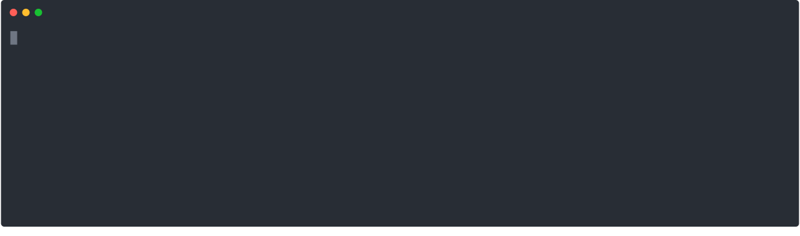
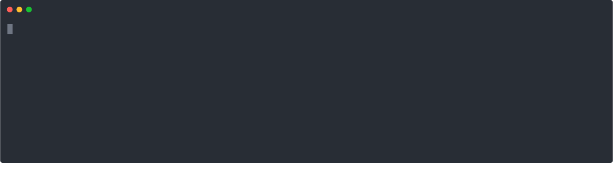
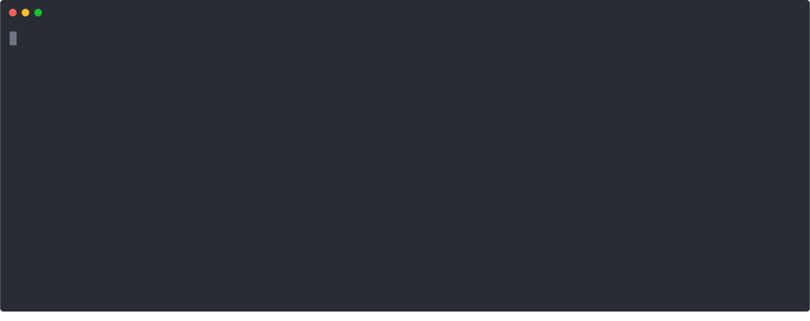
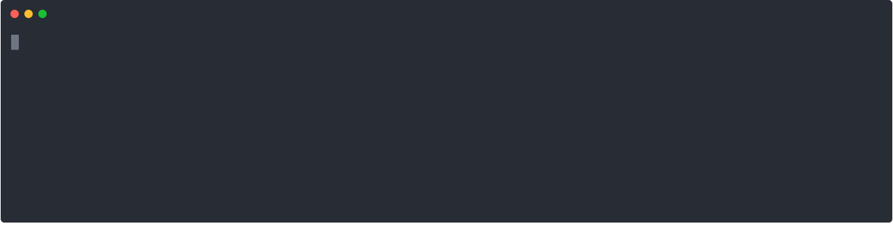
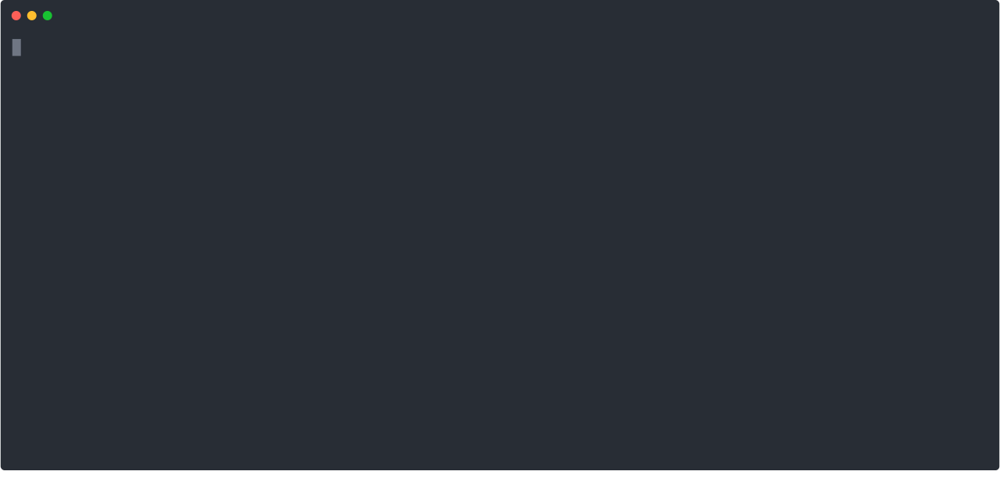
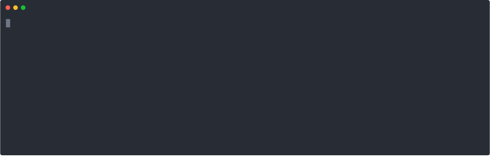
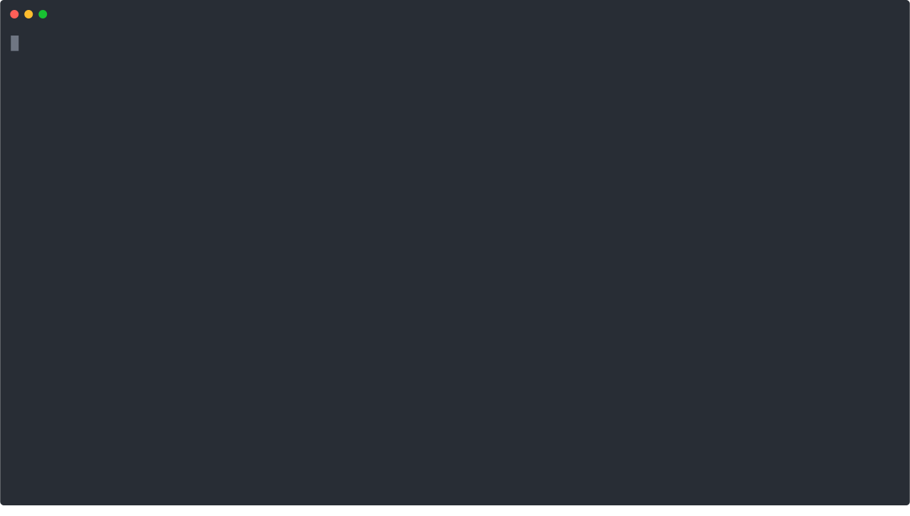
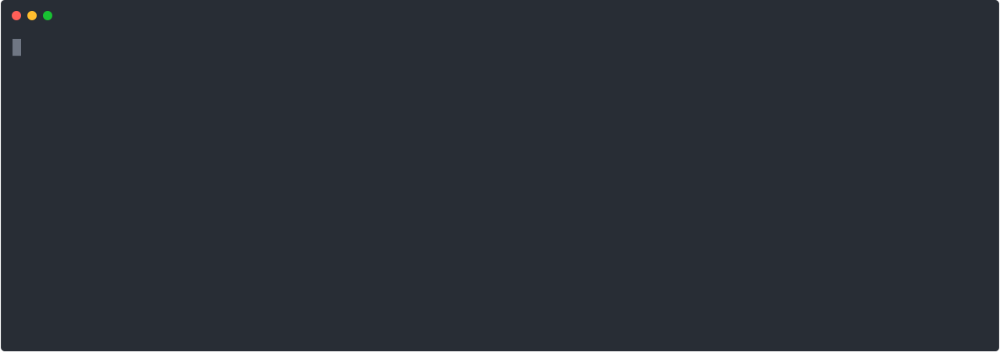

.. sectnum::
.. |approval_notice| image:: https://img.shields.io/badge/Approved%20for-Spring%202024-blue

================
 Unix: Tutorial
================

|approval_notice|

.. contents:: **Table of Contents**
   :depth: 3

----

How to engage with this tutorial
---------------------------------

**Important:** If you have not completed the 
`Unix: Getting Started <https://github.com/cs1302uga/cs1302-tutorials/blob/alsi/unix/unix-getting-started.rst>`_ 
tutorial, please complete that before beginning this tutorial.

When working through any tutorial in 1302, it is expected that you will fully engage with the material. In
other words, it is not sufficient to skim-read the content. You should carefully read and process
and then follow along by typing the commands into your terminal emulator, taking notes as you go.
We recommend writing the answers to any questions asked in this tutorial in your notes along with some
context. For this tutorial, **we recommend logging into Odin and typing the commands as you work through 
the examples**. If you have any questions as you are working through
the tutorial, you are encouraged to post on the course Piazza page. Your questions will not only help
you fill gaps in your knowledge but also give us insight into potential updates to the tutorials.

Fully engaging with the content will improve your understanding of the content and help you retain 
the information long term.

Navigating the File System
-------------------------

In the previous tutorial, you experienced the ``pwd`` (print working directory)
command and were provided a brief introduction to absolute paths. In Unix, a
*directory file* or *directory* is the same concept as a folder in other
operating systems; that is, in most cases the words "directory" and "folder"
are interchangeable. Your current working directory is the directory in which you
are currently executing commands. There are other directories, and in Unix,
they are all organized under a top-most directory called ``/``, representing the
root of the file system. The macOS and Linux operating systems organize their
file systems the same way. If you are coming from a Windows background, then it
is reasonable to compare ``/`` to the ``C:`` drive.

For this part of the tutorial, we are going to assume that you have
some specific files in your home directory. To make sure that you
have these files, you should execute the command below. The command
may take a few seconds to run as it involves downloading some files
from the Internet. You don't need to memorize or understand the command
below; you just need to execute it to proceed with the tutorial.

.. code-block:: shell

   $ curl -s -L https://git.io/fjbdg | bash

.. figure:: img/nav-prep-demo.svg

``ls``, ``ls PATH``, ``tree PATH``
++++++++++++++++++++++++++++++++++

To list the files in your current working directory, use the ``ls`` (list)
command. It is common for ``ls`` to differentiate between directories
and regular files in its output using different colors.

.. code-block:: shell

   $ ls

.. figure:: img/ls-demo.svg?1

* How many directories and regular files are in your home directory?

The ``ls`` (list) command is not limited to the current working directory.
You can tell ``ls`` to list the files in some other directory by supplying a
path to that directory as a command-line argument.

.. code-block:: shell

   $ ls cs1302-unix

.. figure:: img/ls-path-demo.svg?1

* The paths used in the examples above are *relative paths*. Instead of describing
  the traversal path starting from ``/``, they describe the traversal path starting
  from the current working directory. The ``ls`` command also works with absolute paths.
  What is the command to list the files in your home directory using an
  absolute path?

While ``ls`` is nice and probably one of the most used Unix commands of all time,
it doesn't let us see the whole picture without us issuing repetitive
``ls`` commands. To see the bigger picture, use the ``tree`` command, which
lists the contents of a directory in a tree-like format. If this command doesn't work for you,
please go back and make sure you have completed the previous tutorial and all the required setup
steps.

.. code-block:: shell

   $ tree cs1302-unix

.. figure:: img/tree-path-demo.svg

* Which files are contained in the ``cs1302`` directory? What about the ``books`` directory?

.. table::

   ===============  ======================================================================================================
   Command          Description
   ===============  ======================================================================================================
   ``ls``           List contents of the current working directory.
   ``ls PATH``      List contents of the last directory in the provided ``PATH`` (e.g., ``c`` in ``a/b/c`` or ``/a/b/c``).
   ``tree PATH``    List contents of the last directory in the provided ``PATH`` and its subdirectories, in a tree format.
   ===============  ======================================================================================================

``ls -l``, ``ls -lh``
+++++++++++++++++++++

By default, the ``ls`` command displays the contents of a directory using its "simple"
output format. A "long" output option can be specified by supplying a ``-l`` as a
command-line argument. In addition to the name of each file, additional information
is included in the "long" output format, as described below in the next few examples.

.. code-block:: shell

   $ ls -l cs1302-unix/books

.. figure:: img/ls-long-demo.svg?1

.. table::

   ===============  =====  ============  ==========  ===========  ================  ===========================
   [1]_ Mode        [2]_   [3]_ User     [4]_ Group  [5]_ Size    [6]_ Timestamp    [7]_ Name
   ===============  =====  ============  ==========  ===========  ================  ===========================
   ``-rw-r--r--.``  ``1``  ``mepcott``   ``myid``    ``1276233``  ``Feb 28 10:45``  ``moby_dick.txt``
   ``-rw-r--r--.``  ``1``  ``mepcott``   ``myid``    ``799645``   ``Feb 10  2021``  ``pride_and_prejudice.txt``
   ``-rw-r--r--.``  ``1``  ``mepcott``   ``myid``    ``607430``   ``Jun  9 12:45``  ``sherlock_holmes.txt``
   ===============  =====  ============  ==========  ===========  ================  ===========================

.. code-block:: shell

   $ ls -l cs1302-unix

.. figure:: img/ls-long-demo2.svg

.. table::

   ===============  =====  ============  ==========  ===========  ================  ===========================
   [1]_ Mode        [2]_   [3]_ User     [4]_ Group  [5]_ Size    [6]_ Timestamp    [7]_ Name
   ===============  =====  ============  ==========  ===========  ================  ===========================
   ``drw-r-xr-x.``  ``2``  ``mepcott``   ``myid``    ``85``       ``Aug 17 17:39``  ``books``
   ``drw-r-xr-x.``  ``4``  ``mepcott``   ``myid``    ``46``       ``Aug 17 17:39``  ``notes``
   ``-rw-r--r--.``  ``1``  ``mepcott``   ``myid``    ``9``        ``Aug 17 17:39``  ``README.md``
   ===============  =====  ============  ==========  ===========  ================  ===========================

.. [1] .. rubric:: **Mode**

       The mode specifies the file type and permissions. The first character tells you what type of file is listed. 
       In most cases, this character will be either ``-`` for regular files and ``d`` for directories. 
       The rest of the bits represent the permissions of the file; in other words, which users on the system are
       allowed to read, modify, and execute the file. We will talk about permissions in more detail in a few weeks.
       If you are interested in reading ahead, please see the 
       `1302 Octal Mode Tutorial <https://github.com/cs1302uga/cs1302-tutorials/blob/alsi/octal-mode.md>`_.

.. [2] .. rubric:: **Hard Links**

       This topic is outside the scope of this reading. If you are interested in hard links,
       then you are encouraged to read about them `here <https://en.wikipedia.org/wiki/Hard_link>`_.
       Symbolic links are more common and will be discussed in a future reading.

.. [3] .. rubric:: **User / Owner**

       The user denoted as the owner of the file. In most cases, the owner of a file
       is the user who created the file. A file's owner can only be changed by a superuser (administrator)
       or a program acting on behalf of a superuser. Unless the owner of a file is a superuser, the owner
       is subject to the user permissions indicated in the file's mode.

.. [4] .. rubric:: **Group**

       The user denoted as the group of the file. In most cases, a file's group is the same
       as its owner's group. A file's owner can only be changed by a superuser (administrator)
       or a program acting on behalf of a superuser. Users in a file's group that are not the
       file's owner or a superuser are subject to the group permissions indicated in the file's mode.

.. [5] .. rubric:: **File Size**

       Normally the size is printed as a byte count or block count without punctuation.
       These days, byte counts are not very readable, especially for larger file sizes. You can make
       the output more human-readable by supplying the ``-h`` (human-readable) option as a command-line
       argument to ``ls -l``. The human-readable output uses units like ``K`` (kilobyte), ``M`` (megabyte),
       ``G`` (gigabyte), etc. whenever they apply. Block counts are usually shown for directories,
       but that topic is outside the scope of this reading.

.. [6] .. rubric:: **Last Modified Timestamp**

       The last time the contents of the file were modified or the file itself was touched. Often
       referred to as the file's last modification time. Neither reading a file nor changing a file's
       permissions modify the contents of a file, and thus do not cause a change in the file's
       modification time. A file's modification time is changed when a program writes to the file
       or uses the ``touch`` command to update the file's access and modification times to the
       current time.

.. [7] .. rubric:: **Filename:**

       The name of the file. Most systems limit the length of a filename to some value between
       14 characters (older systems) and 255 characters (newer systems), and they require that
       a filename be unique inside its directory. Except for the directory file ``/`` at the root
       of the file system, file names in Unix cannot contain the ``/`` character since
       it is used as the path separator character.

As mentioned in [5]_, you can supply ``-h`` as a command line argument to ``ls -l`` to
enable the display of human-readable units for file sizes. Many Unix programs
like ``ls`` allow you to combine single character (short) options into a single
command-line argument when entering the command at the shell prompt. All three
examples below produce the same output.

.. code-block:: shell

   $ ls -l -h cs1302-unix/books

.. code-block:: shell

   $ ls -h -l cs1302-unix/books

.. code-block:: shell

   $ ls -lh cs1302-unix/books

.. figure:: img/ls-long-human-demo.svg

.. table::

   =================  ================================================================================================
   Command            Description
   =================  ================================================================================================
   ``ls -l``          ``ls`` uses long listing format
   ``ls -l -h``       ``ls`` uses long listing format with human-readable size units
   =================  ================================================================================================

``cd PATH``, ``cd -``, ``cd ~``, ``cd``
+++++++++++++++++++++++++++++++++++++++

So far, you know how to list the files in your home directory, your current working directory,
and other directories; however, all of the examples so far have utilized absolute or relative
paths in a way that kept you in your home directory. It's time for that to change, or rather
it's time for your current working directory to change. This can be done using the ``cd``
(change directory) command.

As you navigate to various directories in this section, try typing ``pwd`` and ``ls`` in each
directory. Note how the output of each command changes as you change directories. That's because
commands are always executed in the context of the current directory.

.. code-block:: shell

   $ cd cs1302-unix

.. figure:: img/cd-path-demo1.svg

.. code-block:: shell

   $ cd notes/cs1302

If you to change to the directory you were last in prior to your current working directory,
then supply ``-`` (minus sign) as a command-line argument to ``cd``.

.. code-block:: shell

   $ cd -

On most Unix systems, ``~`` (tilde) is an alias for the absolute path of your home directory.
While you can use it with ``cd`` to change directly to your home directory, it's more commonly
used to change to directories nested under your home directory.

.. code-block:: shell

   $ cd ~/cs1302-unix

If you use the ``cd`` command without supplying any command-line arguments, then it changes
to your home directory. How convenient!

.. code-block:: shell

   $ cd

.. table::

   =================  ================================================================================================
   Command            Change to
   =================  ================================================================================================
   ``cd``             home directory
   ``cd -``           last previous working directory
   ``cd a/b/dest``    ``dest``, assuming ``a`` is in the current directory and ``a/b/dest`` is a valid *relative* path
   ``cd /a/b/dest``   ``dest``, assuming ``/a/b/dest`` is a valid *absolute* path
   ``cd ~/a/b/dest``  ``dest``, assuming ``a`` is in your home directory and ``~/a/b/dest`` is a valid path
   =================  ================================================================================================

``ls -a``, ``cd ..``
++++++++++++++++++++

The default behavior of ``ls`` is to ignore files starting with ``.`` (hidden files).
To force ``ls`` to not ignore hidden files, supply the ``-a`` (all) option
as a command-line argument.

.. code-block:: shell

   $ ls -a

Every directory on a Unix system has two special hidden files
named ``.`` and ``..``.

.. table::

   ======  =========================================================
   File    Description
   ======  =========================================================
   ``.``   path alias for the directory itself
   ``..``  path alias for parent of the directory (parent directory)
   ======  =========================================================

Remember, the default behavior of ``ls`` is to list the contents of
the current working directory. If we supply ``.`` as a path to ``ls``,
then it does the same thing.

.. code-block:: shell

   $ ls .

You can supply ``..`` as a path for ``ls`` to list the contents
of the current working directory's parent (i.e., its parent directory).

.. code-block:: shell

   $ ls ..

You can supply ``..`` as a path to ``cd`` to change to go up one
directory; that is, change to the parent directory.

.. code-block:: shell

   $ cd ..

You can even go up two directories using ``../..``.

.. code-block:: shell

   $ cd ../..

.. table::

   =================  ================================================================================================
   Command            Description
   =================  ================================================================================================
   ``ls -a``          ``ls`` shows hidden files (those that start with ``.``)
   ``ls .``           ``ls`` lists the contents of ``.`` (current directory); same as ``ls`` with no arguments
   ``ls ..``          ``ls`` lists the contents of ``..`` (parent directory)
   ``cd ..``          ``cd`` changes working directory to ``..`` (parent directory; "up one")
   ``cd ../..``       ``cd`` changes working directory to ``../..`` (parent of parent directory; "up two")
   =================  ================================================================================================

More Time-saving Tips
---------------------

Tab Completion
++++++++++++++

The tab completion feature in ``bash`` permits typing a partial command or path,
then pressing the ``TAB`` key to auto-complete the sequence. When multiple
completions are possible, pressing the ``TAB`` key again lists them all.

Keyboard Shortcuts
++++++++++++++++++

.. table::

   ========  ====================================================
   Key       Description
   ========  ====================================================
   ``C``     ``CTRL`` (control)
   ``M``     ``META`` (meta): usually ``ALT``, ``OPT`` or ``ESC``
   ========  ====================================================

.. table::

   ========  ==========================================
   Shortcut  Description
   ========  ==========================================
   ``C-a``   Move the cursor to the beginning of the line.
   ``C-e``   Move the cursor to the end of the line.
   ``C-f``   Move the cursor forward (right) one character.
   ``M-f``   Move the cursor forward (right) one word.
   ``C-b``   Move the cursor backward (left) one character.
   ``M-b``   Move the cursor backward (left) one word.
   ========  ==========================================

Getting Help
------------

``--help``
++++++++++

Many Unix programs print out information about what they do and
the command-line arguments they support when ``--help`` is supplied
as a command-line argument, usually by itself.

.. code-block:: shell

   $ ls --help

.. figure:: img/ls-help-demo.svg

``man``
+++++++

Unix systems come with a digital copy of their manual, which provides
detailed information about the programs and features that are available.
To access the manual entry ("man" page) for a command, enter the ``man``
(manual) command and supply the command name you want to look up as a
command-line argument. To exit a man page, press the ``q`` key.

.. code-block:: shell

   $ man ls

.. figure:: img/man-ls-demo.svg

Inspecting Files
----------------

``cat``
+++++++

One quick way to display the contents of a regular file to standard output
is using the ``cat`` (concatenate [to standard output]) command, supplying
a path to the file you want to view as a command-line argument.

.. code-block:: shell

   $ cd ~/cs1302-unix/books
   $ cat sherlock_holmes.txt

.. figure:: img/cat-demo.svg

``less``
++++++++

The ``cat`` command displays the entire contents of a file all at once,
which may not be desirable for large files. To display the contents of
a regular file one page (or screen) at a time, use the ``less`` command
and supply a path to the file you want to view as a command-line argument.
To quit out of ``less``, press the ``q`` key. To move up and down one
page (screen) at a time, use the ``C-v`` and ``M-v`` shortcuts,
respectively.

.. code-block:: shell

   $ cd
   $ less cs1302-unix/books/moby_dick.txt

.. figure:: img/less-demo.svg

New Directories
---------------

``mkdir``, ``mkdir -p``
+++++++++++++++++++++++

To make a new directory, use the ``mkdir`` (make directory) command and supply
a path ending with the directory you want created as a command-line argument.

.. code-block:: shell

   $ cd ~/cs1302-unix
   $ ls -l
   $ mkdir practice
   $ ls -l

.. code-block:: shell

   $ cd ~/cs1302-unix
   $ tree notes
   $ mkdir notes/other
   $ tree notes

The default behavior of ``mkdir`` requires that intermediate
directories along the path already exist. If one or more
directories along the path do not exist, then ``mkdir``
will emit a ``No such file or directory`` error.

.. code-block:: shell

   $ cd ~/cs1302-unix
   $ tree notes
   $ mkdir notes/other/a/b/c
   $ tree notes

When intermediate directories do not exist along the desired
path, it is possible to create them one at a time and in the
order that they appear along the path from beginning to end.
The creators of the ``mkdir`` anticipated that such repetitive
calls to their command might be undesirable, so they included
a "passive" option that forces ``mkdir`` to create intermediate
directories when possible. To enable the passive option,
supply ``-p`` as a command-line argument to ``mkdir`` before
the desired path.

.. code-block:: shell

   $ cd ~/cs1302-unix
   $ tree notes
   $ mkdir -p notes/other/a/b/c
   $ tree notes

For more information about ``mkdir``, consult the manual page
using ``man mkdir``.

Moving and Removing
-------------------

``realpath``, ``mv``
++++++++++++++++++++

In Unix, every file has an absolute path that describes
the traversal path from the root of the disk ``/`` to
the file itself. Each path can be split into two components:
the first describing the parents (the *dirname*); and
the second describing the file at the end of the path (the *basename*).
Consider the following path that we have carefully annotated
using ASCII characters::

  /home/myid/■■■■■■■/cs1302-unix/notes/cs1302/cpp.md
  |                                          |     |
  +------------------------------------------+-----+
                    |                           |
                 dirname                    basename

Understanding this split is important when it comes to
moving and renaming a file as both of those tasks modify
a file's absolute path when performed successfully.

.. |Y| replace:: ✓
.. |N| replace:: ✗
.. table::

   =======  ========  ======================
   If you modify      Related
   -----------------  ----------------------
   dirname  basename  Task
   =======  ========  ======================
   |Y|      |N|       move a file
   |N|      |Y|       rename a file
   |Y|      |Y|       move and rename a file
   =======  ========  ======================

If you are unsure what the absolute path for a file is, but
you do know some relative path for it, then you can
print its absolute path using the ``realpath`` command,
supplying the relative path as a command-line argument:

.. code-block:: shell

   $ cd ~/cs1302-unix
   $ realpath notes/cs1302/cpp.md

To move or rename a file in Unix, use the ``mv`` (move) command.
Here is some usage information adapted from the manual:

.. table::

   ==========================  =====================================
   Command                     Description
   ==========================  =====================================
   ``mv SOURCE DEST``          Rename ``SOURCE`` to ``DEST``
   ``mv SOURCE... DIRECTORY``  Move ``SOURCE(s)`` into ``DIRECTORY``
   ==========================  =====================================

To **move a file**, use the ``mv`` command in a way that changes
the file's dirname.

.. code-block:: shell

   $ cd ~/cs1302-unix
   $ mv notes/cs1302/cpp.md notes/cs1730/cpp.md

.. table::

   ======  ======================================================
   State   Absolute Path
   ======  ======================================================
   Before  ``/home/myid/■■■■■■■/cs1302-unix/notes/cs1302/cpp.md``
   After   ``/home/myid/■■■■■■■/cs1302-unix/notes/cs1730/cpp.md``
   ======  ======================================================

To **rename a file**, use the ``mv`` command in a way that changes
the file's basename.

.. code-block:: shell

   $ cd ~/cs1302-unix
   $ mv notes/cs1730/cpp.md notes/cs1730/c.md

.. table::

   ======  ======================================================
   State   Absolute Path
   ======  ======================================================
   Before  ``/home/myid/■■■■■■■/cs1302-unix/notes/cs1730/cpp.md``
   After   ``/home/myid/■■■■■■■/cs1302-unix/notes/cs1730/c.md``
   ======  ======================================================

For more information about ``mv``, consult the manual page
using ``man mv``.

``cp``, ``cp -r``
+++++++++++++++++

To copy a file in Unix, use the ``cp`` (copy) command.
Here is some usage information adapted from the
manual:

.. table::

   ==========================  =====================================
   Command                     Description
   ==========================  =====================================
   ``cp SOURCE DEST``          Copy ``SOURCE`` to ``DEST``
   ``cp SOURCE... DIRECTORY``  Copy ``SOURCE(s)`` into ``DIRECTORY``
   ==========================  =====================================

.. code-block:: shell

   $ cd ~/cs1302-unix
   $ cp notes/cs1730/c.md notes/cs1730/cpp.md

.. code-block:: shell

   $ cd ~/cs1302-unix
   $ cp books/moby_dick.txt notes/other/a/

.. figure:: img/cp-second-demo.svg

The default behavior of ``cp`` when attempting to copy a
directory is to copy the directory itself but not its
contents. To make ``cp`` recursively copy the contents of 
a directory in addition to the directory itself, supply ``cp`` 
with the ``-r`` (recursive) option as a command-line argument.

.. code-block:: shell

   $ cd ~/cs1302-unix
   $ cp -r books books-copy

For more information about ``cp``, consult the manual page
using ``man cp``.

``rm``, ``rm -r``
+++++++++++++++++

To remove or delete a file in Unix, use the ``rm`` (remove)
command. If you have permission to remove a file, then you
can do so by supplying ``rm`` a path to the file as a
command-line argument. **REMOVAL CANNOT BE UNDONE.**

.. code-block:: shell

   $ cd ~/cs1302-unix
   $ rm notes/cs1730/c.md

The default behavior of ``rm`` is to not permit the removal
of a directory file.

.. code-block:: shell

   $ cd ~/cs1302-unix
   $ rm notes/other

To make ``rm`` recursively remove the contents of a directory
so that it can remove it, supply ``rm`` with the ``-r`` (recursive)
option as a command-line argument. **REMEMBER, THIS CANNOT BE UNDONE**.

.. code-block:: shell

   $ cd ~/cs1302-unix
   $ rm -r notes/other

For more information about ``rm``, consult the manual page
using ``man rm``.

.. copyright and license information
.. |copy| unicode:: U+000A9 .. COPYRIGHT SIGN
.. |copyright| replace:: Copyright |copy| Michael E. Cotterell, Bradley J. Barnes, and the University of Georgia.
.. |license| replace:: CC BY-NC-ND 4.0
.. _license: http://creativecommons.org/licenses/by-nc-nd/4.0/
.. |license_image| image:: https://img.shields.io/badge/License-CC%20BY--NC--ND%204.0-lightgrey.svg
                   :target: http://creativecommons.org/licenses/by-nc-nd/4.0/
.. standard footer
.. footer:: |license_image|

   |copyright| This work is licensed under a |license|_ license to students
   and the public. The content and opinions expressed on this Web page do not necessarily
   reflect the views of nor are they endorsed by the University of Georgia or the University
   System of Georgia.
