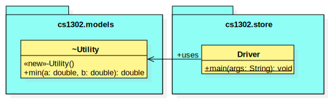
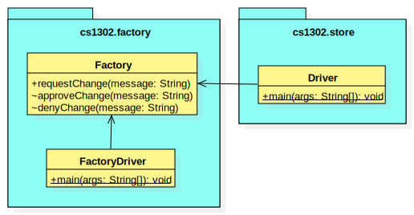

.. |approval_notice| image:: https://img.shields.io/badge/Approved%20for-Fall%202023-green
   :alt: Approved for: Fall 2023

Visibility Reading
##################

|approval_notice|

Package Private Visibility
**************************

Instead of saying that something has **package private** visibility, we usually
just say that it's package private. In Java, only top-level and member-level
declarations are allowed to package private. Things that are package private are slightly
more visible than things that are private; they are **only visible from lines of code
in the same package**.

===============  ==========  ============  ===========  =========
Visibility       Visible From
---------------  ------------------------------------------------
Name             Same Class  Same Package  Child Class  Elsewhere
===============  ==========  ============  ===========  =========
package private  |Y|         |Y|           |N|          |N|
===============  ==========  ============  ===========  =========

* In Java, **there is no modifier keyword for package private visibility**. For
  top-level declarations and member-level declarations within a class, the omission
  of a visibility modifier will cause the compiler to treat the declared
  thing as package private. This behavior is different for member-level declarations
  within an interface, where the omission of a visibility modifier defaults
  a declaration's visibility to public.
* In UML, the ``~`` symbol is used just before an identifier to
  illustrate that it's package private. Some UML programs may not support displaying
  the visibility for top-level declarations; in those cases, a quick hack
  is to include the ``~`` as part of the name. Although omitting a visibility
  modifier in Java code may default to package private, the same is not true
  for UML class diagrams; they default to public visibility (covered in a
  later section).
* The ``javadoc`` program does not include package private declarations in a
  documentation website by default; however, they can be included by
  adding the ``-package`` command-line argument (that option will
  also include anything that is more visible than package private — so
  everything except private).

Some people refer to package private visibility as the "default visibility" because
a modifier isn't needed to indicate that certain declarations are package
private; however, **the term "default" should be avoided when describing visibility**
so that the concept is not confused with Java's default member-level visibility for interfaces.

Example 1
=========

Here is our first example involving a top-level declaration. To get started,
let's consider the UML diagram below and the two code snippets that follow it.

.. code-block:: java

   // inside Utility.java
   package cs1302.models;

   class Utility { // <---- LINE1
       // ... rest omitted

.. code-block:: java

   // inside Driver.java
   package cs1302.store;

   import cs1302.models.Utility; // <---- LINE2

   // ... rest omitted

On the line labelled ``LINE1``, the author omitted a visibility modifier
in their top-level declaration of the ``Utility`` class. As discussed earlier,
this causes the class to default to package private visibility. On ``LINE2``,
which exists in ``Driver.java`` in a different package [6]_, an attempt is made to
import the ``Utility`` class. Since that class is package private, it's not
visible from this line because things that are package private are only visible
from within the same package. If you try to compile ``Driver.java``, then
you get the following error::

    Driver.java: Utility is not public in cs1302.models; cannot be accessed from outside package

The error above is exactly what the author of ``Utility`` class wanted to happen. They
intended for ``Utility`` itself to only be used by code residing within the
``cs1302.models`` package. To make the method not visible from outside the package,
they omitted a visibility modifier in the top-level class declaration. Had they
declared it public, for example, then the example would have compiled.

As an aside, the UML diagram for this example also includes a private
constructor [7]_! You can read about it in the footnote.

.. [6] In Java, two files are said to be in **different packages** whenever
       their package statements are not identical. Don't let the directory
       structure for some packages confuse you into believing something that's
       not true. For example, although the directory for package
       ``cs1302.foo.bar`` might be inside the directory for package ``cs1302.foo``,
       they're both considered by the compiler to be in different packages.

.. [7] A **private constructor** may seem counterintuitive — after all, constructors
       are used to make objects of a class, and constructor calls often
       occur in other classes. There are, however, some valid use cases:

       * **Prevent Object Creation:** If your class only contains static methods
         and constants and it doesn't make sense to turn it into an interface,
         then you might explicitly declare one do-nothing constructor that is
         private and has no parameters. This will prevent the compiler from
         automatically creating its own default constructor, and it will prevent
         users of your class from creating objects that aren't needed.

       * **Restrict Object Creation:** It may be desirable to utilize a private
         constructor along with a static method of some other visibility in
         a carefully setup way to restrict the total number of objects of a
         particular class that can be created. We won't go into the details
         here, but the singleton is an example of this idea that
         restricts the total number of objects to be no greater than one.

Example 2
=========

In this example, we'll see how package private visibility can be used at
the member-level for access control. Suppose a factory has a contract with a store to
produce some product. Throughout the year, the store may need to request
changes to its contract based on sales, buyer interest, etc. The driver
program on the factory's side should be able to access methods to request,
approve, and deny contract-related changes; however, the overall class design
should not allow for the store to approve or deny changes in this scenario.
To see how we can utilize package private visibility to accomplish this,
let's consider the UML diagram below and the two code snippets that follow it.

.. code-block:: java

   // inside FactoryDriver.java (cs1302.factory package)
   public static void main(String[] args) {
       Factory factory = new Factory();
       factory.requestChange("decrease price"); // <------- LINE1
       factory.approveChange("decrease price"); // <------- LINE2
       factory.denyChange("decrease price"); // <---------- LINE3
   } // main

.. code-block:: java

   // inside Driver.java (cs1302.store package)
   public static void main(String[] args) {
       Factory factory = new Factory();
       factory.requestChange("increase quantity"); // <---- LINE4
       factory.approveChange("increase quantity"); // <---- LINE5
       factory.denyChange("increase quantity"); // <------- LINE6
   } // main

The lines labelled ``LINE1``, ``LINE2``, and ``LINE3`` each attempt
to access a different member of the ``Factory`` class **from the same package**.
The table below summarizes the scenario for each line.
Class names in the ``In`` and ``From`` columns have been omitted since they're not
relevant for this particular example.

====  ====================  ===============  ==================  ==================  ========
..    Member                                 Accessed                                ..
----  ---------------------------------------------------------  ------------------  --------
LINE  Name                  Declared         In                  From                Visible?
====  ====================  ===============  ==================  ==================  ========
1     ``requestChange``     public           ``cs1302.factory``  ``cs1302.factory``  |Y|
2     ``approveChange``     package private  ``cs1302.factory``  ``cs1302.factory``  |Y|
3     ``denyChange``        package private  ``cs1302.factory``  ``cs1302.factory``  |Y|
====  ====================  ===============  ==================  ==================  ========

Likewise, the lines labelled ``LINE4``, ``LINE5``, and ``LINE6`` each attempt
to access a different member of the ``Factory`` class **from a different package**.
The table below summarizes the scenario for each line.

====  ====================  ===============  ==================  ==================  ========
..    Member                                 Accessed                                ..
----  ---------------------------------------------------------  ------------------  --------
LINE  Name                  Declared         In                  From                Visible?
====  ====================  ===============  ==================  ==================  ========
4     ``requestChange``     public           ``cs1302.factory``  ``cs1302.store``    |Y|
5     ``approveChange``     package private  ``cs1302.factory``  ``cs1302.store``    |N|
6     ``denyChange``        package private  ``cs1302.factory``  ``cs1302.store``    |N|
====  ====================  ===============  ==================  ==================  ========

If you try to compile ``Driver.java`` as written, then you get the following error::

    Driver.java: error: approveChange(String) is not public in Factory; cannot be accessed from outside package

Through careful use of visibility, the author of the ``Factory`` class was able to
achieve the access control described near the beginning of this example. That is,
code within the ``cs1302.factory`` package can request, approve, and deny contract-related requests,
while code in other packages can only request changes. It's a beautiful, simple setup,
but it did require the author to understand package private visibility.

In the error message that was recently discussed, the wording "is not public in"
may lead you to believe that only public members are visible from another
package; **that's not the case**. We'll provide an example in the next section
on protected visibility that illustrates this.

.. #############################################################################

.. util
.. |Y| unicode:: U+2713
.. |N| unicode:: U+2717

.. copyright and license information
.. |copy| unicode:: U+000A9 .. COPYRIGHT SIGN
.. |copyright| replace:: Copyright |copy| Michael E. Cotterell, Bradley J. Barnes, and the University of Georgia.
.. |license| replace:: CC BY-NC-ND 4.0
.. _license: http://creativecommons.org/licenses/by-nc-nd/4.0/
.. |license_image| image:: https://img.shields.io/badge/License-CC%20BY--NC--ND%204.0-lightgrey.svg
                   :target: http://creativecommons.org/licenses/by-nc-nd/4.0/
.. standard footer
.. footer:: |license_image|

   |copyright| This work is licensed under a |license|_ license to students
   and the public. The content and opinions expressed on this Web page do not necessarily
   reflect the views of nor are they endorsed by the University of Georgia or the University
   System of Georgia.
