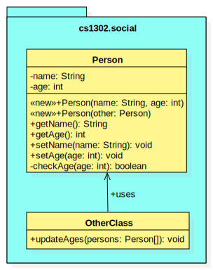

.. |approval_notice| image:: https://img.shields.io/badge/Approved%20for-Spring%202021-success
   :alt: Approved for: Spring 2021

.. external links
.. |jls11_access_control| replace:: The Java Language Specification (JLS) 11 Section 6.6
.. _jls11_access_control: https://docs.oracle.com/javase/specs/jls/se11/html/jls-6.html#jls-6.6
.. |wikipedia_singleton| replace:: Singleton pattern
.. _wikipedia_singleton: https://en.wikipedia.org/wiki/Singleton_pattern

Visibility Reading
##################

|approval_notice|

Private Visibility
******************

Instead of saying that something has **private** visibility, we usually
just say that it's private. In Java, only member-level declarations
are allowed to be private. Private members are considered the least visible;
they are **only visible from lines of code in the same class**.

===============  ==========  ============  ===========  =========
Visibility       Visible From
---------------  ------------------------------------------------
Name             Same Class  Same Package  Child Class  Elsewhere
===============  ==========  ============  ===========  =========
private          |Y|         |N|           |N|          |N|
===============  ==========  ============  ===========  =========

* In Java, the ``private`` modifier must be included in a member's declararion for
  it to be considered private by the compiler.
* In UML, the ``-`` symbol is used just before a member's identifier to
  illustrate that it's private.
* The ``javadoc`` program does not include private declarations in a
  documentation website by default; however, they can be included  by
  adding the ``-private`` command-line argument (that option will
  also include anything that is more visible than private -- so
  everything).

Example 1
=========

This is a classic example that many students are familiar with.
To get started, let's consider the UML diagram below and the code snippet that
follows it.

.. image:: img/private_1.svg

.. code-block:: java

   // inside Person.java
   public void setAge(int age) {
       if (!checkAge(age)) { // <---- LINE1 ✓
           throw new IllegalArgumentException("invalid age");
       } else {
           this.age = age; // <---- LINE2 ✓
       } // if
   } // setAge

On the line labelled ``LINE1``, the code attempts to access
``checkAge``, an instance method of the current object (i.e., it's
the same as ``this.checkAge``) declared within the same class.
Although that method is private, it's visible from ``LINE1``
because private members are always visible from within the same
class. A similar argument can be made for the code on ``LINE2``,
which attempts to access the private intance variable ``age``.

Example 2
=========

According to |jls11_access_control|_, the developers of Java
incorporated visibility into the language "to prevent the users of a package or class
from depending on unnecessary details of the implementation of that package or class."
To illustrate this idea, let's consider the UML diagram below and the code snippet
that follows it.

.. code-block:: java

   // inside OtherClass.java
   public void updateAges(Person[] persons) {
       for (int i = 0; i < persons.length; i++) {
           int newAge = persons[i].getAge() + 1;
           if (persons[i].checkAge(newAge)) { // <---- LINE1 ✗
               persons[i].setAge(newAge);
           } // if
       } // for
   } // updateAges

On the line labelled ``LINE1``, the code attempts to access the
``checkAge`` method, an instance method declared within another
class. Since that method is private, it's not visible from this line
because private members are only visible from within the class where
they are declared. If you try to compile ``OtherClass.java``, then
you get the following error::

    OtherClass.java: error: checkAge() has private access in Person

The error above is exactly what the author of ``Person`` wanted to happen. They
intended for ``checkAge`` to only be used by other methods within the ``Person`` class.
To make the method not visible from outside the class, they declared it private. Had they
declared it public, for example, then the example would have compiled; however, the call
to ``checkAge`` would add unnecessary redundancy since it's called again inside the call
to ``setAge`` on the next line (see the previous example for the inside of ``setAge``).

We're not sure how the author of ``OtherClass`` knew about the ``checkAge`` method, but
the error message lets them know that it's not for them to use. Had they referred to the
Javadoc/API documentation for the ``Person`` class, it's unlikely that the private method
would have been included (private members are not included in the `javadoc` output by default).
If it's private, then it's not for others, and if it's not even listed in the documentation,
then that's less stuff that other programmers need to understand before they're able
to use your code.

Example 3
=========

We mentioned earlier that some students have a flawed conceptual model for
private visibility. Their idea of what it means for something to be private
is more restrictive than it actually is. **Could this be you?**
To find out, let's consider the UML diagram below and the code snippet for
a copy constructor [5]_ that follows it.

.. image:: img/private_1.svg

.. code-block:: java

   // inside Person.java
   public Person(Person other) {
       setName(other.name); // <---- LINE1
       setAge(other.age); // <------ LINE2
   } // setAge

On the lines labelled ``LINE1`` and ``LINE2``, the code attempts to access
the private instance members ``name`` and ``age`` of the ``Person`` object
referred to by ``other``. Before we continue, ask yourself whether or not
this will work.

When asked, many students will say that this will not compile, then
they are shocked and amazed when they see that it does. That's right,
**it does compile**. Although ``other.name`` and ``other.age`` are private, they're visible
from ``LINE1`` and ``LINE2`` because those lines are in
the same class as the declarations.

    Remember, private members are always visible from lines in the same class.

The scenario for each line is summarized in the table below.

====  ========  ========  ==========  ==========  ===========  ========
..    Member                          Accessed                 ..
----  ------------------------------  -----------------------  --------
LINE  Name      Declared  In          From        Same Class?  Visible?
====  ========  ========  ==========  ==========  ===========  ========
1     ``name``  private   ``Person``  ``Person``  |Y|          |Y|
2     ``age``   private   ``Person``  ``Person``  |Y|          |Y|
====  ========  ========  ==========  ==========  ===========  ========

While a reference to an object does allow us to find members of the object
via ``.memberName`` (for some ``memberName``), our ability to access the
member from the current location (line of code) depends only on where the
member is declared and its visibility. In general, **visibility itself has
nothing to do with objects; it's all about where the code is written**.

.. [5] A **copy constructor** for a class called ``A`` is the constructor
       ``A(A other)``; if a class has a copy constructor, then calling it
       with a reference to some existing object of the class as its parameter
       should result in the newly constructed object being a copy. The result
       is not always guaranteed to be a deep copy, so you should always check
       the constructor documentation and class documentation for more
       information before you make any assumptions.

.. #############################################################################

.. util
.. |Y| unicode:: U+2713
.. |N| unicode:: U+2717

.. copyright and license information
.. |copy| unicode:: U+000A9 .. COPYRIGHT SIGN
.. |copyright| replace:: Copyright |copy| Michael E. Cotterell, Bradley J. Barnes, and the University of Georgia.
.. |license| replace:: CC BY-NC-ND 4.0
.. _license: http://creativecommons.org/licenses/by-nc-nd/4.0/
.. |license_image| image:: https://img.shields.io/badge/License-CC%20BY--NC--ND%204.0-lightgrey.svg
                   :target: http://creativecommons.org/licenses/by-nc-nd/4.0/
.. standard footer
.. footer:: |license_image|

   |copyright| This work is licensed under a |license|_ license to students
   and the public. The content and opinions expressed on this Web page do not necessarily
   reflect the views of nor are they endorsed by the University of Georgia or the University
   System of Georgia.
