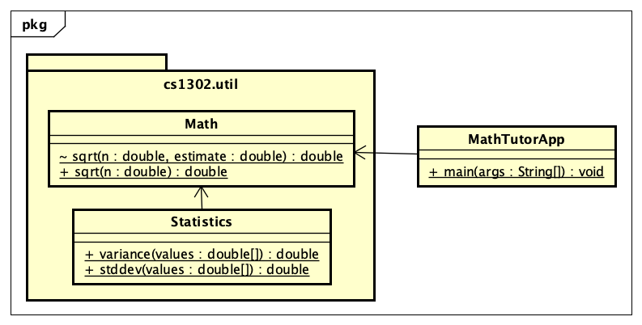

# Visibility Tutorial


## Introduction

Java has four different visibilities that can be assigned to methods 
and instance variable decalarations, three of which are indicated 
with modifier keywords:

| Visibility Name | Modifier Keyword | UML Symbol |
|-----------------|------------------|------------|
| private         | `private`        | `-`        |
| package private |                  | `~`        |
| protected       | `protected`      | `#`        |
| public          | `public`         | `+`        |

Depending on where a declaration occurs, omitting a visibility modifier
keyword means something different. 

* In an an interface, the omission of a visibility modifier keyowrd 
  implies the method has public visibility. In fact, the only visibility
  that is allowed in an interface decalarion is public.
  
* In a class, the omission of a visibility modifier keyword implies 
  the method or instance variable has _package private_ visibility.
  All other visibilities are allowed, however, they must be explicitly
  set using a visibility modifier keyword.

## Why Visibilities?

Visibilities exist so that you can control what code is visibile to other
code. It may be desirable to only mak certain things in a class visible to
the class itself, while it's perfectly okay to make other things visible
to everything else. In particular, the two scenarios describe private and
public visibility, respectively. However, Java has two additional visibilities
to accomodate some of the scenarios that in-between.

## Interpretation

To determine if a line of code can see a method or instance variable, you
need to consider where that method or instance variable is relative to
the line of code that's using it. In the table below, we summarize the 
different scenarios that can occur based on where the method or instance
variable is declared:

| # | Member Declaration | `private` | _package private_ | `protected` | `public` |
|---|--------------------|-----------|-------------------|-------------|----------|
| 1 | same class         | ✓         | ✓                 | ✓           | ✓        |
| 2 | same package       |           | ✓                 | ✓           | ✓        |
| 3 | parent class       |           |                   | ✓           | ✓        |
| 4 | none of the above  |           |                   |             | ✓        |

1. 

2.

3.

4.

## Private Visibility Notes

We leave out the usual private visibility examples in this section and instead
focus on addressing the common misconception that objects have something to do
with visibility. **Visibility has nothing to do with objects in Java.** 
Instead, visibility has to do with classes. To illustrate this, consider the 
following UML diagram for a `Point2D` class which is used to represent 
immutable (i.e., non-modifiable) points described by `(x,y)` coordinates:

<center>

</center>

One of the constructors of this class, the one that takes in a reference to some other
`Point2D` object, is intended to serve as a _copy constructor_. That is, when that
particular constructor is invoked, the new object should be a deep copy of the object
referred to by the `other` parameter. Here is the usual way this is implemented:

```java
/**
 * Represents immutable {@code (x,y)} coordinates in a two-dimensional space.
 */
public class Point2D {

    private double x; // x coordinate
    private double y; // y coordinate

    ...
    
    /**
     * Constructs a new {@code Point2D} object that is copy of the object
     * referred to by {@code other}.
     *
     * @param other  object to copy
     */
    public Point2D(Point2D other) {
        this.x = other.x; // other.x is declared in the same class
        this.y = other.y; // other.y is declared in the same class
    } // Point2D
    
    ...

} // Point2D
```

The lines of code that seem counterintuive to most students are the two lines
inside of the copy constructor:

```java
this.x = other.x;
this.y = other.y;
```

While `other.x` and `other.y` are declared as private, `other` refers to an object
of the same `Point2D` class. Since `other.x` and `other.y` are declared in the same
class, those two lines of code can see `other.x` and `other.y` as presented in the
example. **The fact that `other` refers to another object does not matter.**

## Package Private Notes

Some people refer to _package private_ visibility as the _default visibility_ for
methods and instsnce variables of a Java class. However, **the term _default_ should
be avoided when talking about visibility** so that the concept is not confused with
Java's default methods feature for interfaces. 

When you declare something in a class without a vidibility modifier, it has package
private visibility. Something that has package private visibility is only visible
to lines of code within the same package. That is, a line of code can only see
something that is package private if that something is declared somewhere in the 
same package. To illustrate this, consider the UML diagram below:

<center>

</center>

In the example above, we have three classes, each containing one or more static
methods. The `Math` and `Statistics` classes are both in the same package, while
the `MathTutorApp` class is in some other package. The associations in the
diagram illustrate that both the `Statistics` class and the `MathTutorApp` use,
in some way, the `Math` class.

Most of the static methods in the diagram are declared with public visibility,
however, the two-parameter overload for `Math.sqrt` is noted as having package
private visibility. Within the `Math` class, the `sqrt` methods might look 
something like this:

```java
/**
 * Contains utility methods for mathematical operations.
 */
public class Math {

    /**
     * Returns the square root of {@code n} using Euler's method with
     * the specified initial {@code estimate}. This method should
     * only be used within the current package because we cannot
     * guarantee the user will provide anything meaningful for the
     * {@code estimate}.
     *
     * @param n         number to find the square root of
     * @param estimate  initial estimate
     * @return square root of {@code n}
     */
    static double sqrt(double n, double estimate) {
        ...
    } // sqrt
    
     /**
     * Returns the square root of {@code n}.
     *
     * @param n  number to find the square root of
     * @return square root of {@code n}
     */
    public static double sqrt(double n) {
        ...
    } // sqrt

} // Math
```


<hr/>

[](http://creativecommons.org/licenses/by-nc-nd/4.0/)

<small>
Copyright &copy; Michael E. Cotterell, Bradley J. Barnes, and the University of Georgia.
This work is licensed under a <a rel="license" href="http://creativecommons.org/licenses/by-nc-nd/4.0/">Creative Commons Attribution-NonCommercial-NoDerivatives 4.0 International License</a> to students and the public.
The content and opinions expressed on this Web page do not necessarily reflect the views of nor are they endorsed by the University of Georgia or the University System of Georgia.
</small>
