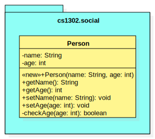
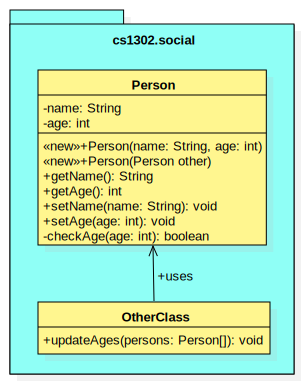

.. |approval_notice| image:: https://img.shields.io/badge/Approved%20for-Fall%202020-blueviolet
   :alt: Approved for: Spring 2021

.. external links
.. |uml_tutorial| replace:: UML Class Diagrams
.. _uml_tutorial: https://github.com/cs1302uga/cs1302-tutorials/blob/master/uml/uml.md
.. |jls11_access_control| replace:: JLS 11 Section 6.6
.. _jls11_access_control: https://docs.oracle.com/javase/specs/jls/se11/html/jls-6.html#jls-6.6

Visibility Reading
##################

|approval_notice|

Introduction
************

Java has four different **visibility** options for **access control**
that can be used in the declaration of class members (i.e., methods, variables, and constants).
When you indicate that a class member has a particular **visibility** in your code,
you communicate to the compiler the set of places in the code that are allowed
to access that thing. The term "access" simply means to "use from elsewhere
in the code." With that in mind, throughout this tutorial we will use "visible from"
to mean that something "can be accessed from" or "can be used from" based on its
visibility.

The table below shows all four visibility options that are available in Java,
three of which have an associated **visibility modifier** that we can
type into our code:

===============  ================  ==========
Visibility Name  Modifier Keyword  UML Symbol
===============  ================  ==========
private          ``private``       ``-``
package private  ..                ``~``
protected        ``protected``     ``#``
public           ``public``        ``+``
===============  ================  ==========

In this tutorial, we cover each available visibility option with a few examples,
often illustrated using a combination of `UML diagrams <uml_tutorial>`__ and code
snippets. The order in which the visibilities are covered is deliberate; we start
with the option that makes something visible from the least number of locations,
then work through the rest in the order of increasing visibility.

While you are likely already familiar private and public visibility, please do not
assume that you already understand how it works. Over the years, we have
found that many students have a somewhat flawed conceptual model for how
private visibility works that is actually more complicated that what it
actually is. Regardless of your experiece, you should work through each
visibility example in this tutorial until you are able to:

1. correctly determine the visibility outcome and justification; and
2. write your own code that illustrates a similar visibility scenario.

We encourage you to make Piazza posts about your examples, ask questions,
and help others to understand the important details of visibility.

Private Visibility
******************

Example 1
=========



+-------------------+-----------------------------------------------------------------------+
| UML Diagram       | Code Snippet(s)                                                       |
+===================+=======================================================================+
| |image_private_1| | .. code-block:: java                                                  |
|                   |                                                                       |
|                   |    // inside Person.java                                              |
|                   |    public void setAge(int age) {                                      |
|                   |        if (!checkAge(age)) {                                          |
|                   |            throw new IllegalArgumentException("invalid age");         |
|                   |        } else {                                                       |
|                   |            this.age = age; // <---- HERE                              |
|                   |        } // if                                                        |
|                   |    } // setAge                                                        |
|                   |                                                                       |
+                   +-----------------------------------------------------------------------+
|                   | On the line labelled ``HERE``, the code attempts to access            |
|                   | ``this.age``, an instance variable declared within the same class.    |
|                   | Although that variable is private, it's visible from this line        |
|                   | because private members are always visible from within the same       |
|                   | class.                                                                |
+-------------------+-----------------------------------------------------------------------+

Example 2
=========

According to |jls11_access_control|_, the developers of Java
incorporated visibility into the language "to prevent the users of a package or class
from depending on unnecessary details of the implementation of that package or class."
This example illustrates that idea quite well.



.. table:: Example 2
   :widths: 33 66

   +-------------------+-----------------------------------------------------------------------+
   | UML Diagram       | Code Snippet(s)                                                       |
   +===================+=======================================================================+
   | |image_private_2| | .. code-block:: java                                                  |
   |                   |                                                                       |
   |                   |    // inside OtherClass.java                                          |
   |                   |    public void updateAges(Person[] persons) {                         |
   |                   |        for (int i = 0; i < persons.length; i++) {                     |
   |                   |            int newAge = persons[i].getAge() + 1;                      |
   |                   |            if (checkAge(newAge)) { // <---- HERE                      |
   |                   |                persons[i].setAge(newAge);                             |
   |                   |            } // if                                                    |
   |                   |        } // for                                                       |
   |                   |    } // updateAges                                                    |
   |                   |                                                                       |
   +                   +-----------------------------------------------------------------------+
   |                   | On the line labelled ``HERE``, the code attempts to access the        |
   |                   | ``checkAge`` method, an instance method delcared within another       |
   |                   | class. Since that method is private, it's not visible from this line  |
   |                   | because private members are only visible from within the class where  |
   |                   | they are declared. If you try to compile ``OtherClass.java``, then    |
   |                   | you get the following error::                                         |
   |                   |                                                                       |
   |                   |     OtherClass.java: error: checkAge() has private access in Person   |
   |                   |                                                                       |
   +-------------------+-----------------------------------------------------------------------+


Package Private Visibility
**************************

TODO

Protected Visibility
********************

TODO

Public Visibility
*****************

TODO

Summary of Visibilities
***********************

In the table below, we summarize all of the different visibility scenarios
that are possible for a single member of a class (e.g., a variable, constant,
or method). To read the table, you should start by picking the column that
describes the member's visibility, then pick the row that describes where
the code is that is attempting to use that member. If you see a ✓ in the
table, then a member with that visibility is visible from that location.

| # | Visible From  | private | package private | protected | public |
|---|---------------|---------|-----------------|-----------|--------|
| 1 | Same Class    | ✓       | ✓               | ✓         | ✓      |
| 2 | Same Package  |         | ✓               | ✓         | ✓      |
| 3 | Child Class   |         |                 | ✓         | ✓      |
| 4 | Elsewhere     |         |                 |           | ✓      |

Here is another table with the exact same information.

| # | Visibility      | Same Class | Same Package | Child Class | Elsewhere |
|---|-----------------|------------|--------------|-------------|-----------|
| 1 | public          | ✓          | ✓            | ✓           | ✓         |
| 2 | protected       | ✓          | ✓            | ✓           |           |
| 3 | package private | ✓          | ✓            |             |           |
| 4 | private         | ✓          |              |             |           |


Important Notes (Do Not Skip)
*****************************


## Private Visibility

<center>
  
</center>

We leave out the usual private visibility examples in this section and instead
focus on addressing the common misconception that objects have something to do
with visibility. **Visibility has nothing to do with objects in Java.**
Instead, visibility has to do with classes. To illustrate this, consider the
following UML diagram for a `Point2D` class which is used to represent
immutable (i.e., non-modifiable) points described by `(x,y)` coordinates:

<center>

</center>

One of the constructors of this class, the one that takes in a reference to some other
`Point2D` object, is intended to serve as a _copy constructor_. That is, when that
particular constructor is invoked, the new object should be a deep copy of the object
referred to by the `other` parameter. Here is the usual way this is implemented:

```java
/**
 * Represents immutable {@code (x,y)} coordinates in a two-dimensional space.
 */
public class Point2D {

    private double x; // x coordinate
    private double y; // y coordinate

    ...

    /**
     * Constructs a new {@code Point2D} object that is copy of the object
     * referred to by {@code other}.
     *
     * @param other  object to copy
     */
    public Point2D(Point2D other) {
        this.x = other.x; // other.x is declared in the same class
        this.y = other.y; // other.y is declared in the same class
    } // Point2D

    ...

} // Point2D
```

The lines of code that seem counterintuive to most students are the two lines
inside of the copy constructor:

```java
this.x = other.x;
this.y = other.y;
```

While `other.x` and `other.y` are declared as private, `other` refers to an object
of the same `Point2D` class. Since `other.x` and `other.y` are declared in the same
class, those two lines of code can see `other.x` and `other.y` as presented in the
example. **The fact that `other` refers to another object does not matter.**

**Regarding Inheritance of Private Members:** You may recall from the Inheritance-related
readings that **child classes do inherit private instance variables and methods** from their
parent. However, since those variables are declared private in another class, the
inheriting class cannot see them directly. In scenarios like this, programmers often use
inherited getter and setter methods declared with protected and public visibility to
indirectly access inherited private members. **Another common pattern** is to initialize
some inherited private variables in a child constructor indirectly by explicitly using
`super` to invoke a parent constructor.

## Package Private Notes

Some people refer to _package private_ visibility as the _default visibility_ for
methods and instance variables of a Java class. However, **the term _default_ should
be avoided when talking about visibility** so that the concept is not confused with
Java's default methods feature for interfaces.

When you declare something in a class without a visibility modifier, it has package
private visibility. Something that has package private visibility is only visible
to lines of code within the same package. That is, a line of code can only see
something that is package private if that something is declared somewhere in the
same package. To illustrate this, consider the UML diagram below:

<center>

</center>

In the example above, we have three classes, each containing one or more static
methods. The `Math` and `Statistics` classes are both in the same package, while
the `MathTutorApp` class is in some other package. The associations in the
diagram illustrate that both the `Statistics` class and the `MathTutorApp` use,
in some way, the `Math` class.

Most of the static methods in the diagram are declared with public visibility,
however, the two-parameter overload for `Math.sqrt` is noted as having package
private visibility. In this case, the programmer realized that the two-parameter
`sqrt` method might be complicated for users, so they made a concious decision
to limits its visibility to the package level. At the same time, they provided
an easier to use `sqrt` method that is publicly visible. Within the `Math` class,
the two `sqrt` methods might look something like this (**do not neccesarily concern
yourself with Euler's method; instead keep in mind that the package private
`sqrt` method is not suitable for public access**):

```java
package cs1302.util;

/**
 * Contains utility methods for mathematical operations.
 */
public class Math {

    /**
     * Returns the square root of {@code n} using Euler's method with
     * the specified initial {@code estimate}. This method should
     * only be used within the current package because we cannot
     * guarantee the user will provide anything meaningful for the
     * {@code estimate}. In general, this method is faster if a
     * good {@code estimate} is supplied.
     *
     * @param n         number to find the square root of
     * @param estimate  initial estimate
     * @return square root of {@code n}
     */
    static double sqrt(double n, double estimate) {
        ...
    } // sqrt

     /**
     * Returns the square root of {@code n}.
     *
     * @param n  number to find the square root of
     * @return square root of {@code n}
     */
    public static double sqrt(double n) {
        ...
    } // sqrt

} // Math
```

In this example, methods in the `Statistics` class can access both the one-parameter
and two-parameter `Math.sqrt` method. Here is an example:

```java
package cs1302.util;

/**
 * Contains utility methods for statistical operations.
 */
public class Statistics {

    ...

    /**
     * Returns the standard deviation of the supplied {@code values} based
     * on their population variance.
     *
     * @param values  values to find the standard deviation of
     * @return standard deviation of {@code values}
     */
    public static double stddev(double[] values) {
        double varianceEst = variance(values);
        // next line compiles; the two-parameter Math.sqrt is visible from here
        double stdDevEst   = Math.sqrt(varianceEst, 0.25 * varianceEst);
        return stdDevEst;
    } // stddev

} // Statistics
```

However, **methods in the `MathTutorApp` class can only access the one-parameter `Math.sqrt` method,**
because relative to any lines in the `MathTutorApp` class, only the public `Math.sqrt` method visible.
The two-parameter `Math.sqrt` method is not visible because it's declared in another package and has
package private visibility. Consider the following code example:

```java
package some.other.package;

import cs1302.util.Math;

/**
 * Driver class for Company XYZ's Math Tutor application.
 */
public class MathTutorApp {

    ...

    public static void main(String[] args) {

        ...

        double n = 1024.0;

        // next line compiles; one-parameter Math.sqrt is visible from here
        double stdDev1 = Math.sqrt(n);

        // next line will NOT compile; two-parameter Math.sqrt is not visible from here
        double stdDev2 = Math.sqrt(n, -100.0);

        ...

    } // main

} // MathTutorApp
```

Hopefully this example illustrates that, just as with other visibilities,
making a method or instance variable package private is a design choice.
You should carefully consider whether access to something is suitable
only within its declared package versus making it available to all other
classes.

## Protected Visibility Notes

In a Java class, instance variables and methods that are declared with _protected visibility_
are only visible to lines of code that are either in the same package as the declaring class
or in a subclass of the declaring class. It is similar to package private visibility except
that it does allow lines of code in other packages to see the declared instance variable or
method if the declaring class is a parent. To illustrate these points, consider
the following, non-exhaustive example:

<center>

</center>

To simplify the example, we consider whether otherwise valid lines of code in each
class in the diagram can see the `attribute` variable in the `Game` class. In the
table below, the "Visible?" column denotes whether or not the `attribute` variable
is visible, assuming a proper reference to an object containing `attribute` is
provided:

| Class         | Visible? | Comment                                     | Note |
|---------------|----------|---------------------------------------------|------|
| `Game       ` | ✓        | `attribute` is declared in the same class   |      |
| `TypeOneGame` | ✓        | `attribute` is declared in the same package | also inherits `attribute` |
| `TypeTwoGame` | ✓        | `attribute` is declared in the same package | also inherits `attribute` |
| `Utility`     | ✓        | `attribute` is declared in the same package |      |
| `YourGame`    | ✓        | `attribute` is declared in a parent class   | also inherits `attribute` |
| `Tester`      | ✗        | `attribute` is not visible                  |      |

There are two additional points that should be considered regarding this
example. The classes `TypeOneGame`, `TypeTwoGame`, and `YourGame` all have
access to:

1. their own inherited `attribute` variable; **and**
1. `attribute` variables in objects of each other, assuming
   a proper reference to an object is given.

To illustrate the second point, consider the following lines of code,
which you should assume, for the sake of this example, are located inside
a method in `YourGame`:

```java
// inside some method in YourGame
TypeOneGame tog = ...  // not-null; refers to a valid object
int a = tog.attribute; // COMPILES; yes, this works
```

Remember, **visibility has nothing to do with objects in Java.**
Instead, visibility has to do with classes. In the third line of
code, `attribute` via `tog.attribute` is visible because:

1. a proper reference to an object contain `attribute` is given (via `tog`); and
1. relative to that line of code, `attribute` is delcared in a parent class of
   the `YourGame` class which is where these lines are located.

## Public Visibility

When you declare a method or instance variable with public visibility, you
are explicitly stating that you are okay with that thing being accessed
from anwhere, including in lines of code that you potentially do not write.
If that kind of access is inappropriate, then you should carefully consider
one of the other visibilities.

## Closing Remarks

You should carefully consider the different scenarios described in this reading
and try to reproduce them in an actual Java programming environment to see what
the Java compiler will and will not let you do.

## Glossary

visibility


.. copyright and license information
.. |copy| unicode:: U+000A9 .. COPYRIGHT SIGN
.. |copyright| replace:: Copyright |copy| Michael E. Cotterell, Bradley J. Barnes, and the University of Georgia.
.. |license| replace:: CC BY-NC-ND 4.0
.. _license: http://creativecommons.org/licenses/by-nc-nd/4.0/
.. |license_image| image:: https://img.shields.io/badge/License-CC%20BY--NC--ND%204.0-lightgrey.svg
                   :target: http://creativecommons.org/licenses/by-nc-nd/4.0/
.. standard footer
.. footer:: |license_image|

   |copyright| This work is licensed under a |license|_ license to students
   and the public. The content and opinions expressed on this Web page do not necessarily
   reflect the views of nor are they endorsed by the University of Georgia or the University
   System of Georgia.
