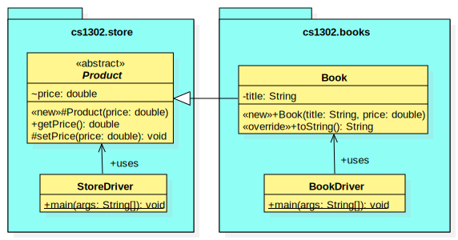

.. |approval_notice| image:: https://img.shields.io/badge/Approved%20for-Fall%202020-blueviolet
   :alt: Approved for: Spring 2021

.. external links
.. |uml_tutorial| replace:: UML Class Diagrams
.. _uml_tutorial: https://github.com/cs1302uga/cs1302-tutorials/blob/master/uml/uml.md
.. |jls11_access_control| replace:: JLS 11 Section 6.6
.. _jls11_access_control: https://docs.oracle.com/javase/specs/jls/se11/html/jls-6.html#jls-6.6
.. |wikipedia_singleton| replace:: Singleton pattern
.. _wikipedia_singleton: https://en.wikipedia.org/wiki/Singleton_pattern


Visibility Reading
##################

|approval_notice|

Introduction
************

Java has four different **visibility** options that can be used to facilitate
**access control**, i.e., to control access to certain things that we declare.
When you declare that something has a particular **visibility** in your code,
you communicate to the compiler the set of locations that are allowed to access
that thing. The term "access" simply means to "use from elsewhere in the code."
With that in mind, throughout this tutorial we will often say that various things
are "visible from" some location; this wording just means that the thing
"can be accessed from" or "can be used from" that location based on its
visibility.

The table below shows all four visibility options that are available in Java,
three of which have an associated **visibility modifier** that we can
include in various declarations throughout our code. The set of potential
visibility options for a declaration may also depends on its level and
other factors.

===============  ================  ==========  ==============  =================  ================
Visibility Name  Modifier Keyword  UML Symbol  Top-Level [1]_  Member-Level [2]_  Local-Level [3]_
===============  ================  ==========  ==============  =================  ================
private          ``private``       ``-``                       |Y|
package private  ..                ``~``       |Y|             |Y|
protected        ``protected``     ``#``                       |Y|
public           ``public``        ``+``       |Y|             |Y|
===============  ================  ==========  ==============  =================  ================

.. [1] A **top-level declaration** is the outermost declaration in a ``.java`` file.
       Some things that can be declared at the top-level include classes and
       interfaces.

.. [2] A **member-level declaration** is any declaration of a class or interface member.
       Members can include, where applicable, the constructors, methods, variables, constants,
       etc. (both static or non-static/instance) of the class or interface; however, the
       never includes Local-level declarations.

.. [3] A **local-level declaration** is any variable declaration that is local, in
       scope, to a particular method. The local variables of a method include
       its parameter and any variables declared within the body of the
       method.

In this tutorial, we cover each available visibility option with a few examples,
often illustrated using a combination of `UML diagrams <uml_tutorial>`__ and code
snippets. The order in which the visibilities are covered is deliberate; we start
with the option that makes something visible from the least number of locations,
then work through the rest in the order of increasing visibility.

We will take some liberties when discussing examples involving multiple
labelled lines (e.g., ``LINE1``) of code; for example, whenever we consider
whether or not a line will work, we will make a good faith assumption that
all other labelled lines of code will also work, even if we find out later
that they don't. If you want to work through such examples yourself (i.e.,
write the code), you may need to comment out or remove some labelled lines of
code whenever you focus your attention a single, labelled line.

While you are likely already familiar private and public visibility, please do not
assume that you already understand how it works. Over the years, we have
found that many students have a somewhat flawed conceptual model for how
private visibility works that is actually more complicated than what it
actually is. Regardless of your experiece, you should work through each
visibility example in this tutorial until you are able to:

1. correctly determine the visibility outcome and justification; and
2. write your own code that illustrates a similar visibility scenario.

We encourage you to make Piazza posts about your examples, ask questions,
and help others to understand the important details of visibility.p

Private Visibility
******************

Instead of saying that something has **private** visibility, we usually
just say that it's private. In Java, only member-level declarations
are allowed to be private. Private members are considered the least visible;
they are **only visible from lines of code in the same class**.


===============  ==========  ============  ===========  =========
Visibility       Visible From
---------------  ------------------------------------------------
Name             Same Class  Same Package  Child Class  Elsewhere
===============  ==========  ============  ===========  =========
private          |Y|
===============  ==========  ============  ===========  =========

* In Java, the ``private`` modifier must be included in a member's declararion for
  it to be considered private by the compiler.
* In UML, the ``-`` symbol is used just before a member's identifier to
  illustrate that it's private.
* The ``javadoc`` program does not include private declarations in a
  documentation website by default; however, they can be included  by
  adding the ``-private`` command-line argument (that option will
  also include anything that is more visible than private -- so
  everything).

Example 1
=========

This is a classic example that many students are familiar with.
To get started, let's consider the UML diagram below and the code snippet that
follows it.

.. image:: img/private_1.svg

.. code-block:: java

   // inside Person.java
   public void setAge(int age) {
       if (!checkAge(age)) { // <---- LINE1 ✓
           throw new IllegalArgumentException("invalid age");
       } else {
           this.age = age; // <---- LINE2 ✓
       } // if
   } // setAge

On the line labelled ``LINE1``, the code attempts to access
``checkAge``, an instance method of the current object (i.e., it's
the same as ``this.checkAge``) declared within the same class.
Although that method is private, it's visible from ``LINE1``
because private members are always visible from within the same
class. A similar argument can be made for the code on ``LINE2``,
which attempts to access the private intance variable ``age``.

Example 2
=========

According to |jls11_access_control|_, the developers of Java
incorporated visibility into the language "to prevent the users of a package or class
from depending on unnecessary details of the implementation of that package or class."
To illustrate this idea, let's consider the UML diagram below and the code snippet
that follows it.

.. image:: img/private_2.svg

.. code-block:: java

   // inside OtherClass.java
   public void updateAges(Person[] persons) {
       for (int i = 0; i < persons.length; i++) {
           int newAge = persons[i].getAge() + 1;
           if (checkAge(newAge)) { // <---- LINE1 ✗
               persons[i].setAge(newAge);
           } // if
       } // for
   } // updateAges

On the line labelled ``LINE1``, the code attempts to access the
``checkAge`` method, an instance method delcared within another
class. Since that method is private, it's not visible from this line
because private members are only visible from within the class where
they are declared. If you try to compile ``OtherClass.java``, then
you get the following error::

    OtherClass.java: error: checkAge() has private access in Person

The error above is exactly what the author of ``Person`` wanted to happen. They
intended for ``checkAge`` to only be used by other methods within the ``Person`` class.
To make the method not visible from outside the class, they declared it private. Had they
declared it public, for example, then the example would have compiled; however, the call
to ``checkAge`` would add unnecessary redundancy since it's called again inside the call
to ``setAge`` on the next line (see the previous example for the inside of ``setAge``).

We're not sure how the author of ``OtherClass`` knew about the ``checkAge`` method, but
the error message lets them know that it's not for them to use. Had they referred to the
Javadoc/API documentation for the ``Person`` class, it's unlikely that the private method
would have been included (private members are not included in the `javadoc` output by default).
If it's private, then it's not for others, and if it's not even listed in the documentation,
then that's less stuff that other programmers need to understand before they're able
to use your code.

Example 3
=========

We mentioned earlier that some students have a flawed conceptual model for
private visibility. Their idea of what it means for something to be private
is more restrivtice than it actually is. **Could this be you?**
To find out, let's consider the UML diagram below and the code snippet for
a copy constructor [4]_ that follows it.

.. image:: img/private_1.svg

.. code-block:: java

   // inside Person.java
   public Person(Person other) {
       setName(other.name); // <---- LINE1
       setAge(other.age); // <---- LINE2
   } // setAge

On the lines labelled ``LINE1`` and ``LINE2``, the code attempts to access
the private instance members ``name`` and ``age`` of the ``Person`` object
referred to by ``other``. Before we continue, ask yourself whether or not
this will work.

When asked, many students will say that this will not compile, then
they are shocked and amazed when they see that it does. That's right,
**it does compile**. Although ``other.name`` and ``other.age`` are private,
they're visible from ``LINE1`` and ``LINE2`` because those lines are in
the same class as the declarations.

    Remember, private members are always visible from lines in the same class.

While a reference to an object does allow us to find members of the object
via ``.memberName`` (for some ``memberName``), our ability to access the
member from the current location (line of code) depends only on where the
member is declared and its visibility. In general, **visibility itself has
nothing to do with objects; it's all about where the code is written**.

.. [4] A **copy constructor** for a class called ``A`` is the constructor
       ``A(A other)``; if a class has a copy constructor, then calling it
       with a reference to some existing object of the class as its parameter
       should result in the newly constructed object being a copy. The result
       is not always guaranteed to be a deep copy, so you should always check
       the constructor documentation and class documentation for more
       information before you make any assumptions.

Package Private Visibility
**************************

Instead of saying that something has **package private** visibility, we usually
just say that it's package private. In Java, only top-level and member-level
declarations are allowed to package private. Things that are package private are slightly
more visible than things that are private; they are **only visible from lines of code
in the same package**.

===============  ==========  ============  ===========  =========
Visibility       Visible From
---------------  ------------------------------------------------
Name             Same Class  Same Package  Child Class  Elsewhere
===============  ==========  ============  ===========  =========
package private  |Y|         |Y|
===============  ==========  ============  ===========  =========

* In Java, **there is no modifier keyword for package private visibility**. For
  top-level declarations and member-level declarations within a class, the omission
  of a visibility modifier will cause the compiler to treat the declared
  thing as package private. This is behavior is different for member-level declarations
  within an interface, where the omission of a visibility modifier defaults
  a declaration's visibility to public.
* In UML, the ``~`` symbol is used just before an identifier to
  illustrate that it's package private. Some UML programs may not support displaying
  the visibility for top-level declarations; in those cases, a quick hack
  is to include the ``~`` as part of the name. Although omitting a visibility
  modifier in Java code may default to package private, the same is not true
  for UML class diagrams; they default to public visibility (covered in a
  later section).
* The ``javadoc`` program does not include package private declarations in a
  documentation website by default; however, they can be included by
  adding the ``-package`` command-line argument (that option will
  also include anything that is more visible than package private -- so
  everything except private).

Some people refer to package private visibility as the "default visibility" because
a modifier isn't needed to indicate that certain declarations are package
private; However, **the term _default_, should be avoided when describing visibility**
so that the concept is not confused with Java's default methods feature for interfaces.

Example 4
=========

Here is our first example involving a top-level declaration. To get started,
let's consider the UML diagram below and the two code snippets that follow it.

.. image:: img/package_private_1.svg

.. code-block:: java

   // inside Utility.java
   package cs1302.models;

   class Utility { // <---- LINE1
       // ... rest omitted

.. code-block:: java

   // inside Driver.java
   package cs1302.store;

   import cs1302.models.Utility; // <---- LINE2

   // ... rest omitted

On the line labelled ``LINE1``, the author omitted a visibility modifier
in their top-level declaration of the ``Utility`` class. As discussed earlier,
this causes the class to default to package private visibility. On ``LINE2``,
which exists in ``Driver.java`` in a different package [5]_, an attempt is made to
import the ``Utility`` class. Since that class is package private, it's not
visible from this line because things that are package private are only visible
from within the same package. If you try to compile ``Driver.java``, then
you get the following error::

    Driver.java: Utility is not public in cs1302.models; cannot be accessed from outside package

The error above is exactly what the author of ``Utility`` class wanted to happen. They
intended for ``Utility`` itself to only be used by code residing within the
``cs1302.models`` package. To make the method not visible from outside the package,
they omitted a visibility modifier in the top-level class declaration. Had they
declared it public, for example, then the example would have compiled.

As an aside, the UML diagram for this example also includes a private
constructor [6]_! You can read about it in the footnote.

.. [5] In Java, two files are said to be in **different packages** whenever
       their package statements are not identical. Don't let the directory
       structure for some packages confuse you into believing something that's
       not true. For example, although the directory for package
       ``cs1302.foo.bar`` might be inside the directory for package ``cs1302.foo``,
       they're both considered by the compiler to be in different packages.

.. [6] A **private constructor** may seen counterintuitive -- after all, constructors
       are used to make objects of a class, and constructor calls often
       occur in other classes. There are, however, some valid use cases:

       * **Prevent Object Creation:** If your class only contains static methods
         and constants and it doesn't make sense to turn it into an interface,
         then you might explicitly declare one do-nothing constructor that is
         private and has no parameters. This will prevent the compiler from
         automatically creating its own default constructor, and it will prevent
         users of your class from creating objects that aren't needed.

       * **Restrict Object Creation:** It may be desirable to utilize a private
         constructor along with a static method of some other visibility in
         a carefully setup way to restrict the total number of objects of a
         particular class that can be created. We won't go into the details
         here, but the |wikipedia_singleton|_ is example of this idea that
         restricts the total number of objects to be no greater than one.

Example 5
=========

In this example, we'll see how package private visibility can be used at
the member-level for access control. Suppose a factory has a contract with a store to
produce some product. Throughout the year, the store mfay need to request
changes to its contract based on sales, buyer interest, etc. The driver
program on the factory's side should be able to access methods to request,
approve, and deny contract-related changes; however, the overall class design
should not allow for the store to approve or deny changes in this scenario.
To see how we can utilize package private visibility to accomplish this,
let's consider the UML diagram below and the two code snippets that follow it.

.. image:: img/package_private_2.svg

.. code-block:: java

   // inside FactoryDriver.java (cs1302.factory package)
   public static void main(String[] args) {
       Factory factory = new Factory();
       factory.requestChange("decrease price"); // <------- LINE1
       factory.approveChange("decrease price"); // <------- LINE2
       factory.denyChange("decrease price"); // <---------- LINE3
   } // main

.. code-block:: java

   // inside Driver.java (cs1302.store package)
   public static void main(String[] args) {
       Factory factory = new Factory();
       factory.requestChange("increase quantity"); // <---- LINE4
       factory.approveChange("increase quantity"); // <---- LINE5
       factory.denyChange("increase quantity"); // <------- LINE6
   } // main

The lines labelled ``LINE1``, ``LINE2``, and ``LINE3`` each attempt
to access a different member of the ``Factory`` class **from the same package**.
The table below summarizes the scenario for each line.
Class names in the ``In`` and ``From`` columns have been omitted since they're not
relevant for this particular example.

====  ====================  ===============  ==================  ==================  ========
LINE  Member                Declared         In                          From        Visible?
====  ====================  ===============  ==================  ==================  ========
1     ``requestChange``     public           ``cs1302.factory``  ``cs1302.factory``  |Y|
2     ``approveChange``     package private  ``cs1302.factory``  ``cs1302.factory``  |Y|
3     ``denyChange``        package private  ``cs1302.factory``  ``cs1302.factory``  |Y|
====  ====================  ===============  ==================  ==================  ========

Likewise, the lines labelled ``LINE4``, ``LINE5``, and ``LINE6`` each attempt
to access a different member of the ``Factory`` class **from a different package**.
The table below summarizes the scenario for each line.

====  ====================  ===============  ==================  ==================  ========
LINE  Member                Declared         In                          From        Visible?
====  ====================  ===============  ==================  ==================  ========
4     ``requestChange``     public           ``cs1302.factory``  ``cs1302.store``    |Y|
5     ``approveChange``     package private  ``cs1302.factory``  ``cs1302.store``    |N|
6     ``denyChange``        package private  ``cs1302.factory``  ``cs1302.store``    |N|
====  ====================  ===============  ==================  ==================  ========

If you try to compile ``Driver.java`` as written, then you get the following error::

    Driver.java: error: approveChange(String) is not public in Factory; cannot be accessed from outside package

Through careful use of visibility, the author of the ``Factory`` class was able to
achieve the access control described near the beginning of this example. That is,
code within the ``cs1302.factory`` package can request, approve, and deny contract-related requests,
while code in other packages can only request changes. It's a beautiful, simple setup,
but it did require the author to understand package private visibility.

In the error message that was recently discussed, the wording "is not public in"
may lead you to believe that only public members are visible from another
package; **that's not the case**. We'll provide an example in the next section
on protected visibility that illustrates this.

Protected Visibility
********************

Instead of saying that something has **protected** visibility, we usually
just say that it's protected. In Java, only member-level declarations
are allowed to be protected. Protected members are slightly more visible
than things that are package private; they are **only visible from
lines of code in the same package or a child class (regardless of its
package)**.

===============  ==========  ============  ===========  =========
Visibility       Visible From
---------------  ------------------------------------------------
Name             Same Class  Same Package  Child Class  Elsewhere
===============  ==========  ============  ===========  =========
protected        |Y|         |Y|           |Y|
===============  ==========  ============  ===========  =========

* In Java, the ``protected`` modifier must be included in a member's declararion for
  the compiler to consider it a protected member.
* In UML, the ``#`` symbol is used just before a member's identifier to
  illustrate that it's protected.
* The ``javadoc`` program includes protected declarations in a
  documentation website by default. If you don't want to include
  protected members, then you can tell ``javadoc`` to only include
  public declarations (as explained in the section on public visibility).

Example 6
=========

In this example, we'll consider two situations that where a protected
member is visible and one that's not. To get started, let's consider
the UML diagram below and the three code snippets that follow it.
There are two snippets for the ``Book`` class constructor, each
representing an alternative approach (i.e., in reality, we would
see one or the other, but not both).



.. code-block:: java

   // inside Book.java (cs1302.books package) -- FIRST APPROACH
   public Book(String title, double price) { 
       super(price); // <---------------------------- LINE1
       this.title = title;
   } // Book

.. code-block:: java

   // inside Book.java (cs1302.books package) -- SECOND APPROACH
   public Book(String title, double price) {
       setPrice(price); // <------------------------- LINE2
       this.title = title;
   } // Book

.. code-block:: java

   // inside BookDriver.java (cs1302.books package)
   public static void main(String[] args) {
       Book lotr = new Book("The Lord of the Rings", 11.99);
       lotr.setPrice(lotr.getPrice() * 0.8); // <---- LINE3
   } // main

====  ===================  =========  ===========  ========  =============  ===========  ========
..    Member                                       Accessed                              ..
----  -------------------------------------------  ------------------------------------  --------
LINE  Name                 Declared   In           From      Same Package?  From Child?  Visible?
====  ===================  =========  ===========  ========  =============  ===========  ========
1     ``Product(price)``   protected  ``Product``  ``Book``  |N|            |Y|          |Y|
2     ``setPrice(price)``  protected  ``Product``  ``Book``  |N|            |Y|          |Y|
3     ``setPrice(price)``  protected  ``Product``  ``Book``  |N|            |N|          |N|
====  ===================  =========  ===========  ========  =============  ===========  ========

Public Visibility
*****************

Instead of saying that something has **public** visibility, we usually
just say that it's public. In Java, only top-level and member-level declarations
are allowed to be public. Things that are public are considered
to be the most visible; they are **always visible**.

===============  ==========  ============  ===========  =========
Visibility       Visible From
---------------  ------------------------------------------------
Name             Same Class  Same Package  Child Class  Elsewhere
===============  ==========  ============  ===========  =========
public           |Y|         |Y|           |Y|          |Y|
===============  ==========  ============  ===========  =========

* In Java, the ``public`` modifier must be included in a declararion for
  it to be considered public by the compiler.
* In UML, the ``+`` symbol is used just before a member's identifier to
  illustrate that it's public. It is also common practice to assume
  that a class in a UML class diagram is public if no visibility
  symbol is included.
* The ``javadoc`` program includes public declarations in a
  documentation website by default. If you want ``javadoc``
  to only include public declarations, then the ``-public``
  command-line argument can be used.

Summary of Visibilities
***********************

In the table below, we summarize the locations that declarations
with a particular visibility are visible from.

===============  ==========  ============  ===========  =========
..               Visible From
---------------  ------------------------------------------------
Declared As      Same Class  Same Package  Child Class  Elsewhere
===============  ==========  ============  ===========  =========
public           |Y|         |Y|           |Y|          |Y|
protected        |Y|         |Y|           |Y|          |N|
package private  |Y|         |Y|           |N|          |N|
private          |Y|         |N|           |N|          |N|
===============  ==========  ============  ===========  =========

Inheritance and Visibility
**************************

You may recall from the inheritance-related readings that **child classes
inherit instance members** from their parent. In such a scenario, it's
usually pretty clear that inherited members are declared elsewhere
(in the parent class); however, some situations like overloading,
shadowing, and initialization can be tricky to determine.

Overload Resolution
===================

Since Java allows authors to override an inherited
method, it's possible for there to be multiple declarations that sometimes
have different visibilities. While most overrides preserve the visibility
of the original declaration, it's also possible for them to be declared
more visible in the child. This can make some situations a little tricky
to parse, but the general rule of thumb is this:

    If you try to access ``var.someMethod`` on some line of code, then
    the visibility that's used by the compiler is determined by type of the
    variable ``var``, itself, and not the type of the object that ``var``
    refers to. Java's dynamic binding [7]_ will still bind the call to the
    override that's closest to object's type (e.g., to allow for polymorphism).

Perhaps that's a little dense. You may find it easier to remember this:

    The variable type is used for visibility and the object type is used
    for binding.

.. [7] The term **binding** usually refers to the association between a
       method call and a particular method body. Java uses **dynamic binding**,
       which means that its binding occurs at runtime. This choice was
       made by the designers of the language to facilitate its polymorphism
       and method override features.

Non-Visible Inherited Members
=============================

It's often possible to access access non-visible inherited members indirectly
via a member that is visible.

* For inherited variables, the child class might utilize a visible getter or setter.
  That usually works so long as the instance variable is not shadowed (i.e.,
  declared again in the child, a practice that is highly discouraged).
* For inherited methods, the child class may have access to a visible overload
  that internally calls the private method.

If we apply the second idea to constructors, then a child class constructor may be able to
access non-visible inherited variables (e.g., to initialize them) using a call to a
visible ``super()`` (or some overload of ``super``); this works really well when
the parent constructor initializes it's own declared instance variables.
This is considered **a common pattern** that exemplifies *separation of concerns* and
*encapsulation* as each class is responsible for its own variables.

Important Notes (Do Not Skip)
*****************************

.. image:: img/Protected.png

To simplify the example, we consider whether otherwise valid lines of code in each
class in the diagram can see the `attribute` variable in the `Game` class. In the
table below, the "Visible?" column denotes whether or not the `attribute` variable
is visible, assuming a proper reference to an object containing `attribute` is
provided:

| Class         | Visible? | Comment                                     | Note |
|---------------|----------|---------------------------------------------|------|
| `Game       ` | ✓        | `attribute` is declared in the same class   |      |
| `TypeOneGame` | ✓        | `attribute` is declared in the same package | also inherits `attribute` |
| `TypeTwoGame` | ✓        | `attribute` is declared in the same package | also inherits `attribute` |
| `Utility`     | ✓        | `attribute` is declared in the same package |      |
| `YourGame`    | ✓        | `attribute` is declared in a parent class   | also inherits `attribute` |
| `Tester`      | ✗        | `attribute` is not visible                  |      |

There are two additional points that should be considered regarding this
example. The classes `TypeOneGame`, `TypeTwoGame`, and `YourGame` all have
access to:

1. their own inherited `attribute` variable; **and**
1. `attribute` variables in objects of each other, assuming
   a proper reference to an object is given.

To illustrate the second point, consider the following lines of code,
which you should assume, for the sake of this example, are located inside
a method in `YourGame`:

```java
// inside some method in YourGame
TypeOneGame tog = ...  // not-null; refers to a valid object
int a = tog.attribute; // COMPILES; yes, this works
```

Remember, **visibility has nothing to do with objects in Java.**
Instead, visibility has to do with classes. In the third line of
code, `attribute` via `tog.attribute` is visible because:

1. a proper reference to an object contain `attribute` is given (via `tog`); and
1. relative to that line of code, `attribute` is delcared in a parent class of
   the `YourGame` class which is where these lines are located.

## Public Visibility

When you declare a method or instance variable with public visibility, you
are explicitly stating that you are okay with that thing being accessed
from anwhere, including in lines of code that you potentially do not write.
If that kind of access is inappropriate, then you should carefully consider
one of the other visibilities.

## Closing Remarks

You should carefully consider the different scenarios described in this reading
and try to reproduce them in an actual Java programming environment to see what
the Java compiler will and will not let you do.

## Glossary

visibility

.. util
.. |Y| unicode:: U+2713
.. |N| unicode:: U+2717

.. copyright and license information
.. |copy| unicode:: U+000A9 .. COPYRIGHT SIGN
.. |copyright| replace:: Copyright |copy| Michael E. Cotterell, Bradley J. Barnes, and the University of Georgia.
.. |license| replace:: CC BY-NC-ND 4.0
.. _license: http://creativecommons.org/licenses/by-nc-nd/4.0/
.. |license_image| image:: https://img.shields.io/badge/License-CC%20BY--NC--ND%204.0-lightgrey.svg
                   :target: http://creativecommons.org/licenses/by-nc-nd/4.0/
.. standard footer
.. footer:: |license_image|

   |copyright| This work is licensed under a |license|_ license to students
   and the public. The content and opinions expressed on this Web page do not necessarily
   reflect the views of nor are they endorsed by the University of Georgia or the University
   System of Georgia.
