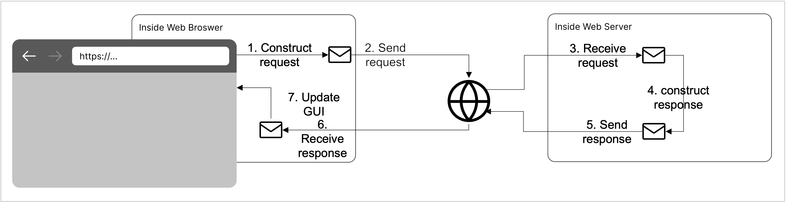

HTTP
====

.. contents::

Quick Introduction to HTTP
**************************

.. |WWW| replace:: World Wide Web
.. _WWW: https://en.wikipedia.org/wiki/World_Wide_Web

.. |URL| replace:: URL
.. _URL: https://en.wikipedia.org/wiki/URL

.. |web_server| replace:: web server

HTTP stands for "HyperText Transfer Protocol", the protocol that defines
the standard data exchange procedure used by the |WWW|_ (i.e., the "web").
Whenever a program (e.g., a web browser) tries to access web content (i.e.,
content located at a ``http://``-prefixed or ``https://``-prefixed |URL|_ or URI), it
uses an **HTTP client** (web client) to communicate with the **HTTP server**
(web server) that hosts the content. Sometimes the program itself is an
HTTP client (i.e., it knows all the protocol details); however, it's more common
these days to use an HTTP client provided by a library. From the program's
perspective, the following steps are taken to access :

1. construct an HTTP request message;
2. use an HTTP client to send the HTTP request message to the HTTP server;
3. (hopefully) receive an HTTP response message; then
4. decide how to update its program state.

Here is diagram that illustrates the entire high-level data exchange
that might occur when a program attempts to access content hosted
by an HTTP server:

.. |http_spec| replace:: HTTP/1.1 specification
.. _http_spec: https://httpwg.org/specs/rfc7231.html

If you're interested in the low-level details of HTTP, then we
encourage you to take a Computer Networks class, read the
|http_spec|_, or both!

Java's ``java.net.http`` Library
********************************

.. |java_net_http| replace:: ``java.net.http``
.. _java_net_http: https://docs.oracle.com/en/java/javase/17/docs/api/java.net.http/java/net/http/package-summary.html

Java (versions >=11) ships with |java_net_http|_, a package that provides
classes and interfaces that understand HTTP. It enables Java programs to
access web content without worrying about the low-level details of the
data exchange we described earlier. In this reading, we are going to
focus on these three classes:

==============================  =============================================================
Class                           Description
==============================  =============================================================
``java.net.http.HttpRequest``   Represents an HTTP request.
``java.net.http.HttpClient``    Used to send HTTP requests and receive their HTTP responses.
``java.net.http.HttpResponse``  Represents an HTTP response.
==============================  =============================================================

.. |HttpRequest| replace:: ``HttpRequest``
.. _HttpRequest: https://docs.oracle.com/en/java/javase/17/docs/api/java.net.http/java/net/http/HttpRequest.html

.. |HttpClient| replace:: ``HttpClient``
.. _HttpClient: https://docs.oracle.com/en/java/javase/17/docs/api/java.net.http/java/net/http/HttpClient.html

.. |HttpResponse| replace:: ``HttpResponse<T>``
.. _HttpResponse: https://docs.oracle.com/en/java/javase/17/docs/api/java.net.http/java/net/http/HttpResponse.html

|HttpRequest|
+++++++++++++

.. |builder_pattern| replace:: builder pattern
.. _builder_pattern: https://en.wikipedia.org/wiki/Builder_pattern

.. |HttpRequest_Builder| replace:: ``HttpRequest.Builder``
.. _HttpRequest_Builder: https://docs.oracle.com/en/java/javase/17/docs/api/java.net.http/java/net/http/HttpRequest.Builder.html

.. |URI| replace:: URI
.. _URI: https://docs.oracle.com/en/java/javase/17/docs/api/java.base/java/net/URI.html

The |HttpRequest|_ class provided by |java_net_http|_ allows Java programs
to "build" HTTP request messages that can be sent using an HTTP client. Instead of
providing a public constructor, the authors of |HttpRequest| decided to use
the |builder_pattern| -- |HttpRequest| objects are constructing by *building*
them using an |HttpRequest_Builder|_ object returned from ``HttpRequest.newBuilder()``.
The authors' use of the |builder_pattern|_ prevents the construction of
incomplete request objects. Most of the methods provided by |HttpRequest_Builder|
merely update the request information stored in the builder object, then just
return a reference to builder object itself so that you can update it further
via additional method calls. Once all the request information is specified,
the ``build()`` method is called to construct the actual |HttpRequest|
object.

Here is an example that builds an |HttpRequest| for an image:

.. code-block:: java

   URI location = URI.create("http://csweb.cs.uga.edu/~mec/cs1302/gui/pikachu.png");
   HttpRequest request = HttpRequest.newBuilder()
       .uri(location) // sets this HttpRequest's request URI
       .build();      // builds and returns an HttpRequest.

.. |get_a_license| replace:: get a license
.. _get_a_license: https://docs.github.com/en/rest/reference/licenses#get-a-license

The |builder_pattern| really comes in handy when a request involves
more than just a location |URI|_. The example below builds an
|HttpRequest| to |get_a_license| using GitHub's REST API. According to
GitHub, they recommend setting the "Accept" header when building a
request -- headers are one way to provide an HTTP server with more
information about a requst. Here is the code:

.. code-block:: java

   HttpRequest request = HttpRequest.newBuilder()
       .uri(URI.create("https://api.github.com/licenses/MIT"))
       .header("Accept", "application/vnd.github.v3.text-match+json")
       .build();

.. |query_string| replace:: query string
.. _query_string: https://en.wikipedia.org/wiki/Query_string

.. |itunes_search_api| replace:: iTunes Search API
.. _itunes_search_api: https://developer.apple.com/library/archive/documentation/AudioVideo/Conceptual/iTuneSearchAPI/Searching.html

.. |URLEncoder_encode| replace:: ``URLEncoder.encode``
.. _URLEncoder_encode: https://docs.oracle.com/en/java/javase/17/docs/api/java.base/java/net/URLEncoder.html#encode(java.lang.String,java.nio.charset.Charset)

.. |StandardCharsets_UTF_8| replace:: ``StandardCharsets.UTF_8``
.. _StandardCharsets_UTF_8: https://docs.oracle.com/en/java/javase/17/docs/api/java.base/java/nio/charset/StandardCharsets.html#UTF_8

Some HTTP servers also let you specify request metadata using
a special |query_string|_ included near the end of the request URI.
Special care must be taken when including a query string in a URI
so that the metadata values are encoded properly using a combination
of |URLEncoder_encode|_ and |StandardCharsets_UTF_8|_.
The example below builds an |HttpRequest| that queries the
|itunes_search_api| for up to 5 records related to "Daft Punk".

.. code-block:: java

   String term = URLEncoder.encode("daft punk", StandardCharsets.UTF_8); // "daft+punk"
   String limit = URLEncoder.encode("5", StandardCharsets.UTF_8);        // "5"
   String query = String.format("?term=%s&limit=%s", term, limit);       // "?term=daft+punk&limit=5"
   HttpRequest request = HttpRequest.newBuilder()
       .uri(URI.create("https://itunes.apple.com/search" + query))
       .build();

|HttpClient|
++++++++++++

The |HttpClient|_ class provided by |java_net_http|_ includes a ``send`` method to
send an HTTP request message (described by an |HttpRequest|_ object) and return the
corresponsing HTTP response message (described as an |HttpResponse|_ object).
The |HttpClient| class also uses the |builder_pattern|_ for object creation.

Here is a quick example that builds an |HttpClient| with preferred, modern
settings:

.. code-block:: java

   HttpClient httpClient = HttpClient.newBuilder()
       .version(HttpClient.Version.HTTP_2)           // uses HTTP protocol version 2 where possible
       .followRedirects(HttpClient.Redirect.NORMAL)  // always redirects, except from HTTPS to HTTP
       .build();                                     // builds and returns an HttpClient

Since a single |HttpClient| object can be used to send multiple requests, you are
encouraged to only create one |HttpClient| object for your program, unless a
specific need to do otherwise arises -- you might do this by defining a static
constant:

.. code-block:: java

   public static final HttpClient HTTP_CLIENT = HttpClient.newBuilder()
       .version(HttpClient.Version.HTTP_2)           // uses HTTP protocol version 2 where possible
       .followRedirects(HttpClient.Redirect.NORMAL)  // always redirects, except from HTTPS to HTTP
       .build();                                     // builds and returns an HttpClient

.. |HttpClient_send| replace:: ``send``
.. _HttpClient_send: https://docs.oracle.com/en/java/javase/17/docs/api/java.net.http/java/net/http/HttpClient.html#send(java.net.http.HttpRequest,java.net.http.HttpResponse.BodyHandler)

.. |HttpResponse_BodyHandler| replace:: ``HttpResponse.BodyHandler<T>`
.. _HttpResponse_BodyHandler: https://docs.oracle.com/en/java/javase/17/docs/api/java.net.http/java/net/http/HttpResponse.BodyHandler.html

.. |HttpResponse_BodyHandlers| replace:: ``HttpResponse.BodyHandlers`
.. _HttpResponse_BodyHandlers: https://docs.oracle.com/en/java/javase/17/docs/api/java.net.http/java/net/http/HttpResponse.BodyHandlers.html

Once built, an |HttpClient| object's |HttpClient_send|_ method can be called
to send an |HttpRequest|_; when doing so, an |HttpResponse_BodyHandler|_ must
also be supplied so that the |HttpClient| object knows how to construct
the |HttpResponse|_ object is creates for the response message. The
|HttpResponse_BodyHandlers|_ class provides some static methods to create
create commonly used |HttpResponse_BodyHandler| objects:

================================  =========================  ===================
Method                            Response Type              Response Body Type
================================  =========================  ===================
``BodyHandlers.ofString()``       ``Response<String>``       ``String``
``BodyHandlers.ofInputStream()``  ``Response<InputStream>``  ``InputStream``
================================  =========================  ===================

.. code-block:: java

   HttpRequest request = HttpRequest.newBuilder()
       .uri(URI.create("https://www.gutenberg.org/files/1661/1661-0.txt"))
       .build();
   HttpResponse<String> response = HTTP_CLIENT.send(response. BodyHandlers.ofString());

|HttpResponse|
++++++++++++++

If an HTTP response message is received, then the program must decide what to
do based on the information contained in the response message. Typically,
the following information is: ...
